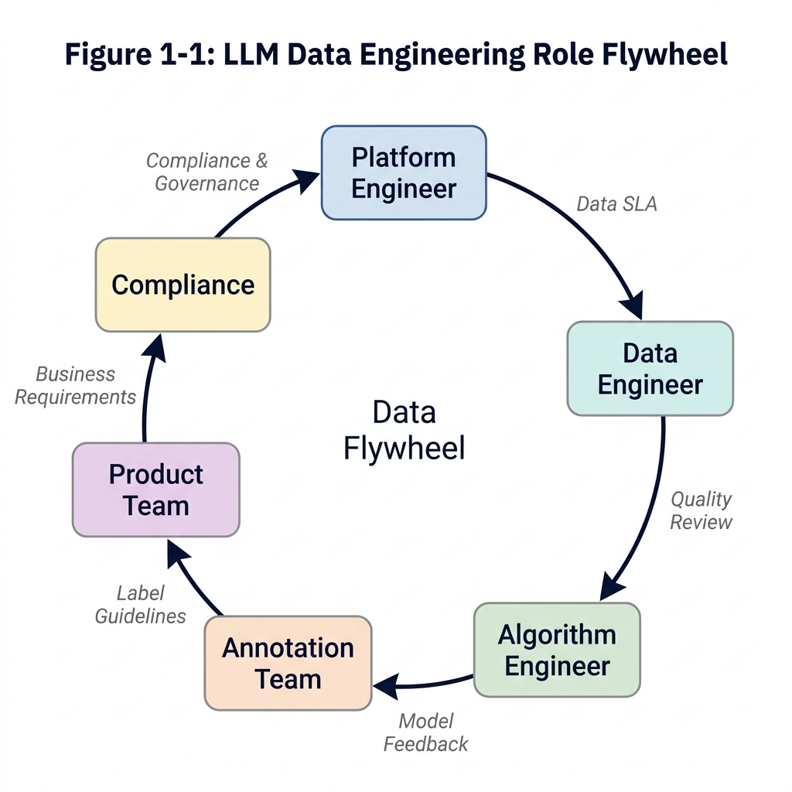
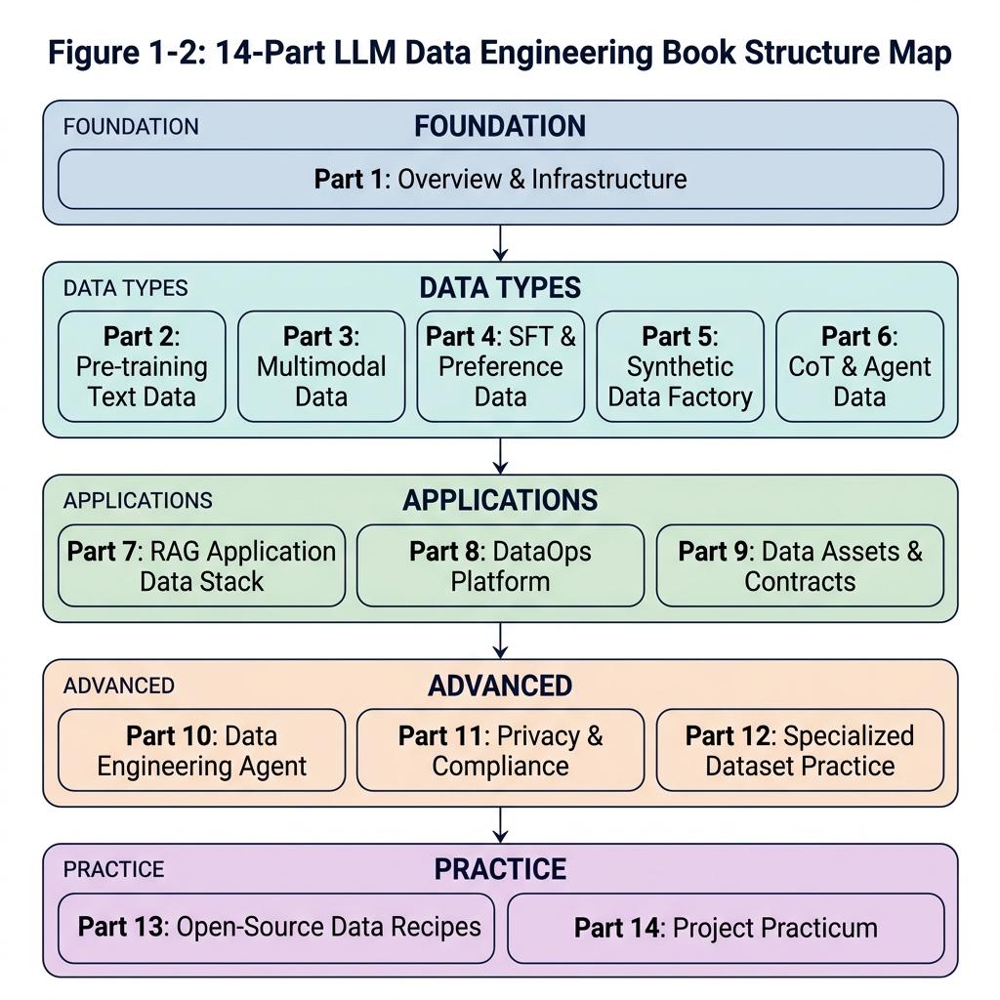

# Chapter 1: The Data Revolution in the Era of Large Models

## 1.1 Opening: Why a Training Project Failed Because of Its Data

Before systematically examining the data engineering system for large models, the most intuitive entry point is to dissect a real-world "engineering disaster." In this industry, cases where vast amounts of compute and months of effort are wasted due to poor-quality data are everywhere.

### 1.1.1 Scene Setting: When Millions in Compute Buys You a "Parrot" and a "Test-Cramming Drone"

Imagine you are the head of data at an AI startup. After landing a round of funding, your team spent three months using a distributed crawler cluster of several hundred servers to scrape and consolidate nearly 50TB of Chinese web corpus, 1TB of GitHub open-source code, and 500GB of Reddit discussion data from the public internet. Brimming with confidence, the team launched a thousand-card A100 cluster and began pre-training a 7B parameter foundation model using the Megatron-LM framework. The entire algorithm and engineering team poured tremendous effort into infrastructure setup (RDMA network tuning), parallel training strategies (a 3D hybrid parallelism architecture), and fault-tolerant scheduling of compute nodes.

However, after two weeks of running at full throttle, crisis struck. On the monitoring dashboard, the Loss (cross-entropy loss) curve suddenly "flatlined" around 2.1, and even displayed an anomalous slight upward oscillation. Moreover, during early Checkpoint Interactive Evaluation by the R&D team, the model's outputs exhibited troubling weirdness:

1. **Garbage content injection**: When given a prompt about "how to maintain a car," the model smoothly generated the first two sentences of a professional explanation, then suddenly veered off to produce a chunk of low-quality SEO marketing copy entirely unrelated to the topic—a "memory residue" left by the massive amount of commercial promotional pages mixed into the training corpus.
2. **The "parrot" infinite loop**: When the model generated Python code, after writing the first `def` function, it seemed to fall into an infinite loop, churning out massive repetitions of `\n\n\n\n\n` or `return return return` until reaching the maximum sequence length.
3. **Strong memorization, weak reasoning**: Given a simple variant of the "chickens and rabbits in the same cage" word problem, the model verbatim recited a long GMAT reading comprehension passage from some past year, along with its trailing copyright notice—yet kept botching simple three-digit addition.

At the emergency post-mortem meeting after halting the training, the team was deeply divided. Algorithm engineers suspected the learning rate warmup steps were insufficient or AdamW optimizer parameters were misconfigured; distributed computing engineers suspected that a few defective cards had caused NaN values during gradient communication synchronization, poisoning the global weights. Finally, after dissecting the most recent batch of data fed to the model, the senior architect threw out a sharp conclusion that silenced the entire room: "What we spent a million in compute training is not a general-purpose language model at all—it's a compressed index of illogical internet SEO garbage and exam question banks."

This scenario is not a sensationalized fabrication. During the 2023–2024 "war of a hundred models" wave, both star startups and established tech giants paid steep prices for the same problem, to varying degrees.

### 1.1.2 Symptoms: How Data Problems Get Misdiagnosed as Model Problems

In traditional backend software development, system crashes typically come with clear stack traces pointing to the exact line of code causing the bug. But in the purely data-driven paradigm of neural network black boxes (i.e., LLM training), **poor data quality often stealthily disguises itself as flaws in model architecture or the optimizer**, dramatically increasing the difficulty of troubleshooting.

We've summarized the three most easily conflated symptoms in practice:

1. **Gradient explosion/vanishing vs. severe data anomalies**
    * **Common misdiagnosis**: When the monitoring dashboard detects violent Loss oscillations or sudden gradient norm spikes diverging to NaN, the algorithm engineer's first instinct is usually to adjust the learning rate or tighten the gradient clipping threshold.
    * **True root cause**: Often, it's incomplete dataset cleaning. For example, the dataset may contain massive HTML/XML tag trees that weren't properly stripped, extremely long meaningless base64-encoded image strings, or special control characters. After being fed into the tokenizer, these may be split into vast numbers of rare tokens or even single-character sequences, causing numerical overflow in the attention mechanism's exponential calculations, and thus poisoning the entire batch's gradients during backpropagation.

2. **Generation degeneration ("parroting") vs. attention collapse**
    * **Common misdiagnosis**: When model generation falls into an infinite loop or repeatedly outputs the same words, the algorithm side might blame inference-time temperature being set too low, or the repetition penalty being ineffective—and then suspect that multi-head attention has collapsed onto a few fixed query-key mappings.
    * **True root cause**: The disease of "parroting" almost invariably points to **a training set that has not been rigorously deduplicated at large scale**. The internet contains enormous quantities of template code, navigation bar text, and SEO articles mechanically reposted everywhere. When the LLM is exposed to these highly similar text passages hundreds or thousands of times across multiple epochs of pre-training, its probability distribution predictions (logits) become compulsively biased toward these low-value patterns, forming deep "probability grooves." At inference time, whenever the model encounters a similar context prefix, it slides into the loop and cannot escape.

3. **Severe "hallucinations" vs. failed world-knowledge construction**
    * **Common misdiagnosis**: When the model confidently spouts nonsense in a specific entity domain, many teams treat it as an innate genetic defect of LLMs, and pin their hopes on patching it up after pre-training with large amounts of domain-specific SFT or by bolting on a RAG (Retrieval-Augmented Generation) system.
    * **True root cause**: "If the foundation is shaky, the building will collapse." If the basic cleaning pipeline fails to filter out low-signal-to-noise web noise—such as massive repetitive filler content, factually erroneous pseudo-science articles, or internally contradictory low-quality corpora—the foundation model's world model is severely distorted from the start. At this point, the model has not learned the general logical rules connecting things in the world; it has become a memorizer of erroneous correlations. Trying to paper over this massive foundational defect with small amounts of fine-tuning during the alignment stage is a drop in the ocean.

### 1.1.3 Why Training Metrics, Evaluation Metrics, and Business Goals Diverge

If we dig deeper into this failure case, we discover a phenomenon even more worth noting: in early large-scale training monitoring, the Validation Loss on the training set was smoothly decreasing with fitting steps; even scores on some evaluation platforms looked decent. But in real-world business blind human evaluation, performance was disastrous.
This metric derailment directly reveals the "head-in-the-sand" effect of low-level data engineering.

*   **The deceptive trap of training metrics (Loss)**: Without proper data separation, if the held-out test corpus used to compute Validation Loss was originally split proportionally from the same un-deduplicated and un-decontaminated pool as the training corpus, this leads to severe **data distribution homogeneity overlap**. The model's low Loss on the test set doesn't mean it has mastered generalizable reasoning—it merely proves that it has powerfully memorized the low-quality data and high-frequency repeated samples present on both sides.
*   **The deep-water bomb: benchmark contamination**: This is one of the most hidden and destructive data quality problems in pre-training engineering. The industry has no shortage of cases where teams achieved exciting high scores on public benchmarks (like the logical reasoning benchmark GSM8K or the general knowledge benchmark MMLU), but performed mediocrely in real-world business blind tests. Post-mortem data provenance audits often point to the same root cause: the crawler pipeline indiscriminately scraped code repositories or web pages containing these public benchmark question banks and their answers. Lacking N-gram level decontamination checks, the relevant questions slipped right into the pre-training corpus. What the model is displaying is not genuine reasoning generalization, but strong memorized matching of previously seen questions—as soon as it encounters out-of-distribution new problems, the capability cliff is immediately exposed.

The lesson of this incident is more than just millions in cloud bills going down the drain—it also delayed the product side by months during a critical market push window. At an extremely high cost, it proved to AI practitioners in this age of exploration an iron law that has now been enshrined as canon: **In an era where model-level operators and Transformer variants are highly homogenized and converging, high-quality, defensible data engineering pipelines are the core competitive edge that opens up the IQ gap between giants.**


## 1.2 The Paradigm Shift from Model-Centric to Data-Centric

Looking back at the pre-deep-learning era, in classical machine learning (such as recommendation systems or early CV tasks), "feature engineering + complex algorithms of varied structure (SVM/decision tree ensembles/capsule networks, etc.)" was once the absolute dominant approach. In the golden decade of rapid development from 2012 to 2020, researchers firmly believed that "complex and grandiose architectural innovations would produce era-defining miracles" (from AlexNet, ResNet to various Transformer variants).
However, when GPT-3's thunderbolt struck and a single autoregressive language model (Autoregressive LM) "unified the realm," the scales tipped completely. "Data-centric AI" with irreversible momentum formally replaced "model-centric AI." This is a comprehensive paradigm shift built on compute reshaping and the discovery of empirical laws.

### 1.2.1 Quantitative Laws: The Origin of Scaling Laws and Chinchilla's Reshaping of Data Proportions

How do we give LLMs intelligence on par with humans? In 2020, OpenAI researchers gave a hardcore answer that stripped away the mysticism. In the landmark paper "Scaling Laws for Neural Language Models," they revealed in detail a core law derived from striking data: the final performance of large language models (characterized by cross-entropy loss) forms a stable power-law constraint relationship with three key factors—
model parameter count $N$, the size of the high-quality training dataset $D$, and the total compute consumed $C$.

Its core equivalent description can be simplified as:

$$
L(N, D, C) \approx \left(\frac{N_c}{N}\right)^{\alpha_N} + \left(\frac{D_c}{D}\right)^{\alpha_D} + \left(\frac{C_c}{C}\right)^{\alpha_C}
$$

This formula proclaims a fact: as long as you give it fully burned silicon-based compute, while simultaneously scaling up the model's neuron capacity and the high-quality data fed in at appropriate ratios, the model's level of intelligence will exhibit **highly predictable linear evolution and capability jumps**. From that day forward, intuition-and-trial-and-error R&D was ended; LLM training became a precise systems engineering discipline akin to bridge-building.

**The Chinchilla Law: Re-evaluating the Hunger for Data Scale**
However, in the early wave following the release of Scaling Laws, there was a major cognitive blind spot. Many companies blindly chased increasing parameter counts (for instance, racing to release ultra-large models in the hundreds of billions or even trillions of parameters, such as the early 175B GPT-3 and its various followers), believing bigger models meant better performance.
But in 2022, a DeepMind paper titled "Training Compute-Optimal Large Language Models" (the famous Chinchilla paper) shattered this illusion.

The DeepMind research team conducted strictly controlled compute-optimal experiments. Their results stunned the academic world: the Chinchilla model, with only 70B (70 billion) parameters, having thoroughly absorbed 1.4T (1.4 trillion) tokens of deeply cleaned high-quality data, comprehensively outperformed the company's own previously trained 280B model Gopher—which was four times its size—across every benchmark.

**Table 1-1: Comparison of Data Resources between DeepMind's Old-Paradigm and New-Paradigm Models**

| Model (Publisher) | Parameter Count $N$ | Training Tokens $D$ | Training Compute Share Estimate | Inference-Side Characteristics |
| :--- | :--- | :--- | :--- | :--- |
| **Gopher** (old empirical line) | 280B | 300B Tokens (~0.3T) | Same control variable | Huge memory footprint, unfavorable for deployment |
| **Chinchilla** (new law baseline) | **70B** | **1.4T Tokens** | Same control variable | **Low inference cost, and comprehensively crushes Gopher on overall evaluations** |

The Chinchilla Law states: in the past, industry models were generally **"fat but undernourished (under-trained)"**. To maximize gains under a given compute budget, model parameter count and training token count should be scaled up roughly in proportion. The golden rule is:
> **For every additional parameter added to the model, at least about 20 high-quality training tokens must be allocated to feed it properly.**

This means that if a team today wants to launch a mainstream open-source 7B-class foundation model baseline, the high-quality, lossless corpus they need to prepare must reach an astonishing minimum of 140B (140 billion) tokens. And if you look at small-scale flagships pursuing extreme performance (such as the LLaMA-3 8B version), the refined data ultimately consumed approaches a staggering 15T (15 trillion) tokens—worth noting, this far exceeds Chinchilla's optimal point (about 160B tokens). This is a deliberate "over-training" strategy adopted by Meta: trading more data for lower inference deployment costs, so that small models achieve stronger long-term performance under the same compute budget—rather than a requirement of the Chinchilla Law itself. This exponentially expanding appetite has forced every company's gaze to shift from "finding new model architectures" to "what do we use to fill the maw of this compute beast."

### 1.2.2 The Counterattack of Quality: The Phi Series Extreme Experiments and the Dawn of Synthetic Data

Just as all major firms were flexing their crawler muscles, competing to see who could scrape together massive internet corpora, Microsoft Research unexpectedly overturned the "bigger is always better" path dependency with its Phi series of papers—delivering a solid lesson to the entire industry on **extreme data quality**.

The Phi-1 model Microsoft released was an outlier. Before training even began, it was constrained to an almost "dwarf"-level architecture (only 1.3B tiny parameters), and what's more, the training consumed a meager 7B tokens. Yet under this comprehensive hardware and scale disadvantage, when placed on hardcore logic benchmarks like the HumanEval code evaluation, tiny Phi-1 toppled many open-source heavyweights of the 10-billion-parameter class.

How did Phi-1 punch so far above its weight? The paper's title reveals the core method—"Textbooks Are All You Need." The research team abandoned the StackOverflow-style posts littered with comment flame wars, typos, and abandoned code that are everywhere on the public web, and instead used the powerful GPT-3.5/GPT-4 as "expert teachers"—relying on rigorously designed prompts to let the strong models continuously generate high-quality programming tutorials with smooth structure, progressive sequencing, and from-the-ground-up algorithm explanations.

When the model absorbs only highly pure, high-density information "premium brews," and isn't forced to waste even a single parameter on understanding noise full of contradictions, illogic, and accents, the threshold for "emergence" is dramatically advanced. This directly reveals a truth in data engineering that should not be obscured: with ultra-high-quality and rapidly refined synthetic data or distilled expert knowledge to perform "concentrated intervention," one can still leapfrog the "brute-force scaling" strategy.

### 1.2.3 Core Foundation: The "Impossible Triangle" of Scale, Quality, and Diversity

From the layered dissection of deep learning history above, we can clearly construct the final decision-making topology that sits on every modern LLM data scientist's desk. Under the LLM data engineering paradigm, what truly constrains the boundaries of a model's intelligence is not a single dimension, but the **"core trinity (Scale, Quality, Diversity) engineering trade-off triangle"** in which the three are in mutual contention and tension—within finite resource constraints, the three cannot simultaneously be optimized; pushing any one to the extreme inevitably comes at the cost of sacrificing the other two.

**Table 1-2: The Three-Tier Rubik's Cube of LLM Data Engineering — Cost Constraint Baseline Matrix for Quality, Scale, and Diversity**

| Core Slice Dimension | Core Tactical Execution Means of Data Processing | Direct Capabilities Acquired and Significant Model Benefits | Strong Pain-Point Constraints Faced (Cost Transfer Zones) |
| :--- | :--- | :--- | :--- |
| **Massive Scale (Scale)** | Rely on CommonCrawl or underlying cloud-wide crawlers to cast a wide net for indiscriminate high-concurrency scraping and storage, often using cheap fuzzy matching like locality-sensitive hashing (MinHash LSH) for crude deduplication and cleaning, aiming only to ingest every publicly accessible corpus on the internet. | Forcibly piles up a sufficiently thick dictionary of broad world knowledge, ensuring ultra-large models have seen the low-level connections between all common-sense entities; meanwhile, scale is the only physical ticket of admission to the qualitative-leap "emergence" point of intelligence as predicted by Scaling Laws. | **The cost of massively ingesting expensive cloud compute and network storage bandwidth.** Often requires alignment with hundreds of PB of hot-warm object storage costs. Furthermore, if blindly piling up garbage leads to overflowing junk and bloated long token sequences, every additional meaningless long training epoch will linearly consume expensive H100 GPU training cluster rack-hour fees. |
| **Near-Obsessive Extreme Quality (Quality)** | Choose high-spec filter logic. Often uses dozens of LLMs as heavy-duty discriminator scorers, paired with massive knowledge graph verification or PPL-based high-dimensional perplexity algorithm interception. Sometimes, to hit volume, you have to spend big money to hire senior full-time employees with real industry expertise to handwrite well-structured SFT dialogue samples from scratch. | Cuts off the curse of models falling into chaotic generation, repetition, and mathematical-logical loops; forcibly breaks through the long-standing bottleneck where simply piling up ordinary data cannot raise model intelligence regardless of volume. Endows the resulting LLM with excellent logical rigor and human-friendly expressive ability in its reasoning chains, and significantly suppresses the model's tendency to fabricate facts (hallucinations). | **Easy to fall into long-term governance experience vacuums and human-resource exhaustion.** High-value, high-quality pure public-web open-source corpora are extremely rare in nature, and have long since been monopolized and mined out by a handful of tech pioneers. "Finding and refining real gold" becomes a more mentally exhausting labor than R&D on algorithm architectures; the marginal cost of hiring experts for manual governance keeps climbing, rapidly approaching the limits of project budgets and effective labor. |
| **Wide Distribution Diversity (Diversity)** | Data engineers execute refined complex data mixing schedules, honed through tens of thousands of experiments to reach a golden ratio; spanning the low-level logic of dozens of different language families, forcibly intermixing medical clinical practice, legal statute case law, architectural-electrical blueprints, low-level C++ programming, and various vertical academic-silo content, while also covering trivial daily QA email interactions and ten-thousand-word deep reflection summaries simultaneously. | Massively prevents and eliminates catastrophic forgetting. Thoroughly prevents the model from becoming a frog in the well of some peculiar context due to data clustering in one batch; under the agitation of diversity, builds rugged anti-interference logical reasoning capabilities like an all-purpose generalist physician, along with astonishing zero-shot instruction generalization adaptability and the ability to fend off all kinds of tricky security attack challenges. | **Extremely intense and constantly-refactored operational costs for the underlying framework parsing structurally complex cross-lingual and multi-modal data. The difficulty is sufficient to scare off rookie teams.** This requires mid-platform architects to customize wildly different distributed regex parsing pipelines for as many as hundreds of distinct, chaotically arranged data layouts, and to maintain entirely different low-level vector validation schedulers; code grows mountain-heavy and management becomes extraordinarily arduous. |

Since you cannot "have it all," the full-pipeline high-level data design led by every team's chief data engineer is essentially the act of finding a barely-feasible saddle-point optimum escape route between the three strong-constraint apex points, while wearing the extraordinarily heavy shackles of budget, manpower, and project delivery timelines.

### 1.2.4 The Comprehensive Misalignment and Collapse of the Traditional AI Lifecycle Pipeline vs. the LLM Data Pipeline

For the vast majority of seasoned architects who have just secured large rounds of venture capital to step into the LLM training arena—but who spent their entire careers working in content recommendation algorithm distribution or industrial machine vision image inspection systems—the most painful "culture shock" comes upon transition. Because their deepest, most painful realization will sooner or later strike: the entire Hadoop-lineage traditional big-data report-cleaning methodology system they spent years accumulating as treasure and revering as ultimate truth has met massive dislocation and failure here. Since the bottom-level task's final orientation has leapfrogged from the previous generation's "process highly structured row-column tables to predict a small target variable" to "let the model independently, in a totally unsupervised lone-wolf mode, understand the complex operating laws of the entire vast world in a near-infinite-dimensional continuous space of language, text, and logical connections," the entire original heavy pipeline paradigm needs to be reset, shattered, and rebuilt. We need to forcefully construct and forge for the new era's LLM developers a brand-new "AI-native high-concurrency data stack and pipeline methodology system" that thoroughly fits this logic.

**Table 1-3: Traditional Empirical AI Machine Learning R&D Lifeline vs. Native Data System of the Large Language Model (LLM)**

| Confrontation Pain-Point Cross-Section | Frontier Industrial Classical AI Development Robust Pipeline (with recommendation systems as the trunk) | LLM-Native Data System Built Purely on Stacked Compute, Driven by Rapid LLM Evolution |
| :--- | :--- | :--- |
| **Core Data Type Carrier** | Enterprise-developed, highly-pure SQL wide tables with structured user behavior mappings, painstakingly maintained over time. Plus large quantities of platform-captured logs with fixed lifespans and fixed lengths, and high-fidelity sensor telemetry time-series slice data. | A vast, fuzzy-bordered, endlessly-stretching ocean of mixed natural-language text streams; nested within, high-level computer call chain code, page after page of layout-chaotic, hard-to-strip thousand-page mega PDFs, and the recently surging long-sequence multi-dimensional multi-modal vision-language-audio-video streams. |
| **Bottom-Layer Throughput / Physical Data Volume** | Basically stays in the high-capacity GB to early TB range. Most are handled by simple Pandas slice-filter cleaning combinations, then unified and merged via offline high-latency heavyweight Hive data-warehouse table query engine mapping and scheduling. | An unprecedented scale challenge: directly jumps and expands to PB or even EB black-hole levels. Quickly exceeds the various once-considered-abundant enterprise-bus I/O and network communication data pipeline bandwidths. |
| **Quality Risk-Control Battleground** | Focus on resolving low-level human errors during manual or machine annotation, or addressing imbalance problems in rare negative samples of certain categories. | Focus on detecting and eliminating deeply hidden text duplication in hundreds of billions of words (removing homogenized memory poison), deep verification of semantic-expression self-consistency and association integrity, severing dirty data that easily violates privacy and collapses values, defending against deliberate knowledge contamination, and enforcing value-alignment baselines. |

From the confrontation above, it is not hard to see why enterprises must transform comprehensively. Under the new LLM industrial paradigm, the rigid combined cost of clusters, network resources, and intellectual trial-and-error required to obtain "more nutritious, refined, clean data" has crossed a critical threshold, and **far exceeds the total investment researchers laboriously put into "finding and debugging a better underlying deep-neural-network layer-structure algorithm."** In many frontline labs: more than 60% of AI researchers with high-paying titles printed on their business cards are essentially working full-time as "top-chef culinary masters of LLM data recipes."


## 1.3 Role Reorganization and Collaboration Interfaces in LLM Projects

Because data's strategic position in the entire training chain has been elevated, the original organizational architecture faces re-evaluation. The traditional linear pipeline model of "the data department handles the warehouse, the algorithm department handles model training, the engineering department handles deployment" can no longer adapt to the iteration tempo of large models.

### 1.3.1 New Collaboration: From Data Hand-off to "Data Flywheel"

In the LLM R&D system, role fusion and clearly defined interfaces have become unprecedentedly important. It is no longer a one-way data hand-off pipeline; instead, you must build a head-to-tail interconnected "**data flywheel**."

The so-called data flywheel refers to a continuously self-reinforcing data closed loop: once the model is deployed, the real interaction behavior of front-end users (such as thumbs-up/down on responses, edit suggestions, abandonment rates, etc.) is collected and recorded in real time; this online negative feedback data is cleaned, annotated, and structured by data engineers, transforming it into the next round's RLHF preference comparison set; the new preference data is fed into the alignment phase to train a better model; the better model is deployed again, producing higher-quality online feedback data—and so the flywheel turns, faster and faster.



*Figure 1-1: Data Engineering Role Reconstruction in the Era of LLMs — illustrating the role flywheel closed loop spanning platform architecture, data collection, model fine-tuning verification, and product-R&D iteration.*

The premise for this flywheel to spin at high speed is the existence of **clear, executable data hand-off SLAs (Service Level Agreements)** between roles. Otherwise, once a single interface becomes ambiguous (e.g., "the product side says feedback data will be given to the data team, but the format and fields have not been agreed upon"), the flywheel will stall at its weakest link.

**Table 1-4: Six Core LLM Project Roles and Their Data Interface Responsibilities**

| Role | Core Data Responsibilities | Data Requested Upstream | Data Delivered Downstream | Key SLA Metrics |
| :--- | :--- | :--- | :--- | :--- |
| **Platform Architect / MLOps** | Build and operate the underlying compute scheduler, distributed file system (e.g., Lustre / HDFS), and training cluster stability | Data packet paths, format specs, and size estimates submitted by data engineers | Stable GPU/TPU training cluster access interfaces; DataLoader optimization recommendations | Training task failure rate < 0.5%; data loading should not bottleneck GPU utilization (utilization > 85%) |
| **LLM Data Engineer** | Raw corpus collection (crawlers/APIs), multi-stage cleaning (deduplication, denoising, desensitization), data mixing and sampling proportions, dataset version management | Domain weight allocation requirements from the algorithm team, security/compliance blacklist rules, SFT sample feedback from the annotation team | Parquet/JSONL data packets that pass quality scorecard acceptance; data lineage documentation | Cleanliness score per batch ≥ 0.85; delivery SLA: new corpus onboarding within T+3 business days of request |
| **Algorithm / Pre-training Researcher** | Design tokenizer vocabularies, formulate training data mixing strategies (Data Mixture Recipes), monitor Loss curves and changes in eval benchmarks | Cleaned standardized data packets; dataset statistics reports (domain distribution, deduplication rate, PPL distribution) | Data mixing weight requirement documents; new eval suite definitions; ablation conclusions (how much a given data category boosts which benchmark) | Ablation cycle ≤ 2 weeks to conclusion; incremental needs for key domain data raised at least 2 weeks in advance |
| **AI Annotator / Prompt Expert** | Design SFT sample instruction sets that match human preferences, define RLHF scoring specs, curate RAG knowledge base Q&A | Raw text from data engineers for filtering; model weakness reports from the algorithm team (which categories of instructions fail) | High-quality (Prompt, Response) pairs; preference scoring sets (chosen/rejected); RAG standard evaluation sets | SFT sample daily output ≥ 500 entries (expert-level) or annotation consistency κ > 0.7 per round |
| **Model Product / Application Layer** | Collect real online user feedback, define business scenario coverage requirements, provide proxy metrics for online anomaly monitoring | Model APIs and performance reports from the algorithm team; coverage analysis from the data team | Online negative samples (responses users downvoted or edited); data requirement specs for new scenarios; aggregated reports on online hallucination anomaly cases | Online anomaly case aggregation cycle: once a week; written specs for new-scenario data requirements within 1 week of request |
| **Security and Compliance Specialist** | Source corpus copyright provenance auditing, PII personal privacy data monitoring, toxic content and bias evaluation/interception | Source metadata for all corpora about to enter storage (URL, scrape timestamp, license type); final versions of SFT samples | Copyright compliance assessment reports; PII filtering rule updates; toxicity/bias evaluation scores; green-light compliance certificates | Per-batch compliance review ≤ 5 business days; high-risk source data warnings issued within 24 hours |

**Complete Timing of the Data Flywheel: A Typical Iteration Cycle (about 4-6 weeks)**

```
[Week T+0] Algorithm team discovers in evaluation that the model has systemic hallucination defects on long-form legal Q&A
              ↓
[Week T+0] Product team collects user downvotes and edit records on related cases from the live system (3,200 negative feedback entries)
              ↓
[Week T+1] Data engineer receives negative feedback data, cleans it into standard JSONL format, categorizes into "factual errors" and "format issues"
              ↓
[Week T+1] Annotation expert selects 800 factual-error cases and writes higher-quality chosen answers for each
              ↓
[Week T+2] Security compliance reviews the 800 SFT data entries (no copyright provenance risk, no PII leakage) → Passed
              ↓
[Week T+2] Data engineer packages the 800 (rejected, chosen) pairs and appends them to the preference comparison database
              ↓
[Week T+3] Algorithm team uses the new 800 preference data entries to perform DPO fine-tuning (3 × A100, about 12 hours)
              ↓
[Week T+4] The new model version improves +8.3% on the legal Q&A benchmark and is grey-launched to 10% of traffic
              ↓
[Week T+5] Product team confirms the hallucination case recurrence rate drops by 76% → Full rollout, entering the next flywheel cycle
```

The above is the full timing of a minimum viable data flywheel (MVP Data Flywheel). **Without role partitioning and SLA constraints at this level of precision, the flywheel will experience severe information distortion or time lag at some link, becoming a "rust-blunted gear" that turns only once every three months**—completely unable to keep up with the iteration tempo of commercial competition.

### 1.3.2 Team Capability Model and Role Evolution

The modern "**LLM Data Engineer**" is a new species that barely existed before 2023, yet became a hot recruiting target for AI unicorn companies in 2024. They are no longer just "plumbers" sitting next to the data warehouse writing SQL to extract reports, nor are they "assembly-line workers" executing per-entry annotation tasks. This highly integrated role sits at the central hub of the model R&D chain and must simultaneously possess capabilities across the following four dimensions:

1. **Large-scale distributed computing capability**: Proficient in massively parallel computing frameworks such as Ray Data, Apache Spark, and Dask, capable of designing and tuning efficient deduplication jobs driven by MinHash LSH + Bloom Filter on thousands of CPU cores. Must be able to perceive the differences between I/O bottlenecks and compute bottlenecks, and understand how to adjust partitioning strategies to prevent the entire job from being dragged down by a few oversized shard files.
2. **Algorithm awareness (ML-Awareness)**: Must deeply understand the underlying principles of tokenization (BPE, Unigram LM), know how to read perplexity curves to judge data quality, and know how to use N-gram language models like KenLM to give candidate data an "information density score"—thus making precise trade-offs between compute cost and corpus quality. Sometimes they need to collaborate with algorithm researchers to design ablation studies, using "dataset A vs. dataset B" controls to determine the real contribution of a certain category of corpus to improvements on a specific benchmark.
3. **Data governance and version control engineering**: Like using Git for source code versioning, use LakeFS or DVC to manage dataset versions at the TB or even PB scale. Every modification to a data filtering rule and every adjustment to domain mixing weights should form a traceable data version commit. This is the fundamental difference between data engineering and "data hauling"—when training problems arise, you must be able to `git bisect`-style locate the source of the dirty data precisely to a certain ratio adjustment or a certain crawled batch.
4. **LLM ecosystem awareness and toolchain integration**: Familiar with mainstream open-source datasets (such as The Pile, RefinedWeb, FineWeb-Edu, Dolma, DCLM-Baseline) and aware of each dataset's content biases and limitations; also proficient with LLM-purpose-built data processing tools like Data-Juicer, datatrove, and dolma-toolkit, rather than awkwardly forcing general-purpose ETL tools to fit.

**Table 1-5: Capability Boundary Comparison — LLM Data Engineer vs. Traditional ML Data Engineer**

| Capability Dimension | Traditional ML Data Engineer | LLM Data Engineer (New Species) |
| :--- | :--- | :--- |
| **Core Tech Stack** | SQL / Pandas / Spark ETL / BI reporting | Ray Data / datatrove / MinHash / KenLM / LakeFS |
| **Data Volume Experience** | GB ~ TB (mostly structured tables) | TB ~ PB (unstructured text / code / mixed-modal image-text) |
| **Quality Judgement Ability** | Identify missing values, outliers, class imbalance | Identify text duplication rate, abnormal PPL distribution, benchmark contamination, toxicity and bias |
| **Algorithm Interface Depth** | Almost no need to understand model internals | Must understand the relationship between tokenizer, attention computation, Loss curves, and data distribution |
| **Compliance Awareness** | Knows basic GDPR desensitization requirements | Must have copyright law awareness, PII detection ability (NER + regex), and robots.txt compliance mindset |
| **Data Versioning Habits** | DB schema versioning / scheduled snapshot backup | Git-ifying datasets: LakeFS commits / DVC pipeline tracking |

**90-Day Growth Roadmap for New LLM Data Engineers**

```
[Days 1-30: Solidify foundations and ramp up on the toolchain]
  Week 1-2: Read FineWeb and RefinedWeb papers carefully, understand the design philosophy of large-scale text cleaning
  Week 3:   Set up datatrove or Data-Juicer locally, run a full 1GB-scale cleaning pipeline end-to-end
  Week 4:   Learn MinHash LSH deduplication principles, hand-write a simple MinHash implementation (≤ 100 lines of Python)

[Days 31-60: Go deep on the core and participate in real data projects]
  Week 5-6: Participate in the team's actual data cleaning PRs, contribute at least one new quality filtering rule
  Week 7:   Learn LakeFS or DVC data version control, add version tracking to an existing project's dataset
  Week 8:   Independently complete a data ablation study: compare the effect of two deduplication thresholds on a small model's PPL

[Days 61-90: Build a systemic perspective and cross-team collaboration capability]
  Week 9-10: Work with the algorithm team to interpret Loss curve anomalies, find at least one root cause traced to data
  Week 11:   Design and maintain a team-level "data quality scorecard" and give an internal presentation
  Week 12:   Complete a full data lifecycle project from crawling → cleaning → version management → ablation verification, and write a retrospective document
```

---

## 1.4 Full-Lifecycle Map and Ten-Part Reading Guide

After understanding the paradigm shift above, we need a global bird's-eye view to organize the vast landscape of LLM data engineering. This book uses a systems engineering perspective to structure the knowledge into "ten parts."



*Figure 1-2: Ten-Part Lifecycle Map of the Book — with infrastructure as the foundation, weaving through the complete data pipeline from pre-training, multi-modal, LLM alignment, all the way to project deployment.*


### 1.4.1 How the Ten Parts Cover Each Stage's Pain Points
1. **Foundations (Part 1)**: This part, which establishes the worldview and the base. It addresses "what kind of infrastructure can support PB-level concurrent processing."
2. **Language Understanding Core (Part 2)**: Text pre-training data engineering. This is a part of the model's foundation, encompassing the main battlegrounds of crawling, deduplication, cleaning, tokenization, and DataLoader optimization, **and is the most core methodological basis of the entire book**.
3. **Sensory Expansion (Part 3)**: Multi-modal data engineering. Pure text is insufficient to describe reality; this part tackles the difficulties of image-text pairs, interleaved text, long video segmentation, and OCR fusion, among other non-unified carriers.
4. **Human Intent and Logic (Parts 4-6)**:
    * **Part 4 (Instruction Alignment)** discusses how to teach the model to "understand human speech" and behave with manners, focusing on building high-quality fine-tuning prompts and preference ranking.
    * **Part 5 (Synthetic Data)** describes the solution after human-written corpora are exhausted—letting LLMs lift themselves up by their bootstraps, using strong models to produce flawless "synthetic textbooks."
    * **Part 6 (Agents and Reasoning)** focuses on chain-of-thought construction and tool-use action interaction annotation, giving the model both a logical reasoning brain and an executive hand.
5. **Into the Business Frontline (Part 7)**: Thoroughly explains the massive document chunking, vector embedding, and long-context retrieval technologies behind RAG systems, resolving hallucination headaches on the business side.
6. **Compliant Platform Operations (Parts 8 and 9)**: Evolves the workshop into a modern data factory, tackling DataOps version tracking and auditing, and in Part 9, building the fence of privacy data protection.
7. **Hardcore Practical Battles (Part 10)**: Uses 10 complete project pipelines to connect the full process from building Mini-C4 from scratch to setting up a vertical-domain DataOps system, supplemented by practical quick-reference appendices.

---

## 1.5 Learning Paths and the Bridge to Subsequent Chapters

Facing this thousand-plus-page data engineering system, different roles should follow different expedition roadmaps. Here, following the principle of "fastest improvement in real productivity," we provide three differentiated reading paths for readers of different backgrounds.

### 1.5.1 Reading Path Recommendations for Different Roles

**Path A: Platform Engineering / MLOps Orientation (focused on infrastructure and efficiency)**

If your daily work involves maintaining training clusters, optimizing data pipeline throughput, and designing distributed storage solutions, the recommended order is:
1. **Must read (carefully)**: Chapter 1 → Chapter 2 (quality framework / scorecard engineering) → Chapter 3 (storage selection) → Part 8 (DataOps).
2. **Key reading**: The distributed cleaning and DataLoader optimization sections of Part 2, which directly affect GPU utilization and training throughput.
3. **Skim only**: Part 4 (SFT sample design); understanding downstream needs is enough, no need to go deep into internal data quality assessment.
4. **Expected benefit**: After completing this path, you should be able to independently design a Ray cluster solution supporting PB-level concurrent data cleaning and build a DataOps monitoring system covering data lineage tracking.

**Path B: Search/Ads/Recommendations / Traditional ML Background Transitioners (crossing the cognitive gap)**

If you have years of traditional ML or recommendation systems experience, your biggest obstacle is leaping from "structured feature engineering" thinking to "unstructured semantic cleaning" thinking. Recommended path:
1. **Must catch up first**: Chapter 1 → Chapter 2 (quality framework, especially PPL and deduplication metrics) → Part 2 in full (pre-training data processing).
2. **Transfer learning by analogy**: Part 4 (SFT data construction); its "positive vs. negative sample" logic is very similar to click positive/negative samples in recommendation systems, easy to transfer; Part 7 (RAG)'s vector retrieval is principally identical to the ANN approximate nearest neighbor search you're familiar with.
3. **Deep-dive on demand**: Part 5 (synthetic data)—for engineers used to real user behavior data, this is a brand-new knowledge area; you'll need time to understand the essential difference between "distillation-style synthesis" and traditional data augmentation.

**Path C: Full-Stack LLM Data Expert Systematic Growth Path (advanced practitioner edition)**

If your goal is to become the core expert leading data engineering decisions in your team, the recommended order to read each part thoroughly is:
1. **Foundation layer**: Chapter 1 (paradigm awareness) → Chapter 2 (quality framework) → Chapter 3 (infrastructure selection)
2. **Data acquisition layer**: Part 2 (pre-training text) → Part 3 (multi-modal data engineering)
3. **Value alignment layer**: Part 4 (SFT instruction fine-tuning) → Part 5 (synthetic data factory) → Part 6 (CoT and Agent toolchain data)
4. **Application deployment layer**: Part 7 (RAG application-grade data stack)
5. **System operations layer**: Part 8 (DataOps platform observability) → Part 9 (privacy, compliance, and federated learning)
6. **Practical acceptance layer**: Part 10 (ten industrial-grade project case studies) → Appendices A-F (quick-reference manuals)

**Table 1-6: Suggested Chapter Priority Weights for Different Reader Types**

| Part | Platform / MLOps Engineer | Transitioning ML Engineer | Full-Stack LLM Data Expert |
| :--- | :---: | :---: | :---: |
| Part 1 (this part) Paradigm and Overview | ★★★★★ | ★★★★★ | ★★★★★ |
| Part 2 Pre-training Text Data | ★★★★★ | ★★★★★ | ★★★★★ |
| Part 3 Multi-modal Data | ★★★☆☆ | ★★★☆☆ | ★★★★★ |
| Part 4 SFT Instruction Fine-tuning | ★★☆☆☆ | ★★★★☆ | ★★★★★ |
| Part 5 Synthetic Data Factory | ★★☆☆☆ | ★★★☆☆ | ★★★★★ |
| Part 6 CoT and Agent Data | ★★☆☆☆ | ★★★☆☆ | ★★★★★ |
| Part 7 RAG Application-grade Data Stack | ★★★☆☆ | ★★★★★ | ★★★★★ |
| Part 8 DataOps Platform | ★★★★★ | ★★★☆☆ | ★★★★★ |
| Part 9 Privacy and Compliance | ★★★★☆ | ★★★☆☆ | ★★★★★ |
| Part 10 Project Practice | ★★★★☆ | ★★★★☆ | ★★★★★ |

### 1.5.2 Avoiding Common Parochial Pitfalls

Before formally pushing open the door, there are three "parochial pitfalls" that engineers with traditional backgrounds are especially prone to trigger, and which must be preemptively avoided:

**Pitfall 1: Only focus on modifying model parameters, while ignoring upstream data anomalies.**
When training Loss oscillates, most engineers' first reaction is to "adjust the learning rate, change the optimizer." But the correct order of investigation should be the reverse: first check whether any new batch of data was ingested in the most recent round; check whether the data shuffling logic has failed due to changes in the number of distributed nodes; or check whether the data length packing strategy has broken the original distribution due to the mixing-in of a batch of extra-long text. **Data takes priority over parameters** is the first principle of LLM engineering troubleshooting.

**Pitfall 2: Belittling the data version and operations system, treating data as a static asset that is "written once, usable forever."**
In fact, an LLM's training dataset is a continuously circulating river, not a one-time forged iron block. Copyright law may at any time require you to remove a certain source's corpus from the trained set (this is technically called Machine Unlearning, which is complex); when new effective adversarial prompts are made public, you must immediately update safety alignment data; when a business line adds a new vertical domain requirement, you must promptly supplement domain-specific corpus. Without a rigorous data quality scoring mechanism and version rollback capability, the team will be stuck in an endless cycle of ad-hoc patching, unable to achieve a sustainable data engineering system.

**Pitfall 3: Equating "synthetic data" with "low-quality data."**
Influenced by the early-days impression of low-quality GAN-synthesized images, many engineers harbor an inherent distrust of synthetic data. However, modern LLM-era synthetic data (the "knowledge distillation" paradigm of strong-teaches-weak) is conceptually nothing like the random noise augmentation of the past. Carefully designed prompts paired with powerful GPT-4o or Claude-3.5 can fully produce high-value samples that surpass human annotation in both logical rigor and coverage diversity. Part 5 will fully showcase best practices of the synthetic data factory.

### 1.5.3 Bridging Forward: What Will We Explore in the Next Chapter?

If Chapter 1 has us standing at the top of the dam, overlooking the entire carefully designed AI "watershed," clarifying "what kind of data lifecycle system we want to build and clearly planning the organizational roles," then before we actually start pouring each wall, we must immediately define an **engineering acceptance standard** that everyone across the full chain agrees on—that is, the "universal yardstick" running through the entire book.

In the next chapter (**Chapter 2: LLM Data Lifecycle and Quality Assessment Framework**), we will systematically establish the "quality dictionary" of LLM data: starting from a unified quality language, we will dissect the differing quality standards of the four major stages—pre-training, SFT, RLHF, and RAG—and introduce the "Data Release Scorecard" as an engineering tool, upgrading quality assessment from intuitive judgment into a quantifiable, auto-triggered gating mechanism. Then, in Chapter 3, we will discuss exactly what level of "weapons arsenal" (Ray + Apache Iceberg + S3 / MinIO object storage) is needed to support the underlying foundation of this vast data quality governance system.

Only after establishing quality consensus and a foundational platform base can we, in Part 2, calmly and purposefully extract from the vast Common Crawl text swamp the golden pre-training data needed to build a world-class large model.

---

**Chapter Summary**

This chapter opens with a real engineering disaster of model collapse caused by poor data quality, arguing the serious engineering significance of the core thesis "**data quality is the ultimate ceiling of model intelligence**" under the twin mathematical constraints of Scaling Laws and the Chinchilla Law. We comprehensively analyzed the contention and cost-transfer mechanisms among the scale/quality/diversity triangle, used six rows of comparison tables to reveal the cognitive gap between the traditional AI data chain and LLM-native data systems, and deeply dissected why the data flywheel is superior to one-way data transmission. By defining the precise responsibility boundaries and SLAs of six core roles (with a complete timing diagram), as well as a 90-day capability growth roadmap for LLM data engineers, we have grounded this seemingly grand and abstract organizational topic into actionable team agreements. Finally, through three differentiated reader roadmaps and a chapter priority weight table, we ensure that this thousand-page tome offers equal practical value to readers of different experience levels.

**Data engineering is no longer simple data hauling—it has become the core engine driving the evolutionary trajectory of LLM intelligence.** With this awareness, let us enter Chapter 2 and begin establishing a unified quality standard and governance language for the entire system.
