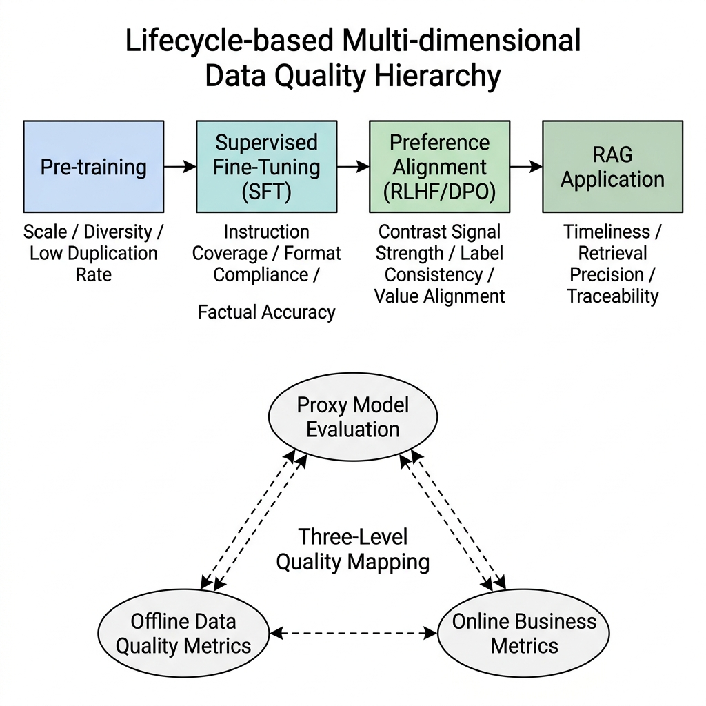
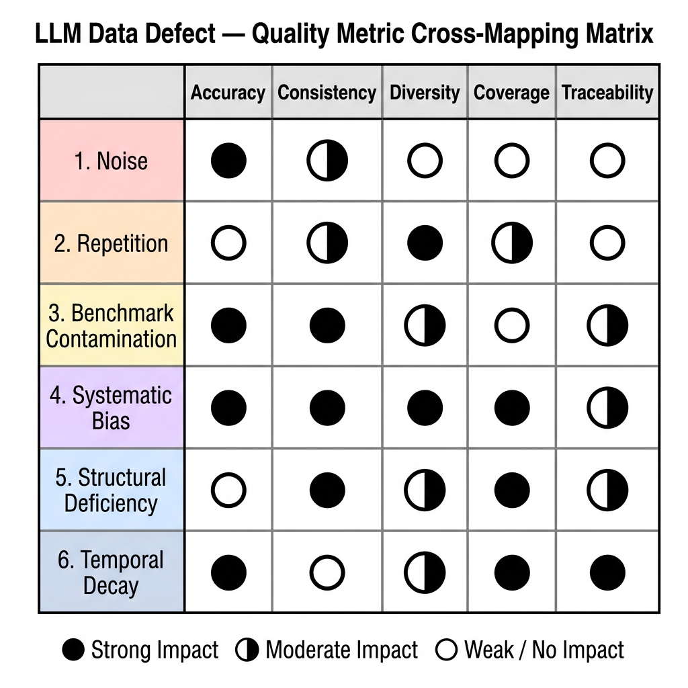

# Chapter 2: LLM data life cycle and quality assessment framework

## Summary

This chapter establishes the data quality assessment framework used throughout the book. "High-quality data" in large model projects is not a single indicator, but a multi-dimensional constraint that changes dynamically with the training stage, task goals and business scenarios. The chapter first explains why algorithm, data, annotation, and product teams disagree on the definition of quality, and proposes unified communication through a data quality terminology contract. Subsequently, this chapter breaks down the quality objectives, detection indicators and typical risks according to the four stages of pre-training, instruction fine-tuning, preference alignment and RAG application; and then establishes a hierarchical evaluation perspective from the sample level, batch level, data set level and system platform level. Finally, this chapter provides six types of core data defects, data release scorecards, CI/CD quality gates, and anonymization composite cases to illustrate how to transform quality assessments into executable governance actions, alert strategies, and rollback mechanisms.

**Keywords**: data quality assessment; data life cycle; data scorecard; baseline pollution; data governance; RAG assessment; DataOps

**Learning Objectives**

- Establish a consistent language of data quality terminology and metrics across teams.
- Differentiate data quality goals and evaluation methods for different training stages.
- Map common data defects into engineering indicators that can be detected, blocked, and reviewed.
- Design data release scorecards, quality gates and rollback processes.

## 2.1 Why is a unified quality language needed?

In the development process of large models, teams with different professional backgrounds often have significant cognitive differences in "what is good data". This lack of a unified “quality language” is an important reason for the delay, rework, or unstable model effects of many LLM projects.

### 2.1.1 Sources of team misunderstandings about "high-quality data"

In a typical large model development team, "high-quality data" means very different things to different roles. The following three anonymized composite scenarios combine common joint review meeting disagreements in front-line projects to illustrate the risks of this cognitive disconnect.

**Scenario 1: Algorithm researcher vs data engineer**

> **Algorithm Researcher** (looking at the Loss curve): "There is a problem with your new batch of data. It is obvious that the Loss cannot go up after the training step 8000, and the code generation ability has declined."
> **Data Engineer** (pointing to the quality report): "No! The cleanliness score of this batch of data is 0.91, which is 5 points higher than the previous version. We have specially added stricter length filtering, and the quality is the best version."

The root cause of the problem: The "quality" the two mentioned is not the same dimension at all. Strict length filtering filters out all long code snippets that contain edge cases - improving the quality of the "noise dimension" but reducing the quality of the "coverage dimension".

**Scenario 2: Annotation expert vs data engineer**

> **Annotation Expert**: "This batch of SFT raw data you gave me is too bad. Half of the answers are factually wrong, and some put events in 2023 in 2021."> **Data Engineer**: "I specifically used KenLM to run perplexity filtering on this batch of data. The PPL distribution is very good and the language fluency is very high."

Root cause of the problem: Perplexity Level (PPL) measures "language distribution reasonableness" - a paragraph with smooth language but all wrong facts can have a very low PPL (it looks "good"). The "factual accuracy" required by annotation experts is a dimension that is completely not covered by PPL filtering.

**Scenario 3: Product Manager vs Algorithm Researcher**

> **Product Manager**: "The model frequently hallucinates users' financial problems online. Yesterday, a user asked about the dividends of a certain stock this year, and the model seriously gave last year's wrong data."
> **Algorithm Researcher**: "On our benchmark evaluation set, this model's financial knowledge quiz accuracy is 78%, which is several points higher than the previous version."

Root cause of the problem: The deadline for financial knowledge in the internal evaluation set was the previous year, and users asked for real-time information online. The quality dimension of **Staleness** was not designed at all in the internal evaluation.

What the three scenarios have in common is that each party understands "quality" based on its own responsibilities, but these partial definitions do not form a common indicator system, which ultimately leads to systematic deviations in model performance.

**Implementation plan: Workshop to establish a unified quality language**

In most first-line large model teams, an effective way to solve this problem is to forcefully hold a **Data Quality Definition Alignment Workshop** during the project startup phase and output an internal "Data Quality Terms and Indicators Contract" document within the team. The first thing that this document needs to complete is to define a complete list of dimensions for the "quality" of this project - accuracy, diversity, repetition rate, timeliness, safety - and give a quantifiable calculation method for each dimension, rather than staying at the level of qualitative description.

Secondly, the document must define respective qualifying line thresholds for different training stages: the qualifying lines for Pre-training data and the qualifying lines for SFT data are fundamentally different in magnitude and dimension and can never be mixed. More importantly, documentation should establish an accurate mapping of terms to code. For example, when one party says "the repetition rate is too high", everyone in the group must have a unified understanding of these five words: its engineering meaning is "sample pairs with a MinHash Jaccard similarity greater than 0.8 account for more than 5% of the entire batch of data", rather than "this batch of data looks a bit repetitive" based on their own feelings.

This contract document is not a static document, but a versioned document that continues to evolve as the project progresses. At each important milestone (such as after a new model version is released), a review must be organized to check whether the existing indicator definitions are still applicable in the new stage and whether they need to be expanded or adjusted as the business scenario changes.

### 2.1.2 Why quality goals change dynamically from a life cycle perspective

Quality is by no means a static standard. As the data life cycle progresses, it presents completely different core demands at different stages. If a fixed standard is used to measure the data of the entire life cycle, there will inevitably be serious misjudgments.

**Table 2-1: LLM data four-stage quality target evolution matrix**| Training phase | Typical data size | Core quality requirements | Main detection indicators | Typical defects and risks | Main processing tools |
| :--- | :--- | :--- | :--- | :--- | :--- |
| **Pre-training** | Hundreds of B ~ dozens of T Tokens | High diversity, low repetition rate, broad knowledge coverage | N-gram repetition rate, PPL distribution, domain proportion, language distribution | Incomplete text deduplication ("rereader"); mixed benchmark question bank (evaluation scores are falsely high); excessive proportion of junk SEO | MinHash / SimHash; fastText language recognition; KenLM; Quality Classifier |
| **Instruction fine-tuning (SFT)** | Tens of thousands to millions of instruction pairs | Instruction diversity, format compliance, complete logical chain | Instruction difficulty distribution, format compliance rate, fact accuracy rate | Instruction semantics are nearly repeated ("approximate clones"); answer formats are confusing; answer fact errors | Rouge-L deduplication; GPT-4 fact audit; format regularity verification |
| **Preference Alignment (RLHF/DPO)** | Tens to hundreds of thousands of preference pairs | Preference difference significance, value fit, harmlessness | Annotation consistency Cohen's κ (Cohen 1960); chosen/rejected quality gap; toxicity score | Annotator preferences are inconsistent (κ < 0.6); chosen/rejected gap is not large enough (weak signal); cultural bias exists | Multiple rounds of calibration; Reward Model Prescreen; Perspective API (Lees et al. 2022) |
| **RAG application implementation** | Thousands to tens of thousands of documents | Timeliness, business coverage, retrieval recall accuracy | Knowledge deadline distribution; scene coverage recall rate; Faithfulness score | Knowledge base is old (not updated for 6 months); too large slice granularity leads to high recall noise; PDF parsing garbled characters | LlamaIndex/LangChain; RAGAs evaluation framework; Embedding quality assessment |

As can be seen from the table: It is also the "quality assessment". From "duplication rate and PPL distribution" in the pre-training stage to "labeling consistency and preference gap" in the RLHF stage, the main indicators have switched. A data set that is qualified in the pre-training stage may not be qualified in the SFT stage due to factual accuracy, format compliance, or insufficient task coverage. This phased migration of quality goals requires the data engineering team to establish a Phase-Specific Quality Contract rather than using a single universal standard to measure all phases.


### 2.1.3 Governance failure phenomenon when there is no unified framework
When there is a lack of a unified data quality assessment framework, projects are bound to experience "governance failure." Typical symptoms include:

1. **Metric Silos**: The pre-training team uses Perplexity Level (PPL) as the core script; the fine-tuning team uses ROUGE-L to measure reply quality; the security team uses the toxicity score of the Perspective API as a compliance indicator. There is a lack of common language between the three systems. When a batch of data triggers alarms for multiple teams at the same time, it is difficult for the team to determine who will lead the repair, and it is also difficult to determine which indicator has the right to veto the release.

2. **Noise Propagation Amplification**: Without a unified framework, small noise in the upstream data pipeline often cannot be intercepted early, and spreads and amplifies along the pipeline, causing orders of magnitude harm downstream:

    ```text
    [Crawling/storage layer] 0.5% of base64-encoded images are mixed into the text stream
          -> not intercepted in time because there is no unified defect standard
    [Cleaning/training layer] these garbled fragments raise the frequency of specific character tokens by 3x
          -> noise is repeatedly amplified during gradient accumulation
    [Inference/alignment layer] the model emits garbled output for about 12% of one content type
          -> severe online hallucination appears and user complaints surge
    [Final cost] the model version is rolled back, losing three weeks of training compute and market window
    ```

    This amplification effect of "1% upstream error → 10% midstream anomaly → 30% downstream loss" can be understood as cross-stage error conduction in the data pipeline. Its governance plan is the unified quality gate system that will be established in this chapter.

3. **Experience Loss**: Since there is no unified defect classification standard, the review conclusion after every problem with the model often stays at "the data is too bad, we should pay attention to it next time". Is "too bad" due to too high a repetition rate, unbalanced field ratio, or baseline pollution? Due to unclear classification, these lessons cannot be transformed into specific rule modifications for the next version of the cleaning pipeline. After the introduction of a unified quality framework, each data problem can be classified into a clear defect type (see Section 2.3), and correspond to repair operators and quantitative improvement goals. The review document should change from "The data is too bad" to "The root cause of this accident: the duplication rate exceeded the standard (the proportion of samples with MinHash similarity > 0.8 increased from 2.3% to 7.1%); the repair plan: tighten the threshold to 0.7, and retest the duplication rate in the next version of incremental verification."


---

## 2.2 Quality goal stratification from a life cycle perspective

To solve the problem of language inconsistency, we must establish a clear "quality goal hierarchy" at each stage of the life cycle.



*Figure 2-1: Multi-dimensional quality layered architecture from a life cycle perspective. Source: Self-drawn in this book. The figure shows the migration of indicator weights at different stages, gradually shifting from scale and diversity to authenticity, helpfulness and traceability. *


### 2.2.1 Differences in goals at each stage

Each stage in the large model training chain has different quality goals. Pre-training focuses on corpus size, diversity and low repetition rate; SFT focuses on instruction coverage, format compliance and factual accuracy; preference alignment focuses on contrast signals and annotation consistency; RAG application focuses on knowledge timeliness, retrieval recall and evidence traceability.

The **Pre-training phase** is the first phase and the goal is to build a broad range of language, code, and knowledge representations. At this time, the requirement for the corpus is not that every sentence is absolutely correct, but that it is of sufficient scale, high diversity, and low repetition rate. At this stage, the model contacts different fields, language styles, and knowledge boundaries in an unsupervised manner to build basic representation capabilities. At this stage, a popular science article with slightly outdated facts is usually not a major risk, but if the same SEO advertising article is repeated thousands of times in the corpus, it will significantly increase the risk of generation degradation and memory overfitting.

**Command fine-tuning (SFT) phase** is the second phase, and the quality goal is narrowed from "breadth" to "precision": the diversity of commands, the compliance of the reply format, and the integrity of the reasoning chain are all indispensable. The SFT stage is usually more sensitive to contamination than the pre-training stage, because at this time the model learns task formats and interactive behaviors; a small number of samples with confusing formats or logical errors may also cause observable degradation on the corresponding tasks.

**Preference alignment (RLHF/DPO) stage** is the third stage. The core quality goal is to compare the validity of the data and the fit of values: there must be a sufficiently discernible quality gap between the chosen answer and the rejected answer (Ouyang et al. 2022; Rafailov et al. 2023). Otherwise, the reward signal is too weak and it is difficult for the model to learn a stable human preference direction.

**RAG application implementation phase** is the fourth phase and the phase closest to users. The quality indicators here turn to timeliness and retrieval accuracy: the proportion of documents in the knowledge base that have not been updated for more than 6 months, whether the retrieved chunks accurately cover the user's question intent, and whether there are field misalignments in PDF and table parsing. These questions are not always explicit in the first three stages, but in the RAG scenario have a direct impact on the final answer quality.### 2.2.2 Triangular mapping of offline, online and service quality

However, it is not enough to define quality goals at each stage separately - a mature data engineering framework must further open up the complete "indicator chain" from data to model to real business, instead of letting "good data quality" and "good online effects" become two separate evaluation systems.

In industrial practice, this indicator chain is described as a **triangular mapping structure**. The first top corner is **Offline Data Quality Indicators**, which are static scores that can be calculated during the data storage and processing stage, including deduplication rate, PPL distribution mean, baseline pollution rate, etc.; these indicators can be calculated efficiently without running the model, and are suitable for automatically triggering inspections in the CI/CD pipeline. The second top corner is **proxy model evaluation quality**, which is to inject the processed data into a small-scale surrogate model (usually 1B level) for rapid training and testing, and use the benchmark test score to measure the actual training value of the data - this step is an indispensable "bridge verification" between offline data indicators and the final model effect. The third top corner is **real business online system quality**, that is, the real retention rate, satisfaction score and conversion indicators of users after the model is launched.

Ideally, the three should show a stable positive correlation. Once a certain edge of this triangle is broken - for example, the offline data score is very high but the proxy model score has not improved, or the proxy model score is very high but the online user feedback is poor - it is a strong signal that the current evaluation framework has a systemic design flaw in a certain link, and it is necessary to immediately analyze which indicator is decoupled from which indicator, and trace the source to the root cause of the data layer.


### 2.2.3 Aspect stratification: sample level to system level

Quality assessment also requires cross-section stratification in the dimension of "granularity". Quality problems with different granularities have completely different discovery timing, repair costs, and repair methods. If they are lumped together, it is easy for there to be a mismatch between the repair methods and the problem level.

The most granular is Sample-level. This is the earliest level of detection in the data pipeline - does this long piece of text contain remnants of HTML tags? Is this image semantically aligned with the corresponding text description? Does the answer to this question-and-answer pair seriously deviate from the direction of the question? The number of sample-level problems is large but the cost of repairing a single problem is low, so it is suitable for batch processing with automated rules.

The next level up is **Batch-level**. This granularity focuses on the overall statistical distribution characteristics of a batch of data: Does the domain sampling ratio of this batch deviate by more than 10% from the preset baseline? Has the ratio of code corpus to natural language changed suddenly because a certain crawler quota has expired? Batch-level problems will not appear on a single sample, but can only be discovered on the statistical portrait of the entire batch, so special rolling distribution monitoring is required.

Further up is the **Dataset-level**, which focuses on the macro health of the entire training set: Is the time distribution of knowledge in the entire corpus severely concentrated in certain years? What proportion of content is flagged as high risk in benchmark contamination detection? Does the proportion of each language meet the training needs for multilingual abilities? Issues at this level are strategic and are usually completed by the data engineering leader through manual review and report review before a version is released, rather than relying on automated pipelines.

Finally, there is the **system platform level (System-level)**, that is, the operating health status of the engineering entity of the data pipeline itself: Is there a backlog in a certain Kafka consumption queue? Did a certain version of the MinHash deduplication task silently exit early due to memory OOM, leaving a large amount of unprocessed duplicate data? The problem at this level is not the data content itself, but the engineering quality monitoring of the data pipeline, which is the core focus of DataOps observability (will be discussed in depth in Part 8).

---

## 2.3 Defect classification and indicator matrix

To establish public governance actions, those vague “data are bad” must be translated into a matrix of concrete, measurable defect indicators.

*Figure 2-2: Cross-mapping diagram of large model data defects and quality indicators. Source: Self-drawn in this book. This figure shows the impact relationship network between the six core defect types (noise, duplication, baseline pollution, system deviation, structure loss, timeliness decay) and the five core quality indicators (accuracy, consistency, diversity, coverage, traceability). *

### 2.3.1 Six Core Defect Classes

For large model training, we have established the following six core defect dimensions, and each defect is equipped with an automated detection solution:

**1. Noise**

Definition: Contains HTML residual tags, garbled characters, meaningless symbol sequences, base64 encoding fragments, etc., which will produce abnormal input to the Tokenizer, and in severe cases, lead to gradient NaN.

```python
import re

def noise_score(text: str) -> float:
    """Return the noise ratio; values above 0.1 indicate high-noise samples."""
    # Detect residual HTML tags.
    html_tags = len(re.findall(r'<[^>]+>', text))
    # Detect a high proportion of non-printable characters.
    non_printable = sum(1 for c in text if not c.isprintable())
    # Detect repeated symbol runs, such as !!!!!!!.
    repeat_symbols = len(re.findall(r'[^\w\s]{5,}', text))
    total = len(text) if text else 1
    return (html_tags * 10 + non_printable + repeat_symbols * 5) / total

# Filtering threshold: discard samples where noise_score > 0.1.
```

*Code Listing 2-1: Text noise ratio detection example. The production environment should be supplemented with language, encoding, HTML parser version and abnormal sample sampling logs. *

**2. Vicious Repetition**

Definition: The same content (exact or approximate) appears repeatedly in the training set a large number of times, and the model is forced to "recite" these fragments, causing memory overfitting and becoming a "re-reader" during reasoning. The industry generally uses MinHash LSH for approximate deduplication.

```python
from datasketch import MinHash, MinHashLSH

def build_minhash(text: str, num_perm: int = 128) -> MinHash:
    m = MinHash(num_perm=num_perm)
    for word in text.lower().split():
        m.update(word.encode('utf-8'))
    return m

# Suggested deduplication threshold: Jaccard similarity > 0.8
# is treated as duplicate for pre-training. SFT data can be stricter:
# remove samples above 0.6.
lsh = MinHashLSH(threshold=0.8, num_perm=128)
```

*Code Listing 2-2: Example of approximate duplicate detection based on MinHash LSH. Thresholds, sharding strategies, and sampling review results should be documented in the production environment. *

**3. Benchmark Contamination**

Definition: The crawler captures the original questions and answers from various public AI evaluation question banks (GSM8K, HumanEval, MMLU, etc.) into the pre-training set without filtering. The model scores falsely high on the benchmark test (mechanical recitation rather than reasoning).

```python
# Benchmark-contamination detection: compute the N-gram overlap rate.
from collections import Counter

def ngram_overlap(text: str, benchmark_ngrams: set, n: int = 13) -> float:
    """Return the 13-gram overlap ratio with the benchmark question bank."""
    words = text.split()
    text_ngrams = set(
        ' '.join(words[i:i+n]) for i in range(len(words) - n + 1)
    )
    overlap = len(text_ngrams & benchmark_ngrams)
    return overlap / max(len(text_ngrams), 1)

# Suggested threshold: mark samples with 13-gram overlap > 0.1
# as suspected contamination and send them to manual review.
```

*Code Listing 2-3: Baseline pollution N-gram overlap detection example. An independent fingerprint database of evaluation sets and a manual review process should be maintained in the production environment. *

**4. System bias (Bias)**

Definition: Due to the geographical, language or topic focus of the data crawling site, the data has systematic knowledge biases such as country, gender, race, ideology, etc., and the model performs unbalanced on tasks related to specific groups.

Detection plan: Use StereoSet (Nadeem et al. 2021) or WinoBias (Zhao et al. 2018) to evaluate the degree of bias of the set evaluation model; at the same time, count the word frequency distribution of sensitive groups (gender/ethnicity/religion) involved in the training set to check whether there is a serious word frequency imbalance (the frequency of one group is more than 10 times higher than that of another group).

**5. Incompleteness**

Definition: Long text is truncated (only the first half of the article), question and answer pairs only have answers but no questions, pictures in multi-modal data lack supporting text descriptions, etc.

```python
def check_completeness(sample: dict) -> list:
    """Check structural completeness for an SFT sample."""
    issues = []
    if 'instruction' not in sample or not sample['instruction'].strip():
        issues.append('missing_instruction')
    if 'response' not in sample or len(sample['response']) < 20:
        issues.append('response_too_short')
    # Check truncation: the text ends mid-sentence without punctuation.
    resp = sample.get('response', '')
    if resp and resp[-1] not in '.!?。！？…"\'':
        issues.append('possibly_truncated')
    return issues
```

*Code Listing 2-4: SFT sample structural integrity detection example. In the production environment, schema validation, field length distribution, and sampling review rules should be supplemented by task type. *

**6. Staleness**

Definition: The knowledge base or pre-training corpus stays at a certain time cut-off point and cannot respond to factual changes that occur after the cut-off date. This is especially fatal in RAG application scenarios.

Detection plan: record `crawl_timestamp` meta-information for each document in the corpus, and regularly count the proportion of documents in the knowledge base that have not been updated for more than N months. When the proportion of documents older than 6 months reaches 30%, an aging decay warning is issued.```python
from datetime import datetime, timedelta

def staleness_ratio(docs: list, threshold_days: int = 180) -> float:
    """Return the ratio of documents older than the threshold."""
    now = datetime.now()
    stale = sum(
        1 for d in docs
        if (now - datetime.fromisoformat(d['crawl_timestamp'])).days > threshold_days
    )
    return stale / len(docs) if docs else 0.0
# Recommendation: trigger a knowledge-base update when staleness_ratio > 0.3.
```

*Code Listing 2-5: Example of knowledge base aging decay detection. Different thresholds should be set in production environments by domain, data source and business priority. *

### 2.3.2 Establish core indicator matrix
In order to quantify the defects, the book adopts five major assessment indicators:
1. **Accuracy**: The rate at which data contains correct knowledge is the best indicator for fine-tuning data.
2. **Consistency**: Whether there are contradictions (logical consistency) in the upstream and downstream data and in each modal combination.
3. **Diversity/Entropy**: The distribution of discreteness covering different topics.
4. **Coverage**: The hit rate and recall of business scenarios in the data flow.
5. **Traceability**: When an error occurs, can the source of dirty data be traced to a certain web page or original bucket (seriously affecting debugging efficiency).

### 2.3.3 Game and conflict relationship between indicators
There is no perfect combination of indicators. Forcibly improving one indicator often comes at the expense of another indicator falling. For example:
* **Deduplication (improving accuracy/avoiding overfitting) vs. diversity**: Too strict MinHash deduplication threshold (for example, discarding if the similarity exceeds 0.7) will eliminate many high-quality feature learning that are different at subtle edges (such as template code), resulting in compromised code capabilities.
* **Accuracy vs Timeliness**: The extremely demanding manual expert-level verification will significantly lengthen the production cycle. At this time, when high-quality corpus is generated, the corresponding facts may have changed.

---

## 2.4 From scorecard to governance action: automatic washing and screening closed loop

The quality assessment framework must eventually be implemented into specific engineered automatic gates. We established a closed loop by setting up a "Data Release Scorecard".


*Figure 2-3: Data scorecard-driven automatic truncation and governance flow. Source: Self-drawn in this book. This diagram shows how hard gates, soft gates, manual reviews, and rollback actions work together to block contaminated or degraded data samples. *

### 2.4.1 Design and implementation of data scorecard

The scorecard is a "data physical examination report" synthesized from a set of rule scripts and verification models. Its core design principles are: **objective repeatable calculation, threshold baseline configuration, and action-oriented interception**. Before any version of the training dataset can be officially released, the scorecard script must be forced to trigger and serialize the evaluation results into a standard JSON format archive.

**Code Listing 2-6: SFT dataset release scorecard JSON example**

[[[../../images/part1/data_quality_hierarchy_1775835516841.png0]]]

**Code Listing 2-7: GitHub Actions example integrated with CI/CD pipeline**

[[[../../images/part1/data_quality_hierarchy_1775835516841.png1]]]

With the above integration, the CI pipeline automatically runs a scorecard check every time a data engineer merges a new batch of data. If any hard gate indicator exceeds the threshold, PR Merge will be automatically blocked until the problem is fixed and resubmitted.


### 2.4.2 Quality threshold, blocking gate design and rollback (Rollback)
When a newly crawled batch of 100G incremental data arrives at the pipeline:* **Hard Gates**: If it is found that the baseline pollution rate has increased significantly, or the security blacklist dictionary is hit, it will be blocked immediately at this stage (Stage), prohibiting flow to the next level and automatically triggering an alarm (PagerDuty).
* **Soft Gates**: If the average text complexity is 5% lower than the previous version, it will be temporarily sealed for manual confirmation. This is called "grayscale freezing".
Once post-event monitoring reveals serious degradation of the online model (due to data), the DataOps platform should support **one-click rollback to the previous "clean" data pointer combination**.

### 2.4.3 Convert alarms into repair actions
After an abnormal score is discovered, the alarm needs to be mapped to standardized repair actions. If there is a contamination rate alarm, the N-gram reverse filtering and elimination operation is started; if the format verification fails (such as a missing field in a batch of data), the import is blocked and the original crawler parsing script node is located, and the ETL fields are re-extracted. Only by allowing alarms to directly drive the corresponding cleaning operators can governance form a closed-loop system.

---

## 2.5 Cross-stage conduction amplification case

In order to deepen our understanding of this data quality transmission mechanism where “one hair affects the whole body”, this section reviews two anonymization composite cases. The timeline and indicators in the case are used to illustrate troubleshooting logic and do not represent the complete event record of a public project.

### 2.5.1 Case Playback 1: "Implicit Grammar Drift" of Pre-training Corpus
After an open source model was released in 2023, it was found that as the number of steps increased, the ability to generate code not only did not improve, but began to degrade and even introduced rare and strange whitespace characters.
**Tracing analysis**: The team traced the access of the previous batch of data and found that during language recognition and cleaning, some HTML format filter packages were upgraded. The [[[../../images/part1/data_quality_hierarchy_1775835516841.png2]]] code tags that were normally skipped caused parsing failures, resulting in a large number of web page source codes with special space indentations suddenly increasing by 4 times in the last 1T of data (this is a weight loss caused by not setting a baseline check for "consistency" in the quality indicator). The model silently undergoes "distribution drift" during long-term training.
**Lessons and review**: At the batch-level, there was a lack of long-term static distribution stability monitoring, which forced the team to later build a rolling N-gram distribution radar.

### 2.5.2 Case Replay 2: “Offline high score, online failure” in RAG scenario
After the financial knowledge question and answer model was trained using a certain batch of private research report SFT, the Rouge/Bleu score on the offline evaluation set far exceeded the baseline model. However, after the business department went online, they reported that the model frequently fabricated data (serious hallucinations) when encountering research reports from long-tail companies.
**Tracing analysis**: The research report question and answer pairs used in SFT training were generated by a weak model and the format was relatively neat. However, a random inspection found that a large number of financial figures were misaligned due to errors in table splitting and parsing. The offline evaluation set is also generated by the same process, so the evaluation data shares the same kind of parsing errors as the training data, causing Rouge/Bleu scores to overestimate true capabilities.
**Lessons and review**: This case shows that the separation of self-reference evaluation and offline and online indicators will significantly amplify risks. After this version, the team introduced the **Independent Gold Standard Evaluation Set (Gold Standard Set)**, which is independently written by human experts and does not participate in any model synthesis or generation links, and serves as a veto evaluation set before going online.

**Complete troubleshooting timeline (Case 1)**- **T+0 days**: Internal beta users reported strange indentation in Python code generation, and [[[../../images/part1/data_quality_hierarchy_1775835516841.png3]]] was reported immediately after running.
- **T+1 days**: The algorithm team speculates that it is a problem with the temperature parameter (Temperature), which will be invalid after adjustment.
- **T+2 days**: The data team is pulled in to retrieve the data batch diffs of the last 3 Checkpoints
- **T+3 days**: It was found that when the 6th batch (about 1.2T Tokens) was connected, the HTML filter dependency package was upgraded from v2.3.1 to v2.4.0. The new version changed the processing logic of the [[[../../images/part1/data_quality_hierarchy_1775835516841.png4]]] tag, and the code indentation that should have been retained was mistakenly converted to non-standard spaces.
- **T+3 days**: Quantitative verification: [[[../../images/part1/data_quality_hierarchy_1775835516841.png5]]] accounts for **1.2%** of all whitespace characters in batch 5 (normal), rising to **4.9%** in batch 6 (increased 4 times)
- **T+5 days**: Lock the dependent version, reprocess the 6th batch of data, and restart training from the checkpoint before the contamination (about 4 days of computing power loss)
- **T+12 days**: Post-fix HumanEval pass@1 restored from **42.3%** to **51.7%**

Root cause: Lack of rolling distribution smoothness monitoring at the batch level. If the Z-score changes in the frequency of key characters can be automatically compared when each batch of data is accessed (an alarm exceeds 2σ), this accident can be intercepted at T+0.

[[[../../images/part1/data_quality_hierarchy_1775835516841.png6]]]

*Code Listing 2-8: Batch-level indent character drift detection example. In the production environment, the alarm threshold should be changed to a statistical threshold based on historical distribution. *

**Complete troubleshooting timeline (Case 2)**

- **T+0 days**: Within 6 hours of going online, many users reported that the financial report data was inconsistent with the official website (the difference was about 20%)
- **T+1 days**: The operations team reviews 50 hallucination cases, all involving tabular data (revenue, EPS, etc.)
- **T+2 days**: The data team randomly checked 200 samples containing financial tables and found that **34% of the financial figures were misaligned**. The root cause is that when the weak model parses a multi-column PDF table, the numbers between columns are incorrectly aligned.
- **T+3 days**: It was further found that the offline evaluation set was also generated by the same set of weak models, and ROUGE-L 0.63 overestimated the true capabilities of the system.
- **T+5 days**: Emergency treatment: Stop automatically generating financial QA for weak models and replace it with manual annotation; add manual review marks to RAG Chunks containing financial figures
- **T+14 days**: Introducing the independent gold standard assessment set (600 items, 100% human-written). After the fix, the ROUGE-L is **0.49**, but the system hallucination rate drops from **34% to 4.7%**, and user complaints are significantly reduced.

**Core Lesson**: **Self-referential Evaluation** is a high-risk issue in RAG and synthetic data scenarios. The independent gold standard evaluation set should meet three requirements: (1) independently written by human experts; (2) physically isolated from the training data pipeline; (3) after each data set iteration is released, the gold standard set results must be included in the score card as an online rejection indicator.


---

## 2.6 How does this chapter become the "public contract" for subsequent projects?

Starting with this chapter, the book formalizes the "public contract" that applies to the various engineering approaches that span hundreds of pages.

* **For the second article (text pre-training) and the third article (multi-modal)**: the thresholds and filtering baselines in cleaning, deduplication, parsing and alignment are derived from the combination of the bottom-line principles of "signal-to-noise ratio and consistency" set in this chapter.
* **For Article 4 (Instruction Fine-tuning and Preference Data) and Article 5 (Synthetic Data)**: The indicator matrix here will be transformed into the basis for Reward model scoring, rule verification and manual review in SFT data design, preference data construction and synthetic data audit.
* **To support Chapter 8 (DataOps Platform)**: The core charts of the large alarm screen and quality dashboard on the platform display the indicator library, gate status and rollback data version discussed in this chapter.

Therefore, this is a "book-wide" checklist. Before moving forward to the execution of each specific phase, first ensure that the entire team has achieved "cognitive alignment" on these terms. With this systematic measurement ruler in this chapter, now, in the next chapter, let us go into the basic engineering that can truly realize and support these measurement actions - **AI-native modern data infrastructure**.

---

**Summary of this chapter**

This chapter systematically establishes a "public contract on data quality" throughout the book. Starting from three anonymized composite dialogue scenarios, we analyzed why teams with different professional backgrounds always have cognitive gaps in "high-quality data" - this is by no means a personal problem, but an inevitable structural result of the lack of a unified quality framework.

Through the four-stage quality goal evolution matrix, we reveal that quality standards are not static, but dynamically migrate with the training life cycle: the pre-training stage pursues scale and diversity, the SFT stage pursues accuracy and format compliance, the RLHF stage pursues preference difference significance, and the RAG stage pursues timeliness and retrieval recall. Measuring all stages with a fixed set of standards will inevitably lead to misjudgment.

The six core defect classifications (noise, duplication, baseline pollution, system deviation, lack of structure, timeliness decay) provide the team with a common language to translate the vague "data is bad" into measurable and actionable indicators, and attach directly runnable Python detection code for each defect.

Data release scorecard (with complete JSON example) and GitHub Actions CI/CD integration solution upgrade quality assessment from manual perceptual judgment to engineering gates that can automatically trigger blocking. Two in-depth review cases (syntax drift and self-reference evaluation) reveal the cross-stage amplification mechanism of data problems in the pipeline through the T+N day timeline, as well as the irreplaceable value of the independent gold standard evaluation set.

With this quality measurement system in mind, we have laid a solid governance foundation for the engineering content throughout this book.

## References

Cohen J (1960) A Coefficient of Agreement for Nominal Scales. Educational and Psychological Measurement 20(1):37-46.

Lees A, Tran V Q, Tay Y, Sorensen J, Gupta J, Metzler D, Vasserman L (2022) A New Generation of Perspective API: Efficient Multilingual Character-level Transformers. In: Proceedings of the 28th ACM SIGKDD Conference on Knowledge Discovery and Data Mining, pp 3197-3207.Nadeem M, Bethke A, Reddy S (2021) StereoSet: Measuring Stereotypical Bias in Pretrained Language Models. In: Proceedings of the 59th Annual Meeting of the Association for Computational Linguistics, pp 5356-5371.

Zhao J, Wang T, Yatskar M, Ordonez V, Chang K W (2018) Gender Bias in Coreference Resolution: Evaluation and Debiasing Methods (WinoBias). In: Proceedings of the 2018 Conference of the North American Chapter of the Association for Computational Linguistics, pp 15-20.

Ouyang L, Wu J, Jiang X, Almeida D, Wainwright C, Mishkin P, Zhang C, Agarwal S, Slama K, Ray A, Schulman J, Hilton J, Kelton F, Miller L, Simens M, Askell A, Welinder P, Christiano P F, Leike J, Lowe R (2022) Training Language Models to Follow Instructions with Human Feedback. Advances in Neural Information Processing Systems 35:27730-27744.

Rafailov R, Sharma A, Mitchell E, Manning C D, Ermon S, Finn C (2023) Direct Preference Optimization: Your Language Model Is Secretly a Reward Model. Advances in Neural Information Processing Systems 36:53728-53741.


Chen M, Tworek J, Jun H, Yuan Q, Pinto H P d O, Kaplan J, Edwards H, Burda Y, Joseph N, Brockman G, others (2021) Evaluating Large Language Models Trained on Code (HumanEval). arXiv preprint arXiv:2107.03374.

Cobbe K, Kosaraju V, Bavarian M, Chen M, Jun H, Kaiser L, Plappert M, Tworek J, Hilton J, Nakano R, Hesse C, Schulman J (2021) Training Verifiers to Solve Math Word Problems (GSM8K). arXiv preprint arXiv:2110.14168.

Hendrycks D, Burns C, Basart S, Zou A, Mazeika M, Song D, Steinhardt J (2021) Measuring Massive Multitask Language Understanding (MMLU). In: International Conference on Learning Representations.

Broder A Z (1997) On the Resemblance and Containment of Documents. In: Proceedings of the Compression and Complexity of Sequences, pp 21-29.

Heafield K (2011) KenLM: Faster and Smaller Language Model Queries. In: Proceedings of the Sixth Workshop on Statistical Machine Translation, pp 187-197.
