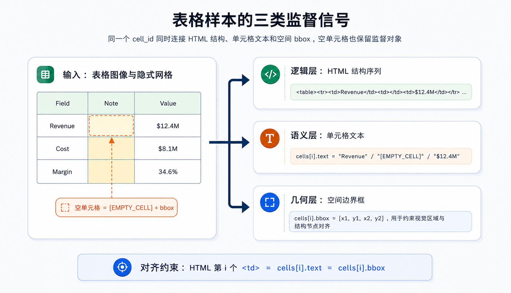
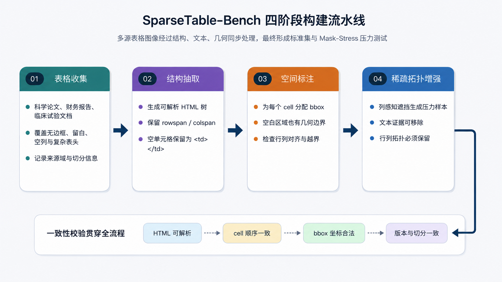
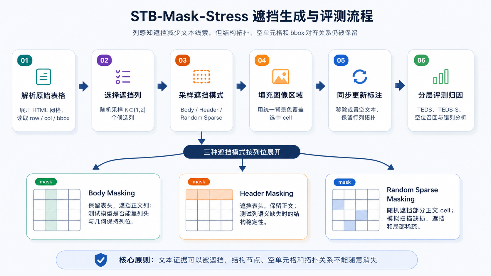

# Chapter 39: SparseTable-Bench Table-Structure Robustness Data Engineering

Tables are among the most underestimated objects in document intelligence. For ordinary paragraphs, restoring text order is often enough for retrieval, summarization, or question answering. For tables, text is only the surface. Meaning is determined by row-column topology, cell boundaries, row and column spans, and structural positions implied by blank areas. A cell with no text may still be a valid column position, a missing observation, or an alignment anchor. If a model skips these blanks when generating HTML or Markdown, downstream numeric comparison, field extraction, and evidence localization all drift.

SparseTable-Bench (STB) is built around this problem. It is not a general OCR dataset and not a table-content benchmark that checks only cell text. It targets table structure recognition (TSR) and geometry-aware annotation. STB contains table images from scientific papers, financial reports, clinical-trial documents, and other sources. It focuses on borderless tables, sparse layouts, large blank regions, and complex row/column spans. Each sample provides synchronized HTML structure, cell-level text, and fine-grained bounding boxes. STB-Mask-Stress further creates an occlusion stress test to observe whether models can preserve stable row-column structure under severe information loss.

In Chapter 38, constraints came from business fields, bill layout, and field-level arithmetic consistency. In STB, constraints come from the table itself: topology, empty cells, and spatial boundaries. This chapter explains how a benchmark for sparse tables defines task boundaries, organizes sample schema, preserves empty cells, builds stress tests, interprets TEDS/TEDS-S, and becomes a trainable, evaluable, and reproducible data asset.

## 39.1 Why Table Structure Recognition Needs a Dedicated Benchmark

Visual document understanding often simplifies tables into collections of text blocks. This sometimes works for dense tables because every row-column position has text that acts as an implicit anchor. It fails quickly in weak-border, blank-heavy, empty-column, or merged-cell scenarios. The model sees scattered text and large blank areas; grid lines may be invisible, so logical structure must be inferred from layout, alignment, and context.

Traditional TSR evaluation often compares the final HTML tree or cell text. The problem is that if annotations do not preserve empty cells, a model may skip empty columns and still produce a plausible text sequence. If evaluation compares only non-empty text, content from the third column may shift left into the second column without enough penalty. If no cell-level bbox exists, a correct number of `<td>` nodes does not prove those nodes align with the image. In financial reports, clinical trial tables, and scientific result tables, this is not cosmetic. It changes field ownership and evidence chains.

STB places these risks into data design. Each table sample has three synchronized layers:

- **Logical layer:** HTML tags represent rows, columns, cells, and span relationships.
- **Semantic layer:** each cell's text represents readable information, while empty cells are preserved as explicit objects.
- **Geometric layer:** each cell's bounding box records its spatial position in the image.

All three layers are necessary. HTML without bbox cannot constrain spatial alignment. Bbox without HTML cannot teach topology. Non-empty text without empty placeholders systematically underestimates sparse-layout difficulty.

## 39.2 Dataset Overview and Task Boundary

The task is: given a table image, recover a parseable structured representation while keeping text, structure, and geometry consistent. Models output an HTML-like structure sequence and align cell-level text and bbox. STB supports ordinary TSR training and robustness testing for VLMs under sparse, borderless, or partially occluded conditions. It is often used as data support for SA-Table and Structural Prior Injection Adapter (SPIA) style methods, but this chapter focuses on the data design rather than model architecture.

Public dataset entry:

https://huggingface.co/datasets/champion666/SparseTable_Bench_Dataset

The dataset is often described as about 11,000 table images. By split, it contains 10,983 images.

| Split | Image Count | Annotation Format | Main Use |
| --- | ---: | --- | --- |
| STB-Train | 8,000 | HTML + cell bbox | Multi-task supervised training |
| STB-Val | 1,000 | HTML + cell bbox | Hyperparameter selection and development evaluation |
| STB-Standard-Test | 1,000 | HTML + cell bbox | Standard generalization evaluation |
| STB-Mask-Stress | 983 | Occluded tables + topology labels | Robustness under sparse and missing-information conditions |
| **Total** | **10,983** | - | Training, validation, standard testing, and stress testing |

STB covers three capabilities. First, **table structure recognition**: recover `<table>`, `<tr>`, `<td>`, row/column organization, empty positions, merged cells, and local alignment. Second, **geometry-aware annotation**: each cell has `bbox=[x1,y1,x2,y2]`, enabling location-aware heads and error analysis. Third, **mask stress testing**: STB-Mask-Stress reduces textual cues through column-level and local occlusion to test whether topology is preserved.

## 39.3 Sample Schema: Synchronized HTML, Text, and Bbox

STB represents each table image as a synchronized multi-signal sample rather than a single target format. The example below keeps the second cell empty while preserving it as a valid structural column.

```json
{
  "html": "<table><tr><td>Revenue</td><td></td><td>$12.4M</td></tr></table>",
  "cells": [
    {
      "text": "Revenue",
      "bbox": [34, 52, 118, 74]
    },
    {
      "text": "[EMPTY_CELL]",
      "bbox": [118, 52, 215, 74]
    },
    {
      "text": "$12.4M",
      "bbox": [215, 52, 310, 74]
    }
  ]
}
```

`[EMPTY_CELL]` is not ordinary text. It expresses “the structure exists but the content is empty.” Even if no readable character exists in the region, the position still has row-column coordinates, bbox, and context. This prevents the model from treating blank regions as nonexistent and reduces column collapse and left-shift errors.



From a data-engineering perspective, the schema contains these objects and checks:

| Object | Typical Fields | Role | Quality Checks |
| --- | --- | --- | --- |
| Image | `image_id`, image file, width, height | Visual input and bbox coordinate reference | Image opens; resolution matches bbox coordinate system; no corrupt page |
| HTML structure | `html`, `rowspan`, `colspan` | Logical topology and output sequence | HTML parseable; row/column counts consistent; merged cells do not conflict |
| Cell text | `cells[i].text` | Semantic content of each cell | Text order matches HTML order; empty cells use one placeholder; symbols normalized |
| Empty cell | `[EMPTY_CELL]` or equivalent | Preserve structure with empty text | Not filtered; bbox exists; participates in structural evaluation |
| Bounding box | `cells[i].bbox=[x1,y1,x2,y2]` | Align visual region and structure node | In bounds; positive area; row/column approximate alignment; one-to-one with cells |
| Split | `split`, version, source domain | Support reproducibility | No train/test leakage; pressure set relation clear; version traceable |

The empty-cell token must be consistent across data, tokenizer, training script, and evaluation script. If `[EMPTY_CELL]` and variants such as `[EMPTY CELL]` are mixed, tokenization and evaluation targets diverge.

## 39.4 Four-Stage Construction Pipeline

STB can be organized into four stages: table collection, structure extraction, spatial annotation, and sparse-topology augmentation.



### 39.4.1 Table Collection

Raw images come from scientific publications, financial reports, clinical-trial documents, and similar sources. These sources naturally contain irregular tables: borderless result tables, financial tables with layered headers and blank groups, and clinical tables mixing metrics, groups, time points, and missing observations. Data collection should emphasize sparse structural diversity, not just image count.

### 39.4.2 Structure Extraction

This stage converts logical topology into HTML. HTML is useful because its tag tree expresses rows, columns, and cells, and metrics such as TEDS operate directly on HTML trees. Ordinary cells need row and column ownership. Merged cells must keep `rowspan` and `colspan`. Empty cells must keep `<td>` nodes rather than being deleted.

The common failure is “visually plausible but logically unparsable.” A missing empty `<td>` may be hard to see manually, but after HTML expansion it shifts subsequent columns. Structure extraction should therefore parse HTML back into a grid matrix and check expanded column counts, occupied merged-cell regions, empty positions, and cell order.

### 39.4.3 Spatial Annotation

Each cell receives a 2D bbox. Bbox is not only for visualization. It determines whether the dataset can train and evaluate geometric alignment. For text cells, bbox should cover the cell region, not only the text. For empty cells, bbox should be inferred from neighboring rows/columns and the implicit grid. This teaches the model that a region without text can still be a valid cell.

Quality checks include geometric legality and topological consistency: coordinates in bounds, positive width/height, same-row vertical overlap, same-column horizontal alignment, and merged-cell boxes covering their occupied regions.

### 39.4.4 Sparse Topology Augmentation

Sparse topology augmentation builds the stress split and robustness signals. It is not random image occlusion. It is controlled masking based on columns, headers, body cells, and topology. After masking, selected regions are filled with a uniform background; target text tokens are emptied or removed, but cell nodes, row/column positions, and topology remain.

The final pipeline should produce standard train/validation/test samples, STB-Mask-Stress samples, and a data card recording source domains, split strategy, version, and conversion scripts.

## 39.5 Why Empty Cells and Sparse Layouts Break Traditional Evaluation

Sparse tables are hard not just because blanks reduce information. Blanks carry structure. A blank region can be an empty cell, a whole missing-value column, an area occupied by a spanning cell, or simple page whitespace. If a model cannot distinguish these cases, it hallucinates structure.

Typical failures include empty-column skipping, cascading left/right shift, and misleading metrics. If empty cells are not annotated, deleting them is not penalized. If only text is compared, structural drift is hidden. If only HTML is checked, geometric mismatch can pass. STB keeps HTML, text, and bbox together to reduce these blind spots.

| Error Type | Symptom | Main Cause | Observation in STB |
| --- | --- | --- | --- |
| Empty-position omission | Empty `<td>` missing and column count shrinks | No visual text anchor | `[EMPTY_CELL]` recall, TEDS-S, row/column expansion check |
| Column left/right shift | Non-empty content moves to neighboring column | Empty middle column skipped or merged | HTML matrix alignment, bbox-column consistency |
| Merge error | `rowspan` / `colspan` missing or wrong | Weak sparse-region boundary, complex headers | Tree edit, merged-region coverage |
| Spatial drift | HTML parseable but bbox mismatched | Model learns sequence but lacks geometry | Cell bbox IoU, row/column geometry alignment |

STB's value is that it turns unstable, hard-to-explain evaluation issues into annotatable, computable, and attributable supervision objects.

## 39.6 STB-Mask-Stress

STB-Mask-Stress is the robustness split. It systematically reduces text cues while preserving table topology, then observes whether the model can still recover row-column structure and empty-cell positions. It is closer to a structural understanding stress test than ordinary augmentation.



The masking strategy is column-aware:

1. Parse the original table into cell row/column indices, header/body ownership, and bbox.
2. Randomly select candidate columns.
3. Sample a masking mode for each selected column: body masking, header masking, or random sparse masking.
4. Fill selected cell regions with a uniform background.
5. Update annotation: masked text tokens are removed or emptied, while topology remains.
6. Compute TEDS, TEDS-S, or masked structural metrics and attribute errors.

Body Masking keeps headers and removes body content, testing whether the model preserves column positions from headers and geometry. Header Masking removes headers and tests body alignment when column semantics are missing. Random Sparse Masking creates local breaks and intermittent blanks closer to real scanning or rendering defects.

The score should not be interpreted as ordinary test generalization. The standard test measures natural-table recognition; the stress test measures structural recovery under missing information. A model can score high on the standard test but collapse under Mask-Stress, indicating overreliance on visible text anchors.

The key engineering principle is synchronized masking and annotation. If images are masked but targets still contain invisible text, evaluation mixes in language guessing. If text is removed and cell nodes are removed too, the stress test degenerates and no longer checks topology preservation.

## 39.7 Evaluation Protocol: TEDS, TEDS-S, and Error Explanation

STB uses Tree-Edit-Distance-based Similarity (TEDS) and its structural variant TEDS-S. TEDS parses predicted and reference HTML as trees and computes normalized edit similarity; it is affected by tags, node order, and cell text. TEDS-S ignores text and focuses on topology such as row-column alignment, merged-cell recovery, and empty-cell positions.

These metrics are useful for comparison but must be interpreted carefully.

| Metric Pattern | Possible Explanation | Do Not Conclude Directly | Complementary Check |
| --- | --- | --- | --- |
| High TEDS and high TEDS-S | Structure and text are stable | Bbox is definitely correct | Cell bbox IoU, row/column geometry |
| Low TEDS, high TEDS-S | Structure correct, text wrong | Structure recognition is bad | OCR/text normalization, number formatting |
| Low TEDS-S, TEDS near or slightly high | Some text correct but structure shifted | Text accuracy is enough | Empty-cell recall, column-shift check |
| Standard high, Mask-Stress low | Relies on visible text anchors | Model unusable in normal scenarios | Report by body/header/random mask type |
| Mask-Stress high TEDS-S, low TEDS | Topology preserved, masked text unrecoverable | Model should recover invisible content | Verify masked text removed from target |

TEDS is a mixed structure-text metric. TEDS-S is structural but not geometric. For geometry-aware models, add bbox IoU, center-point distance, row/column alignment error, or cell-to-region assignment checks. Pressure-test scores should also be reported by masking type; one average can hide collapse under header masking or stability under body masking.

Diagnostic metrics such as empty-cell recall, column expansion consistency, merged-cell accuracy, and bbox match rate are not always leaderboard metrics, but they are excellent for debugging.

## 39.8 Data Engineering Practice: Training and Reproduction

When using STB for training, the common pattern is to use the image as input and organize HTML, cell text, and bbox as either one unified output sequence or multi-task supervision. A generative VLM can generate HTML directly, inserting text and empty-cell tokens. A model with position heads can add bbox regression or coordinate-token prediction. Adapter or structural-prior models can convert bbox and topology into auxiliary features.

Several constraints are easy to miss:

- The order of samples and cells must remain aligned. The `i`-th HTML cell, `cells[i].text`, and `cells[i].bbox` must refer to the same logical cell.
- Empty cells must not be deleted during cleaning.
- Bbox coordinate systems must be explicit: original pixels, normalized coordinates, or discrete coordinate tokens.
- Standard-Test and STB-Mask-Stress should be reported separately.
- Failure cases should return to data objects: parseability, row/column expansion, empty-cell omission, text error, and bbox drift.

A reproducible experiment can be split into four stages:

| Reproduction Stage | Input Objects | Output Objects | Key Checks |
| --- | --- | --- | --- |
| Data read | Images, HTML, cells, bbox | Unified sample record | ID alignment, complete fields, correct split |
| Schema rendering | HTML tree, cell list | 2D grid and overlay visualization | Empty cells kept, spans parseable, bbox in bounds |
| Model training | Table image and multi-task labels | HTML sequence, text tokens, bbox prediction | `[EMPTY_CELL]` vocabulary consistency, coordinate consistency, reasonable loss mask |
| Evaluation attribution | Prediction and reference | TEDS, TEDS-S, diagnostic errors | Standard/stress split separate; errors trace to fields |

STB can play two roles for VLM and document-model training. As training data, it supplies structured visual supervision for aligning visual regions to logical cells. As evaluation data, it is a robustness slice that tests whether a model relies only on text density and local OCR cues. A general VLM that performs well on natural image QA but fails to preserve empty columns in STB-Mask-Stress still needs document-structure data.

For team collaboration, STB should be promoted from experimental data to a deliverable data asset. A version should include a data card (sources, license, scale, split, schema, empty-cell convention, bbox coordinate system), an evaluation card (model, input resolution, decoding parameters, TEDS/TEDS-S script version, OCR post-processing, Mask-Stress strategy), and an error card (typical failures, root cause, and next repair action).

Empty-cell errors should become queryable slices, such as “whole column empty but header visible,” “header empty but body dense,” “blank spans multiple rows,” and “empty cell next to merged cell.” Each slice can report TEDS-S, empty-cell recall, and column expansion consistency. This catches regressions hidden by average scores.

Quality review can use two channels. The structural channel checks whether HTML expands into a stable 2D matrix and whether `rowspan` / `colspan` causes overlap or holes. The geometric channel checks bbox bounds, cell-region coverage, column continuity, and empty-cell grid plausibility. A sample should enter training only when both channels pass.

The benchmark version should freeze train, validation, standard test, and STB-Mask-Stress versions, along with hashes of generation scripts. Stress tests especially need versioning because small changes in masked columns, probabilities, or background fill affect scores.

## 39.9 MindSpore Implementation and Code

The MindSpore companion implementation is available at:

https://github.com/champion666/SparseTable-Bench-MindSpore

The repository should help readers reproduce the data engineering flow: read samples, validate schema, construct occlusion, run evaluation, and explain errors. A complete implementation usually includes an STB data reader, HTML/cell schema conversion scripts, `[EMPTY_CELL]` normalization, bbox coordinate conversion, STB-Mask-Stress generation, TEDS/TEDS-S evaluation, and minimal MindSpore training configuration.

The dataset address should also be referenced in the README:

https://huggingface.co/datasets/champion666/SparseTable_Bench_Dataset

Stable interfaces let future experiments replace the model with SA-Table, OCRFlux, Qwen-VL, or other recognizers while keeping the data protocol comparable.

## 39.10 Connections with Other Chapters

STB connects naturally to several parts of the book. It extends document understanding from Part 3 by requiring visual regions, text content, and structure tokens to align at the same time. Compared with StructBill-CN in Chapter 38, STB emphasizes table topology, empty cells, and sparse layout, while StructBill-CN emphasizes business schema, field extraction, and logic consistency. Compared with the multi-chart infographic reasoning in Chapter 40, STB focuses on recovering structure inside one table; Chapter 40 focuses on evidence aggregation and multi-step computation across charts.

Looking ahead, STB connects directly to Chapter 47's VLM data recipes: its input is a table image, and its output contains HTML structure, cell text, bbox, and empty-cell placeholders. It can also support P03's multimodal instruction factory and P05's multimodal RAG project by providing instruction sources such as “recognize table structure,” “point out empty-cell positions,” and “explain column-shift errors.”

## 39.11 Summary

SparseTable-Bench turns sparse-table structure robustness into an annotatable, trainable, and evaluable data engineering problem. It synchronizes HTML structure, cell-level text, and fine-grained bbox, and uses `[EMPTY_CELL]` to preserve empty-cell topology. STB-Mask-Stress adds column-aware occlusion so structural recovery under severe information loss can be measured separately.

Using STB requires more than one aggregate TEDS score. TEDS, TEDS-S, bbox checks, empty-cell recall, and per-mask error analysis should be combined to distinguish text errors, structure errors, and spatial errors. STB's lesson for large-model data engineering is that complex document datasets draw value not only from scale, but from encoding real failure modes into schema, construction flow, and evaluation protocol.
