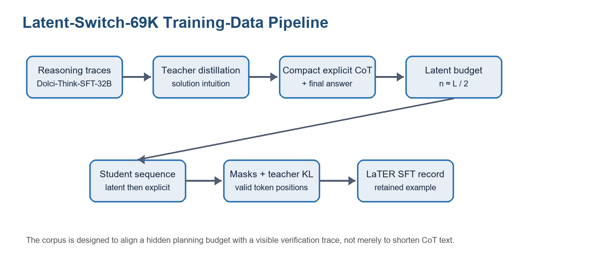
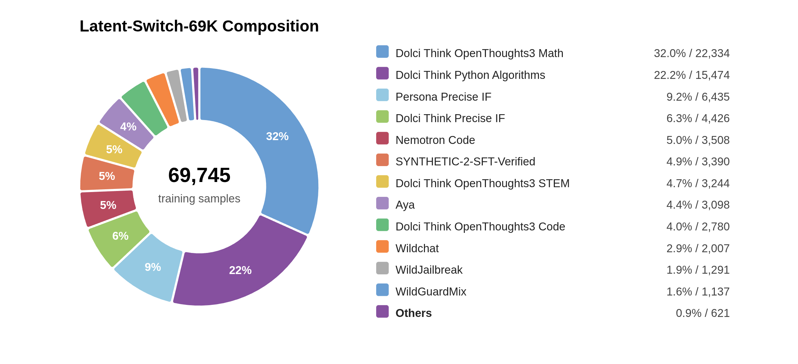
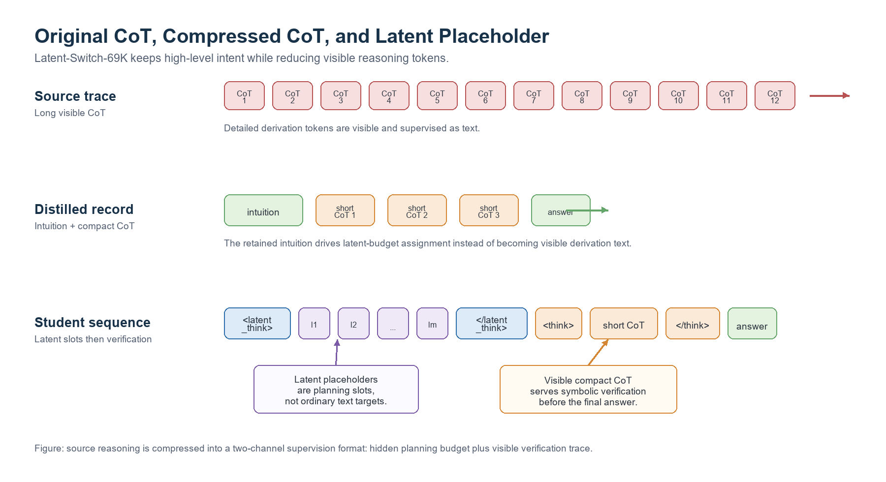
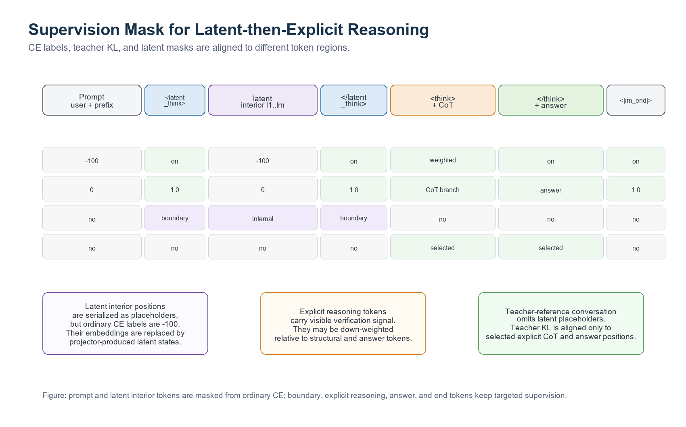

# Chapter 43: Latent-Switch-69K Implicit/Explicit Reasoning Data Engineering

## 43.0 Opening Scenario: Why Long-CoT Still Needs Compression

Chapters 18 through 20 discussed the basic forms of chain-of-thought, tool-call trajectories, and agent interaction data. For reasoning models, long chain-of-thought has an obvious appeal: when a model writes intermediate steps, trainers can inspect whether it is following a plausible path, and inference can use self-consistency, verifiers, or process reward models to find errors. Once Long-CoT becomes training data rather than a research example, however, the problem immediately becomes an engineering problem.

First, long CoT is expensive in tokens. In math, code, and science tasks, derivations often consume most of the output length while the final answer occupies only a small part. If all intermediate reasoning enters training and inference as visible text, the model spends context window, memory, and inference time on repeated expansion, trial branches, and self-correction. Second, long CoT is not automatically high-quality reasoning. Some traces break simple conclusions into unnecessary detail; some contain wrong branches; some give correct final answers while writing redundant or inconsistent intermediate explanations. Third, ordinary SFT struggles to distinguish high-level problem-solving intent that should be internalized from verification steps that must be visible to the user. If the whole CoT is treated as target text, the model may learn a habit of long exposition rather than better reasoning scheduling.

Latent-Switch-69K was created against this background. It is not simply a shorter CoT dataset, and it does not summarize Long-CoT samples and use them directly for SFT. It supports [LaTER](https://github.com/TioeAre/LaTER)-style latent-then-explicit reasoning systems: the model first passes through a bounded latent reasoning interval, where high-level planning and compressed thinking occur in continuous hidden states, and then switches back to visible text for a shorter explicit CoT and final answer. The data engineering objective changes accordingly. Each sample must answer not only what the answer is, but which content is suitable for hidden planning budget and which content still needs visible verification supervision.



*Figure 43-1: Latent-Switch-69K distills reasoning traces from Dolci-Think-SFT-32B into solution intuition, compressed CoT, latent budget, student sequence, and mask-aligned SFT records.*

This chapter connects synthetic-data engineering from Part 5 with reasoning data engineering from Part 6. Chapters 15 through 17 discussed how to define, distill, and quality-check high-quality training samples. Chapter 18 discussed explicit CoT organization. Chapters 19 and 20 discussed how intermediate states are recorded in tool and agent trajectories. Latent-Switch-69K pushes those ideas further: intermediate reasoning does not always need to be stored as natural language, and a dataset can explicitly reserve slots for hidden computation. Looking forward, it connects naturally to the post-training recipes in Chapter 45, RL reasoning data engineering in Chapter 46, and the reasoning flywheel projects in Part 14.

## 43.1 Dataset Overview: Scale, Difficulty, and Domain Mix

The final training split of the [Latent-Switch-69K dataset](https://huggingface.co/datasets/Tioe/LATENT-SWITCH-69K) contains **69,745 samples**. Each retained sample includes a user question, a distilled solution intuition, a shortened explicit CoT, a final answer, latent-step metadata, and masks that determine how different token spans are supervised. This structure distinguishes it from ordinary CoT or SFT data. A normal SFT record usually needs only a prompt and assistant output. A normal CoT record usually places reasoning and answer inside `<think>` tags or natural-language sections. Latent-Switch-69K also records a hidden-planning budget and renders that budget into latent placeholders in the student sequence.

The difficulty distribution is not uniform. Medium samples dominate, with **45,650 samples** or **65.5%** of the dataset. Hard samples total **17,428**, or **25.0%**. Easy samples total **6,667**, or **9.5%**. This distribution matters for latent-switch training. Medium-difficulty problems require real reasoning without making distillation too unstable. Hard samples expose the model to longer and more complex reasoning chains and therefore larger hidden-planning budgets. Easy samples preserve short-answer and direct-verification behavior, preventing every sample from being shaped into a long reasoning task.

| Metric | Value | Ratio / note |
| --- | ---: | --- |
| Total examples | 69,745 | 100.0% |
| Easy | 6,667 | 9.5% |
| Medium | 45,650 | 65.5% |
| Hard | 17,428 | 25.0% |
| Compression ratio mean | 0.612 | distilled CoT length / original CoT length |
| Compression ratio median | 0.569 | median sample keeps about 56.9% of visible reasoning length |
| Latent steps mean | 41.49 | average number of latent placeholders per sample |
| Latent steps median | 40.00 | median sample has about 40 latent steps |

The domain mix is clearly reasoning-intensive. Math accounts for about 37%, code about 34%, science-oriented questions about 5%, and the remaining share mainly comes from instruction-following and general-knowledge prompts. This is deliberate. Latent-then-explicit reasoning is most useful for tasks that have high-level solution plans but do not need every derivation step to be written out. Math and code have strong verifiability, step structure, and high token cost. Science tasks provide concept reasoning and multi-condition judgment. General instruction and knowledge samples prevent the model from learning only contest-math or code-completion expression patterns.



*Figure 43-2: The final training set contains 69,745 samples, with relatively high shares from math, code, and precise instruction data.*

From a data engineering perspective, three classes of statistics must be preserved together. Scale statistics show that the corpus is large enough to serve as specialized latent-reasoning supervision rather than a small prompt template set. Difficulty statistics show that the data supports curriculum design and latent-budget stability. Domain statistics show that this dataset is better suited to math, code, science, and complex-instruction reasoning than to every general dialogue scenario.

Latent-Switch-69K retains fields such as `dataset_name`, `source_dataset`, `record_id`, `difficulty`, `domain`, `source_cot_length`, `distilled_cot_length`, `compression_ratio`, `solution_intuition_length`, `n_latent_steps`, `assistant_cot`, `assistant_answer`, and `mask_schema_version`. These fields may look operational, but they determine whether a training result can be attributed to shorter CoT, latent-budget adjustment, or domain-ratio shift.

The fields can be grouped into four categories. The first is source metadata: where the sample comes from, which task family it belongs to, and whether it is math, code, science, or general instruction. Source metadata is not decoration. It controls mixing, deduplication, and accountability. For example, if a model improves on code but becomes verbose in open QA, engineers need source fields to check whether code samples were overweighted or instruction samples were compressed too aggressively.

The second group is reasoning content: source reasoning trace, solution intuition, `assistant_cot`, and `assistant_answer`. The source trace is the pre-distillation reference and does not necessarily enter the final student sequence. Solution intuition is the high-level plan. `assistant_cot` is the compressed visible verification chain. `assistant_answer` is the final answer. These four fields should remain traceable to one another. Ideally, an auditor can inspect a sample and determine which parts of the original long CoT were distilled into intuition, which were retained in the compressed CoT, and whether the answer matches the verifiable target.

The third group is length and budget metadata: source CoT length, distilled CoT length, insight length, compression ratio, and `n_latent_steps`. These fields directly support cost control and budget diagnostics. If a data version's mean compression ratio suddenly falls to 0.3, token cost may drop, but the visible verification chain may have become too short. If mean `n_latent_steps` rises sharply, effective training length and hidden inference cost also change. Without these fields, it is difficult to make quantitative tradeoffs between efficiency and lost supervision.

The fourth group is supervision metadata: prompt mask, latent internal mask, latent boundary mask, CoT mask, answer mask, and teacher-KL mask. They determine how the same token sequence is interpreted during training. Ordinary dataset schemas often only check that text fields exist. Latent-Switch-69K must treat masks as data assets. The reason is simple: the same text with different masks corresponds to a different training task. A latent placeholder trained with CE becomes an ordinary token. A latent placeholder masked out and replaced by recurrent latent state becomes a hidden-computation slot.

## 43.2 Distillation and Record Formation: From Teacher Trace to Compressed Reasoning Record

The construction of Latent-Switch-69K starts from reasoning traces sampled from Dolci-Think-SFT-32B. These original traces can be understood as source reasoning traces: they contain questions, one or more assistant outputs, possibly ground truth or extractable answers, and source metadata. Construction is not a matter of directly selecting shorter answers. It first decomposes the long trace into two complementary targets: high-level problem-solving intent and a shorter visible verification chain.

The first stage extracts solution intuition. The distillation prompt asks the teacher to extract only key insights, not to write a short CoT and not to give the final answer. This field should describe the high-level plan for solving the problem: which equation to set up, which state family to enumerate, which data structure to use for a coding task, or which causal relation matters in a science question. Its granularity sits between a label and a full derivation. It is more specific than a domain tag but more compressed than step-by-step reasoning. The purpose is to extract the planning signal from Long-CoT and use it to inform latent budget.

The second stage generates compressed explicit CoT. Conditioned on the original problem and solution intuition, the teacher solves the problem again and writes a shorter reasoning process plus final answer. Because the teacher already receives the high-level plan, it does not need to replay every exploration branch or repeat failed attempts from the original trace. Each retained sample therefore has four main content objects: problem, intuition, compressed CoT, and final answer. Unlike summarization, compressed CoT is not trying merely to shorten the original text. It preserves enough visible verification for the model to switch from latent reasoning to explicit symbolic checking.



*Figure 43-3: A large amount of visible source reasoning is split into two signals: solution intuition for latent-budget estimation and compressed CoT for explicit verification and answer supervision.*

Compression ratio is defined as:

$$
\text{compression ratio}
= \frac{\text{distilled CoT length}}{\text{original CoT length}}.
$$

The final corpus has a mean compression ratio of **0.612** and a median of **0.569**. In other words, the distilled visible CoT usually retains about 57% to 61% of the original reasoning length. This number should not be interpreted as "40% of the reasoning information was deleted." A better interpretation is that some details were compressed into the high-level plan represented by solution intuition and then mapped to latent placeholder budget, while necessary derivations remained inside `<think>` for visible verification and reasoning-style supervision.


*Figure 43-4: The distribution covers source CoT length, distilled CoT length, insight length, ground-truth length, and compression ratio.*

Sample retention should focus on three questions. First, does the source trace have a sufficiently trustworthy final answer? If the answer cannot be extracted, is obviously inconsistent with ground truth, or cannot be reproduced by the teacher, the sample should not enter the final set. Second, does solution intuition describe only the high-level plan? If it leaks the final answer or becomes a full CoT, it no longer works as a proxy for latent budget. Third, does compressed CoT still connect the problem to the answer? If compression is too aggressive, visible reasoning becomes a few jumping sentences; the model may imitate the answer without learning the boundary between implicit planning and explicit verification.

This distillation process gives data teams an important lesson: reasoning compression cannot be judged only by token count. Reliable compression must check intent preservation, answer consistency, and verification sufficiency. The compressed sample must preserve problem-solving intent, keep enough visible verification, and remain consistent in the final answer.

In an engineering system, the flow can be split into six auditable stages. The first stage extracts source traces, normalizing prompts, assistant outputs, ground truth, source dataset, and metadata from Dolci-Think-SFT-32B into an internal record. The key is to preserve original context rather than rewrite too early. If a teacher output later appears abnormal, engineers need to trace the error back to the source trace, prompt template, or answer extraction logic.

The second stage is high-level intuition distillation. The prompt requires teacher output as JSON and constrains `correct_insight` to a coarse-grained plan, not a final answer and not a full CoT. This constraint is crucial because intuition is not meant to train the model to say the text verbatim. It estimates how much hidden planning space the model should receive. If intuition already contains detailed derivation, latent budget changes from "compressed planning complexity" into "copy a hidden CoT length," weakening the clarity of the design.

The third stage is compact explicit CoT generation. The teacher receives the problem and intuition and generates a shorter reasoning chain. This reorganizes the publicly verifiable part of the source trace. The stage must avoid two extremes: a CoT that remains almost as long as the source and a CoT that keeps only the conclusion. Good samples usually keep key equations, key branches, code invariants, or final-choice rationale while removing repeated setup, self-doubt, and failed trials.

The fourth stage is answer validation. Math problems can compare extracted answers to ground truth. Multiple-choice problems can check option format. Code tasks should use tests or static rules where possible. Open QA at least needs teacher consistency checks or human sampling. Latent-switch training relies more heavily on answer consistency than ordinary summarization because answer tokens are the core supervised positions. Wrong answers will be learned together with latent budget and explicit CoT.

The fifth stage is sequence rendering. The system renders problem, latent placeholders, compressed CoT, and answer into a chat-style student sequence. This stage requires a tokenizer contract: `<latent_think>`, `</latent_think>`, `<think>`, and `</think>` must be recognized reliably. If different tokenizers or special-token registrations split them unpredictably, span checks and mask construction become unreliable.

The sixth stage is mask materialization. The loader locates boundaries from token IDs and constructs labels, loss weights, and masks. It should not rely only on character offsets in raw strings, because tokenizer changes can invalidate character offsets. A more stable approach constructs spans from special-token positions in token IDs, then validates boundary counts, order, answer span, and teacher-reference span for every sample.

## 43.3 Latent Budget and Student Sequence Rendering

One of the key fields in Latent-Switch-69K is `n_latent_steps`. It determines how many latent placeholders are placed between `<latent_think>` and `</latent_think>` in the student sequence. The basic heuristic used by the paper and code is: if retained solution intuition contains \(L\) tokens, the latent budget is about \(L/2\), clipped by maximum latent length and tokenizer constraints. In the final data, mean latent steps are **41.49**, and the median is **40.00**.

This rule has two implications. First, latent steps are not arbitrary padding. They relate to the compressed high-level reasoning content. Longer intuition suggests more complex high-level planning and therefore more hidden-computation slots. Second, more latent steps are not always better. A long latent interval increases training and inference cost and may let the model drift in hidden state. LaTER's training-freedom experiments observed a strong tradeoff around 40 to 50 steps, so the final distribution concentrates near that range.

In abstract form, a student sequence can be written as:

$$
\texttt{<latent\_think>}~l_1,\ldots,l_m~\texttt{</latent\_think>}
~\texttt{<think>}~t_1,\ldots,t_n~\texttt{</think>}~a_1,\ldots,a_r~\texttt{<|im\_end|>}.
$$

Here, \(l_1,\dots,l_m\) are latent placeholder positions, \(t_1,\dots,t_n\) are distilled explicit CoT tokens, and \(a_1,\dots,a_r\) are final answer tokens. In code, latent placeholders may be filled by repeated `latent_pad_token`. During training, however, these positions are not treated as ordinary language targets. Their input embeddings are replaced by recurrent latent states produced by a latent projector. They have token boundaries and length in the sequence, but semantically they are hidden-computation slots.

The following teaching example illustrates schema and mask relationships. It is not a real training sample.

```text
<|im_start|>user
Target Question:
A sequence satisfies a_1 = 2 and a_{n+1} = 3a_n + 1. Find a_4.
<|im_end|>
<|im_start|>assistant
<latent_think>
<|endoftext|><|endoftext|><|endoftext|><|endoftext|>
</latent_think>
<think>
Use the recurrence step by step. From a_1, compute a_2, then a_3, then a_4.
a_2 = 3 * 2 + 1 = 7.
a_3 = 3 * 7 + 1 = 22.
a_4 = 3 * 22 + 1 = 67.
</think>
The final answer is 67.
<|im_end|>
```

In this example, `<latent_think>` and `</latent_think>` are structural boundaries. The four `<|endoftext|>` tokens are placeholders; a real sample uses the number specified by `n_latent_steps`. The span from `<think>` to `</think>` is the visible compressed CoT, followed by the answer. For training, the key point is not whether the text looks like a natural conversation. The key point is whether each token span can be located stably. In the [LaTER training code](https://github.com/TioeAre/LaTER), `build_spans` checks that each sample contains exactly one `<latent_think>`, one `</latent_think>`, one `<think>`, and one `</think>`, and that they satisfy:

```text
assistant_content_start <= latent_start < latent_end < think_start < think_end
```

This order constraint is critical. If boundary tokens are missing, duplicated, or out of order, masks shift. Latent placeholders may be mistaken for ordinary answer tokens, or the answer span may be truncated. In ordinary SFT data, one boundary error may be only a formatting issue. In latent-switch data, boundary misalignment directly changes the training objective.

In an actual data repository, the student sequence should not be saved only as one long string. A safer design saves both structured fields and rendered text. Structured fields include `messages`, `assistant_cot`, `assistant_answer`, `n_latent_steps`, `latent_pad_token`, and `state_align_reference_messages`. Rendered text is useful for quick inspection and compatibility with ordinary training frameworks. The code's `LatentSFTDataset` preferentially constructs token IDs from structured fields and falls back to string re-encoding only when fields are missing. This reflects a practical lesson: latent special-token boundaries are too important to depend entirely on pre-joined text.

`latent_pad_token` deserves separate attention. It is a placeholder, not semantic content. If the tokenizer has registered it, the loader can repeat its ID directly. If not, the loader has to repeat and encode the string, which can produce uncertain length. That uncertainty may be acceptable for ordinary padding, but it changes the actual token count \(m\) for latent budget and therefore changes the number of hidden rollout steps. A released dataset should specify tokenizer version, special-token registration, and latent-pad semantics.

Teacher-reference conversation is another easily missed sequence. It is not a copy of the student sequence. It omits latent placeholders and uses the original problem plus solution intuition as the teacher input, while the assistant continuation is the compressed CoT and answer. This design lets teacher KL focus on visible reasoning quality and answer distribution instead of asking the teacher to understand the student's internal latent slots. The student sequence trains the latent-then-explicit format; the teacher reference provides distributional guidance for visible verification and answer positions.

## 43.4 Supervision Masks: Which Tokens Participate in Loss

The supervision design of Latent-Switch-69K can be summarized as follows: prompt tokens and latent interior placeholders do not participate in ordinary token-level CE; structural boundaries, explicit CoT, answer, and end token receive targeted supervision; teacher KL applies only to selected visible CoT and answer positions.

In code, a sample constructs several masks: `prompt_mask`, `latent_internal_mask`, `latent_boundary_mask`, `cot_mask`, `answer_mask`, and `teacher_kl_mask`. These masks are not for visualization convenience. They directly determine where different objectives apply. Ordinary labels are initialized from student token IDs, and then prompt spans and latent interior spans are set to `-100`, meaning cross-entropy ignores those positions.

A simplified CE label rule is:

$$
y_i =
\begin{cases}
-100, & i \in \mathcal{S}_{prompt} \cup \mathcal{S}_{lat}^{int}, \\
x_i, & \text{otherwise}.
\end{cases}
$$

Here, \(\mathcal{S}_{prompt}\) denotes user prompt and context before the assistant output target, and \(\mathcal{S}_{lat}^{int}\) denotes the internal placeholder positions between `<latent_think>` and `</latent_think>`. Tokens set to `-100` are not directly fit by ordinary CE. This avoids an incorrect target: asking the model to predict a fixed text token at latent interior positions. For LaTER, the value of those positions is not outputting `<|endoftext|>`, but executing several hidden-state updates.



*Figure 43-5: Prompt and latent interior are masked out from ordinary CE; latent boundaries, explicit CoT, answer, and end token are controlled by different weights and masks.*

`latent_boundary_mask` marks `<latent_think>` and `</latent_think>`. These boundary tokens still need supervision because the model must learn when to enter the latent interval and when to exit. Without boundary supervision, it may fail to switch to `<think>` or may produce incomplete structure during inference.

`cot_mask` covers the span from `<think>` to before `answer_start`. In the training objective, internal explicit CoT tokens can receive different weights, for example lowering the contribution of visible reasoning to total CE with \(\lambda_{CoT}\). This matches the dataset objective. Explicit CoT still matters because it carries verification and interpretable output, but training should not collapse into "more similar to long CoT is better." The model also needs to prioritize structural boundaries and final-answer behavior.

`answer_mask` covers the answer span after `</think>` and before `<|im_end|>`. Answer tokens usually should receive strong supervision because the final answer carries task correctness. For math, it may be a boxed result. For multiple-choice tasks, it may be A, B, C, or D. For code, it may be a function implementation. Regardless of latent design, answer consistency must be maintained strictly.

`teacher_kl_mask` is used for teacher-distribution supervision. Each sample also builds a teacher-reference conversation: it contains no student latent placeholders, and instead combines the original problem with distilled solution intuition as the teacher input. The teacher provides distributional reference over the shortened `<think> ... </think>` span and answer positions. This is useful because the teacher does not need to simulate continuous latent placeholders. It supervises only the token distribution quality of visible reasoning and answer.

| Span | Example token | Ordinary CE label | Main mask | Engineering meaning |
| --- | --- | --- | --- | --- |
| Prompt and assistant prefix | user question `<\|im_start\|>assistant` | `-100` | `prompt_mask` | Used as condition, not output target |
| Latent start boundary | `<latent_think>` | supervised | `latent_boundary_mask` | Learn to enter latent reasoning |
| Latent interior slots | `l_1 ... l_m` | `-100` | `latent_internal_mask` | Hidden-computation slots, not placeholder-text fitting |
| Latent end boundary | `</latent_think>` | supervised | `latent_boundary_mask` | Learn to stop latent reasoning |
| Explicit reasoning | `<think> ... </think>` | weighted supervised | `cot_mask`, `teacher_kl_mask` | Visible verification chain, can be downweighted |
| Final answer | answer tokens | supervised | `answer_mask`, `teacher_kl_mask` | Core task-correctness supervision |
| End token `<\|im_end\|>` | supervised | end-token weight | `answer_mask` | Keep chat format closed |

This mask design explains why Latent-Switch-69K should not be casually re-encoded by an ordinary data loader. Ordinary chat loaders usually only care about the prompt-response boundary. A latent-switch loader must know exact positions for latent_start, latent_end, think_start, think_end, answer_start, and im_end. If special-token registration changes or string re-encoding moves boundary tokens, masks become wrong.

More precisely, masks decouple training objectives. CE teaches the model to output structural boundaries, explicit reasoning, and answers. The latent internal mask protects hidden-computation slots from being learned as normal text. Teacher KL pushes visible CoT and answer closer to the teacher distribution. Halt or boundary-related supervision helps the model stop latent reasoning in the right place. This chapter does not reproduce the full LaTER training algorithm, but the dataset must provide stable interfaces for these objectives.

For data engineers, the most useful check is not to rederive the loss function. It is to verify that every sample satisfies a small set of invariants. First, all prompt-span labels should be `-100`. Second, all latent interior labels should be `-100`, but latent boundary tokens should not be swallowed by the prompt mask. Third, `cot_mask` should cover the `<think>` to `</think>` region, and `answer_start` must come after `think_end`. Fourth, `answer_mask` should not include `<|im_end|>` if the end token is supervised separately. Fifth, teacher KL mask should not cover latent interior, because the teacher reference contains no such placeholders.

These invariants should be checked both during data construction and during training loading. Construction-time checks prevent bad samples from entering the corpus. Loader-time checks detect tokenizer, max-length, truncation, or configuration changes. Max-length truncation is especially dangerous: once the answer span is truncated away, the sample contains structure and reasoning but no final-answer supervision. Code should therefore rebuild spans after truncation and check that `answer_start` remains before `im_end`.

One more detail is explicit CoT weight. Latent-Switch-69K does not remove explicit reasoning; it reduces dependence on full long CoT. If CoT weight is too high, the model may focus on reproducing visible reasoning text. If CoT weight is too low, the model may learn structure and answer while weakening visible verification. The data side should at least preserve configurable `cot_loss_weight` or an equivalent field so trainers can adjust the balance between visible verification and final answer by task.

## 43.5 Quality Control: Compression, Boundaries, and Bias Risks

Quality control for Latent-Switch-69K is not just dirty-text filtering. Because the dataset contains compressed reasoning, latent budget, and multiple masks, risks appear at several layers.

| Risk type | Typical symptom | Impact | Repair action |
| --- | --- | --- | --- |
| Over-compression | Compressed CoT contains only a conclusion and no visible verification chain | Model cannot learn the switch from latent planning to explicit verification | Add verification-sufficiency checks; reject jumpy samples |
| Reasoning fracture | Solution intuition and compressed CoT use different solution paths | Latent budget's high-level plan cannot support later CoT | Check intuition-CoT entailment; regenerate with teacher |
| Answer inconsistency | Source, teacher continuation, and final answer disagree | Answer-position training target conflicts | Recheck with ground truth, verifier, or answer extraction |
| Boundary misalignment | `<latent_think>` or `<think>` is missing, duplicated, or out of order | Masks shift; latent placeholders receive wrong supervision | Run span validation before loading; isolate bad samples |
| Domain bias | Math and code dominate while general instruction is under-covered | Transfer to non-reasoning tasks becomes stylistically narrow | Record domain mix; adjust sampling weights by training goal |
| Latent-budget anomaly | `n_latent_steps` is 0, too large, or mismatched with intuition length | Hidden-planning budget is distorted and cost is uncontrolled | Set budget bounds; monitor mean, median, and tail |
| Teacher-KL misalignment | KL mask does not align with teacher-reference tokens | Teacher distribution supervision hits wrong positions | Keep teacher-span validation; record top-k distribution version |

The first risk is over-compression. The mean compression ratio of 0.612 and median of 0.569 show that visible CoT is significantly shortened, but engineering should not optimize for the lowest possible ratio. If a sample compresses 1,000 reasoning tokens into 50 tokens but loses key equations, state transitions, or code invariants, it saves tokens at the cost of supervision quality. A safer metric combines lower length, answer consistency, and visible reasoning that still explains the final answer.

The second risk is reasoning fracture. Solution intuition is the source of latent budget. If intuition describes one path and compressed CoT follows another, the model receives inconsistent signals. For example, intuition may say to use dynamic programming while the compressed CoT gives a greedy proof, or intuition may say to establish an equation while the CoT jumps straight to enumeration. The number of latent placeholders may still look reasonable, but the high-level plan behind them is mismatched. The data pipeline needs to check semantic consistency between intuition and CoT.

The third risk is answer inconsistency. One of the most common reasoning-data problems is a plausible chain with a wrong final answer. For Latent-Switch-69K, this is more severe because teacher reference, student sequence, and `answer_mask` are all built around the final answer. If a wrong answer enters training, the model learns both the wrong conclusion and the wrong latent-to-explicit switching behavior. Math and multiple-choice tasks can use rule-based verifiers or answer extractors. Code tasks can use unit tests. Open QA at least needs teacher checks or human sampling.

The fourth risk is boundary and mask misalignment. `<latent_think>`, `</latent_think>`, `<think>`, and `</think>` are structural tokens, not decorative text. The data loader checks their occurrence counts and order and then computes spans. If a sample contains an extra `</think>`, the rendered text may still display, but training masks will move. Span validation should happen before data enters training, not after a training run fails.

The fifth risk is domain bias. Latent-Switch-69K is about 37% math, 34% code, and 5% science. This makes it strong for reasoning-heavy training, but it is not a complete replacement for general assistant SFT data. When it is mixed with ordinary SFT, the team should define the goal: strengthen math-code reasoning, reduce visible CoT cost, or improve answer efficiency across all user questions. Different goals require different sampling weights and evaluation sets.

Quality control should preserve audit information. Each data version should produce at least four reports: length and compression report, difficulty/domain distribution report, span and mask validation report, and answer-consistency failure report. For latent-reasoning data, a final parquet or JSONL file is not enough. Without reports, it is hard to tell whether model changes came from better data quality or from unintended distribution drift.

A practical pre-release checklist should cover length, compression, structure, masks, semantics, distribution, and versioning. At the length layer, inspect source CoT, distilled CoT, intuition, answer, and total-sequence distributions, especially very short and very long samples. Very short samples may lack supervision; very long samples may often be truncated. At the compression layer, inspect mean, median, quantiles, and outliers to ensure one source dataset is not creating abnormal ratios.

At the structure layer, check occurrence count and order for the four boundary tokens. Any missing, duplicate, nested, or out-of-order boundary should isolate the sample. At the mask layer, sample-render token spans in different colors for prompt, latent internal, latent boundary, CoT, answer, and im_end, and confirm that human reading matches program masks. For a new data source, manually inspect at least dozens of samples, especially long math proofs, code functions, multiple-choice questions, and open QA.

At the semantic layer, check whether intuition leaks the final answer, whether compressed CoT supports the answer, and whether the answer matches ground truth or verifier output. For code tasks, distinguish "the explanation sounds plausible" from "the final code runs." For math tasks, distinguish "the final value is correct" from "the derivation is verifiable." Latent-switch data aims for high-level planning plus explicit verification, so neither layer can be ignored.

At the distribution layer, inspect joint distributions of difficulty, domain, source dataset, language, answer format, and token length. Each marginal may look normal while combinations expose bias: hard samples may almost all be math, code samples may use a single Python template, or instruction samples may have lower compression ratios than math samples. These biases do not all need to be removed, but they must be recorded because training and evaluation will reflect them.

At the version layer, every release should state data version, construction-script version, teacher model version, tokenizer version, special-token contract, filtering rules, and statistics reports. The recheckability of a dataset like Latent-Switch-69K comes from text, structure, and configuration together. If only final text is saved, it becomes difficult years later to explain why one sample has 38 latent steps, why one CoT was downweighted, or why some teacher-KL positions were skipped.

## 43.6 Backlinks Across the Book: From Reasoning Data to Reasoning Flywheels

Placed in the structure of this book, Latent-Switch-69K matters not as an isolated dataset but as a new reasoning-data interface.

For Part 5, it continues the core idea of synthetic and distilled data. Chapter 15 starts from task definitions for data synthesis. Chapter 16 discusses how distillation transfers strong-model behavior into training corpora. Chapter 17 discusses quality evaluation and filtering. Latent-Switch-69K concretizes these principles: extract high-level solution intuition from teacher traces, keep explicit verification with compressed CoT, and assign different supervision targets to different token spans with masks.

For Part 6, it is the next step after CoT data engineering. Chapter 18's CoT samples usually supervise the reasoning process directly as text. Chapter 19's tool data emphasizes action, observation, and result. Chapter 20's agent data emphasizes state and trajectory. Latent-Switch-69K shows that reasoning state can partly live in invisible latent slots. It does not abandon interpretability; it compresses visible explanation into a necessary verification chain while moving exploratory planning into a hidden computation interval.

For Part 13, it is a precursor to post-training and RL reasoning data recipes. Chapter 45 discusses SFT, preference alignment, and online continuous optimization data layers. Chapter 46 discusses RL reasoning, verifiers, candidate groups, and reward signals. Latent-Switch-69K introduces structured reasoning budget and mask schema already at the SFT stage, so later RL can optimize around whether latent budget is appropriate, whether explicit verification is sufficient, and whether answers are verifiable.

For Part 14 projects, it connects to P06, P10, and P12. P06's PRM data focuses on scoring process steps. Latent-Switch-69K provides compressed explicit reasoning and answer spans that can be further turned into scoreable verification steps. P10's LLM data flywheel focuses on online feedback and continuous iteration; latent-switch data can be a candidate asset for reducing reasoning-token cost. P12's R1 reasoning flywheel emphasizes multi-sample generation, verifiers, and rejection sampling. Latent-Switch-69K offers a cold-start idea: first teach the model how to switch between latent planning and explicit verification through distilled data, then use verifiers and RL data to tune budget and answer correctness.

The engineering conclusions can be summarized in four points.

1. Latent reasoning data is not a shorter version of ordinary CoT data. It must record the relationship among hidden planning budget, explicit verification chain, and final answer.
2. `<latent_think>` and `<think>` are structurally and semantically different spans. The former provides hidden-computation slots; the latter provides visible reasoning supervision.
3. Masks are part of the data schema, not an implementation detail attached to training code. Prompt, latent interior, boundary, CoT, answer, and teacher-KL positions must be recoverable from data construction onward.
4. The goal of compression is not deleting reasoning. It is redistributing high-level intent, hidden computation, and explicit verification into more suitable channels.

If a team reuses only the text output of Latent-Switch-69K and ignores `n_latent_steps`, latent boundaries, and supervision masks, it obtains only a shorter CoT SFT dataset. The latent-then-explicit design appears only when compression ratio, latent placeholders, student sequence, and masks are managed as one data engineering object.

## 43.7 Reuse Advice: Porting the Latent-Switch Idea to Proprietary Data

If a team wants to reuse the Latent-Switch-69K idea on its own math, code, or business reasoning data, the safest first step is not to change the model architecture. Start by building the data schema. Select a small batch of high-quality Long-CoT samples. Generate solution intuition manually or with a teacher model, then generate compressed CoT and final answer. Assign conservative latent budgets by intuition length, such as \(L/3\), \(L/2\), and a fixed 32-step variant, then run one or two versions for comparison. This lets the team observe whether samples render stably, masks are correct, and answers remain consistent before entering expensive training.

The second step is to build a small acceptance set. It does not need to be large, but it should include short questions, long questions, math, code, multiple-choice tasks, open QA, and format-constrained tasks. Each sample should answer three questions: does high-level intuition express a sufficient plan, does compressed CoT support the answer, and do latent steps roughly match problem complexity? If these checks frequently fail in human sampling, the problem is data construction rather than the training algorithm.

The third step is to manage latent-switch data separately from ordinary SFT data. Ordinary SFT can store prompt and response. Latent-switch data must store structured fields, special-token contract, mask schema, and construction version. Mixed training should also record sampling weights and purpose for each data type. Otherwise, when the model becomes shorter, loses reasoning explanations, or produces unstable boundaries, it is difficult to tell whether the cause is the latent-switch data itself, the mixture ratio, tokenizer configuration, or training setup.

The fourth step is to interpret effects cautiously. If a model uses fewer visible tokens and achieves similar answers, that does not by itself prove latent reasoning has been learned. It may have learned to answer directly. Proper acceptance should inspect answer accuracy, explicit verification quality, format-closure rate, latent-boundary stability, and token cost under different budgets. Only joint improvement across these metrics supports the claim that the data is enabling implicit planning plus explicit verification.

This is why the chapter repeatedly emphasizes schema, masks, and quality reports. Latent reasoning can only be engineered if the data defines the hidden-planning interface clearly.

## Chapter Summary

Latent-Switch-69K shows an important shift in reasoning data engineering: from collecting longer and more detailed CoT to designing more efficient reasoning supervision structures. Starting from Dolci-Think-SFT-32B traces, it uses teacher distillation to extract solution intuition and compressed CoT, maps intuition length to latent budget, and renders a student sequence composed of `<latent_think>`, placeholders, `<think>`, and answer tokens. Prompt and latent interior are masked out from ordinary CE, while boundaries, explicit reasoning, answer, and end token receive their respective supervision. Teacher KL applies only to selected visible positions.

This design turns the dataset from a text collection into a training interface that includes structure, budget, masks, and quality reports. For later reasoning models and RL data engineering, that is the main value of Latent-Switch-69K: it turns "write less reasoning" into a trainable, checkable, and iterable data engineering problem.
