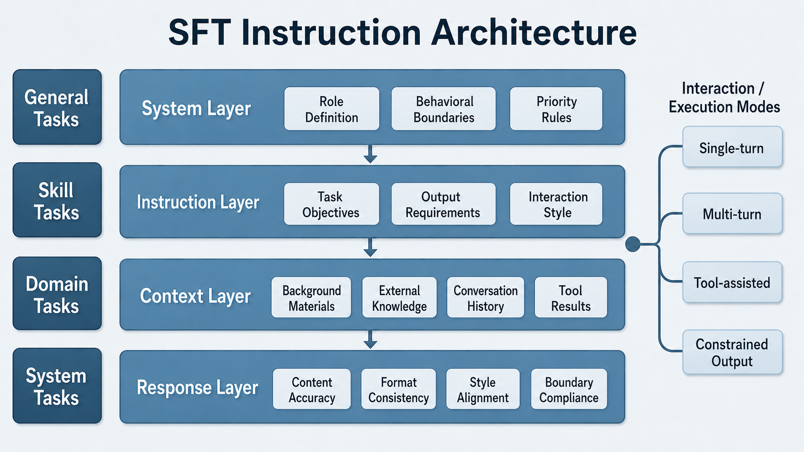

**Part Introduction**

After pretraining, a large model already possesses strong language generation capabilities, but this does not mean it can naturally complete tasks reliably, understand requirements accurately, or give answers that meet human expectations. The core question of this part can therefore be summarized as: **why a model speaks correctly, speaks consistently, and speaks like a human**.

Here, "speaking correctly" emphasizes that the model can understand instructions, complete tasks, and output correct, relevant content; "speaking consistently" emphasizes that the model maintains coherent, reliable, and controllable behavior across different scenarios, input forms, and constraint conditions; "speaking like a human" emphasizes that the model's answers are not only correct but also natural, clear, and helpful, aligning with human preferences and usage habits. Achieving these three goals cannot rely solely on the model's parameter scale; it must rely on data design, preference modeling, and quality operations during the post-training stage.

Therefore, this part focuses on the key data problems in post-training of large models, **establishing a complete chain from SFT to preferences and then to annotation operations**. First, through SFT data design and instruction systems, the model is taught to answer questions according to requirements, forming a basic task-following capability. Second, through preference data and reward signals, the model's behavioral style is further shaped so that its answers better align with human preferences and business goals. Finally, through annotation platforms, QA systems, and data operations, systematic support is provided for the production, evaluation, iteration, and scalable supply of high-quality data.

What this chain answers is not just "how is the model trained," but "why can the model stably produce high-quality answers." Only by treating SFT, preference alignment, and annotation operations as a continuous data system can one truly understand how model capabilities are formed and the data-engineering logic behind high-quality large models.


# Chapter 12 SFT Data Design and Instruction Systems

In the journey from "can generate" to "usable, controllable, and deployable," supervised fine-tuning (SFT) plays an extremely critical yet often misunderstood role. Many teams simply think of SFT as "collecting some Q&A pairs and letting the model learn to answer," but in real engineering, this understanding is far from sufficient. For teams responsible for instruction-tuning data design and annotation standards, SFT is not merely a data-organization step, but a process of encoding task objectives, behavioral boundaries, output specifications, domain knowledge, interaction styles, and system constraints into training samples. It effectively defines the last explicitly shapeable "behavior shell" before the model goes live.

This chapter targets team members responsible for SFT data design, template authoring, annotation standard formulation, quality acceptance, and version management. It systematically discusses the goals of SFT, task layering, instruction systems, sample structure, quality evaluation, and industry implementation. We particularly emphasize one core point: a high-quality SFT dataset is not a pile of scattered Q&A, but a capability-alignment-oriented instruction engineering system. It needs capability coverage as the skeleton, task templates as the carrier, quality closed-loops as the safeguard, and downstream preference data and tool-call data as extension interfaces.

From the perspective of organizational collaboration, SFT data construction typically spans product, algorithms, annotation, evaluation, operations, and domain expert roles. The product team defines scenario goals and launch constraints; the algorithm team defines training interfaces and sample formats; the annotation team is responsible for template implementation and sample generation; the evaluation team tracks failure modes; and domain experts ensure knowledge boundaries and professional consistency. If any link is missing, an SFT dataset may "look large in scale" on the surface but actually lack structure, focus, and sustainable evolution capability.

Therefore, this chapter does not treat SFT as a one-off "data preparation task," but as a piece of systems engineering centered on model behavior design. The difficulty of this engineering work is not whether one can quickly produce hundreds of thousands of samples, but whether those samples can truly form an organized, layered, feedback-driven instruction system with version governance. Only when SFT data is built as "an explicit design document for model behavior" can it become a reliable foundation for subsequent preference alignment, tool calling, Agent trajectory learning, and online feedback iteration.

---

## 12.1 What Exactly Is the Goal of SFT

### 12.1.1 The Place of SFT in Capability Alignment

If we divide the training process of a large model into several stages, pretraining gives the model broad language statistics, knowledge compression, and basic reasoning potential. SFT turns this "latent capability" into "dispatchable capability." The preference alignment stage further shapes "dispatchable capability" into "behavior more aligned with human preferences and platform rules." From this perspective, SFT is the middle layer connecting "what the model knows" and "how it acts."

When doing SFT, many teams fall into one of two extremes. One extreme is treating SFT too lightly, believing that as long as the pretrained model is strong enough, any small amount of instruction data will do. The other extreme is taking SFT too seriously, assuming that with enough SFT data, the model can be patched up to acquire deep capabilities it inherently lacks. The former underestimates the difficulty of behavior shaping, while the latter overestimates how much supervision signals can reshape underlying capabilities. More accurately, SFT is best at three things: first, organizing existing potential into callable task capabilities; second, constraining response styles onto a clear, stable, scenario-appropriate track; third, standardizing task interfaces so that the model produces consistent responses to input structures, context boundaries, and output formats.

Looking at the training chain, pretraining yields a base model whose parameter space contains substantial potential, but this potential is often scattered, vague, and lacks behavioral interfaces. The model may know a lot and have certain reasoning potential, but that does not mean it will stably produce answers in appropriate format, tone, length, and boundary when receiving actual business tasks. The task of SFT is to organize latent capabilities into task-oriented behavioral patterns. It does not create capability out of nothing; it makes "when, in what way, and which existing capabilities to invoke" controllable.

This is also why SFT is typically an unskippable step before productization. A model that has only been pretrained may occasionally amaze in open-ended dialogue, but on tasks such as batch ticket classification, structured extraction, enterprise Q&A, replies in sensitive scenarios, and fixed-schema output, it usually exposes a lot of unstable behavior. It may be overly verbose at one moment and miss key information at another, follow the format one moment and freelance the next. SFT bridges this instability and business requirements.

From the angle of capability alignment, SFT occupies a very particular position. It is not like pretraining, which absorbs world knowledge broadly, nor like preference alignment, which emphasizes ranking by human preference. Rather, it is responsible for defining "a foundational behavior distribution that can be further optimized by later stages." If this distribution itself is highly chaotic, subsequent preference learning or tool learning will be built on a fragile foundation. Conversely, if SFT has already brought the model into a relatively normalized, clear, controllable behavior space, later optimization will be more efficient and stable.

Therefore, SFT should not be viewed as the main means of "making the model smarter," but rather as the key engineering stage of "making the model controllable, usable, and reproducible in business." It can significantly improve the model's instruction-following, task stability, output consistency, and scenario adaptation, but it cannot replace the base model's fundamental acquisition of complex reasoning, long-term memory, deep domain knowledge, and tool planning. For data design teams, understanding this is very important, because it determines exactly what problems the SFT dataset should solve, what problems it cannot solve, and which problems should be left to upstream model selection, downstream preference learning, or system engineering.

### 12.1.2 The Boundary between "Making the Model Obey" and "Making the Model Capable"

"Obedience" and "capability" are often conflated in engineering. In a sample, if the user requires "please answer in three paragraphs and give a conclusion," and the model learns to follow the three-paragraph structure and the position of the conclusion, that is obedience. If the user asks to "compare the applicable conditions of two options and point out sources of risk," the model not only needs to follow the format but also actually carry out comparison, abstraction, and attribution—involving both obedience and capability invocation.

In SFT design, teams must clearly distinguish three types of signals. The first is behavior format signals, such as language style, paragraph organization, whether to output JSON, whether to summarize first and then elaborate. The second is task execution signals, such as extraction, classification, rewriting, planning, summarization, comparison, clarification, refusal, and so on. The third is knowledge and reasoning signals, such as the use of domain facts, constraint solving under conditions, and integration over multi-turn context. These three types of signals often appear together in a single sample, but their training significance differs. Format signals are closer to interface specifications; task execution signals are closer to skill alignment; knowledge and reasoning signals depend more on the base model and data selection strategy.

This means that when reviewing data, the SFT team must not only ask "does this answer look human-written," but also "what is this sample actually teaching the model." If a sample merely writes a correct answer beautifully but lacks explicit task boundaries and constraint expression, then its gain to the model may be far less than that of a sample with clear structure, explicit intent, and complete constraints.

In actual engineering, an effective way to distinguish "obedience" from "capability" is to analyze why a task fails. If the failure manifests as messy format, wrong tone, failing to follow required paragraphing, or not adhering to the output schema, then this is usually an "obedience-layer" problem. If the format is correct but the model misses key evidence, has incomplete comparison logic, or fails to recognize conflicting conditions, then it is closer to a "capability invocation" problem. These two are handled differently in data design: the former requires clearer templates, more stable specifications, and more consistent demonstrations; the latter requires more representative task construction, richer context, and reasonable difficulty stratification.

Another common misconception is mistaking "the model appears to have learned it" for "the model actually mastered the capability." For example, a model performing well on a large number of "please summarize the following text" samples may merely have learned common summary phrasing; only when it can still stably grasp key information as input length, style, topic, and constraints vary can we say it has formed a reasonably solid capability-invocation pattern for summarization. The goal of SFT is not to make the model look good on a few templates, but to keep it stable across variants of a class of tasks.

Therefore, in annotation specifications, design teams should try to avoid samples that are "superficially correct but signal-sparse." A good SFT sample not only tells the model what the final answer is, but also—through task structure and contextual conditions—clearly tells the model "when to answer this way and when not to." Truly high-quality data does not heap results onto the model; it teaches the model the behavioral boundaries and capability interfaces.

### 12.1.3 Why SFT Data Cannot Simply Be Equated with Q&A Pairs

Understanding SFT data as a "question–answer" pair is the most common and most dangerous oversimplification. A truly high-quality SFT sample contains at least four layers: role setting, task instruction, context conditions, and target response. In other words, the model is not learning "when seeing this question, output this answer," but "given a role, constraints, context, and task goal, how to construct a compliant response."

A seemingly simple customer-service sample, if it retains only the user's question and the agent's answer, may teach the model only surface phrasing. But if it includes system rules, policy snippets, user history, and format requirements, the model learns a conditional response mechanism. The difference is huge. The former is closer to memorized templates; the latter is closer to task execution.

Moreover, many high-value SFT tasks are not single-step Q&A at all. For example, multi-turn clarification requires the model to first recognize information insufficiency and then ask follow-up questions; tool-assisted tasks require the model to output call parameters or action plans before answering; constrained output requires the model to generate structured results following a specific schema; system tasks require the model to maintain priority consistency under conflicting instructions. All of these show that SFT data design is essentially "interaction structure design," not "answer collection."

From the training-interface perspective, the essence of an SFT sample is a "condition-to-response" mapping, and this "condition" is far more than a natural-language question. It may include system instructions, developer constraints, business rules, dialogue history, tool results, external documents, field schemas, refusal policies, and even certain implicit but must-be-explicit context variables. If these conditions are ignored and only an isolated question and an isolated answer remain, the model often learns a fragile surface correspondence rather than a reliable task mechanism.

This is also why many teams encounter a phenomenon in early SFT: offline sampling looks "clean," and the model answers static Q&A reasonably well, but as soon as it enters real interactive environments, style drift, format instability, instruction-priority confusion, over-elaboration, and context forgetting begin to appear. The root cause is that the training data does not actually describe the conditional structure of business interaction; it merely collects a batch of answer text. The model learns to "say something that sounds nice," not to "execute a specific task under specific conditions."

Therefore, SFT design for production scenarios must upgrade from "Q&A-pair thinking" to "task-instance thinking." A task instance integrates role, input, context, constraints, response style, and quality target into the same training unit. Only then does SFT data acquire true engineering significance.

### 12.1.4 An Engineering Statement of SFT Goals

To avoid making SFT goals vague in team collaboration, real projects often need to rewrite them into more actionable engineering objectives. At the start of a project, many teams will say they hope the model will be "more obedient," "more stable," "more business-fit," and "stop making those obvious mistakes." There is nothing wrong with these statements per se, but without further decomposition, they cannot truly guide data construction. The annotation team will not know what kinds of samples to write first, the review team will not know by what standards to accept them, and the algorithm team will struggle to judge whether a training run has moved closer to the goal. In short, SFT is not driven by vision—it is driven by a set of engineering objectives that can land on samples, templates, scoring, and regression sets.

Generally speaking, SFT carries at least the following engineering responsibilities.

First, behavior alignment. That is, when faced with instructions, the model knows what to do, what to prioritize, and which constraints not to cross. Behavior alignment sounds abstract, but in engineering it is very concrete. When users ask the model to extract fields, it should extract fields, not casually explain the background. When users require a summary first and then elaboration, it should not arbitrarily switch to a different organization. When the system prompt sets refusal boundaries, the model should not cross them just because the user rephrases. Many problems are not that the model cannot do the task at all, but that it always swings between "good enough" and "strictly as required." What SFT solves here is to compress this swing as much as possible, so the model forms more stable task-execution habits.

Second, interface alignment. That is, the model's output form can be caught by the system—stable JSON, fixed fields, specific language style, controlled length, and standardized phrasing. The importance of interface alignment is usually especially keenly felt by those who have done system integration. During training, a wrong field order, an inconsistent null-value expression, or one extra explanatory sentence may all look like small problems; but in real systems, these small problems directly become parsing failures, broken flows, or rising manual-fallback costs. So very often, the value of SFT lies not in "how much smarter the model became," but in "it finally speaks stably in the way the system needs." This capability does not grow naturally; it is trained bit by bit through many consistent, clear, boundary-explicit samples.

Third, scenario alignment. That is, the model develops different expression and boundary awareness across business contexts—more conservative in medical scenarios, more procedural in customer service, and more emphatic about evidence and conditions in legal scenarios. Many teams interpret scenario alignment as "swapping in a batch of domain data," but that is far from enough. True scenario alignment is not just teaching the model more professional vocabulary, but teaching it to adjust how it speaks under different responsibility structures. For the same question, in a customer-service scenario the model may need to deliver next-step actions quickly; in a legal scenario it should first state the basis and limits of judgment; in a medical scenario it may need to first determine whether there are risk signals. In other words, scenario alignment trains not knowledge itself, but how knowledge is expressed safely, appropriately, and actionably in specific scenarios.

Fourth, failure convergence. That is, through targeted sample design, gradually compress high-frequency failure modes to acceptable levels. Many projects, when doing SFT, only watch whether "average effectiveness has improved" but ignore that what truly affects product experience is often a handful of repeated errors. For instance, always missing a certain field in structured output, always forgetting prior constraints in multi-turn dialogue, frequently missing required parameters in tool calls, having an inconsistent refusal tone, or habitually dropping the conclusion paragraph in long-text summaries. If these are not separately watched and patched, no amount of data will necessarily make them disappear on their own. A core idea of SFT engineering is to not fantasize that the model will smooth out all bad habits among massive samples, but to explicitly identify the most common, most launch-critical failure modes and use dedicated templates, regression samples, and quality gates to gradually press them down.

These goals matter because they can each be directly influenced by dataset design. In other words, they do not remain at the slogan level of "hoping the model gets better"; they map clearly to data work. Behavior alignment maps to task templates and constraint expressions; interface alignment maps to output schemas and format acceptance; scenario alignment maps to system design, tone standards, and domain boundaries; failure convergence maps to hard sets, long-tail samples, and failure-sample recycling. Once goals can land on the data layer this way, team responsibilities become genuinely clear: which problems are fixed by changing templates, which by adding samples, which by tightening review standards, which by building separate regression sets to watch over the long term.

Conversely, goals like "expanding the model's world knowledge" or "significantly boosting cross-domain complex reasoning ceilings" generally cannot be carried by SFT alone. If the annotation team does not understand this, it can easily waste effort directionally during sample construction—piling up data on the one hand, and unable to explain on the other why the model still hasn't fundamentally changed on deeper capabilities. More commonly, teams unconsciously try to push onto the SFT stage tasks that should be carried by base-model capability, pretraining quality, retrieval systems, tool systems, or even reasoning architectures. The result is usually that SFT goals grow larger, samples become more miscellaneous, and in the end everything is half-taught.

This is also why a familiar misjudgment appears in projects: when the model performs unsatisfactorily after launch, the first reaction is always "is it because the SFT data isn't enough?" But often, the issue is not insufficient data, but that the goal itself was never properly bounded. For example, hoping that through SFT the model suddenly masters a professional knowledge system it has barely seen; hoping it can stabilize complex multi-hop reasoning purely through supervised samples; hoping it can solve query tasks—originally meant to be completed by external systems—without any tool support. Once such expectations creep into SFT goals, the team easily ends up adding data, changing templates, and patching samples in iteration after iteration, yet feels the results "never come together."

Therefore, at project initiation, we recommend that the team explicitly define the success criteria for SFT. For example: whether the model needs to achieve over 90% format stability on a class of tasks; whether high-risk error rates need to be compressed below a certain threshold; whether multi-turn answers need style consistency; whether tool tasks need to maintain a high parameter-correctness rate. Only when SFT goals are converted into measurable engineering standards does data design work truly gain direction.

The key here is not that metrics must be designed in complicated ways, but that they must actually guide production. For example, a goal like "make answers more natural," if not further broken down into observable dimensions, is hard to act on. But if rewritten as "in customer-service scenarios, avoid overly written expressions and ensure complete next-step instructions," the data team knows how to write templates and the review team knows how to score. Similarly, "improve model safety" sounds vast, but rewritten as "in medical scenarios, must not give advice that delays urgent care for high-risk symptoms" or "in legal scenarios, must explicitly state limiting conditions when information is insufficient," it shifts from a vague goal to an executable specification.

Many mature teams take one more step here: they don't just write the overall goal—they break it into version-level goals. That is, the first phase first stabilizes format consistency and basic behavior boundaries; the second phase fills in high-frequency business flows; the third phase specifically presses down high-risk long-tail errors. The benefit is that the team does not pile all expectations onto the same version from the start, nor does an overly broad goal cause evaluation to lose focus. What SFT engineering fears most is not low goals but goals that are too scattered, too vague, and pursued all at once, so that nobody can clearly state what this training run is meant to solve.

In this sense, the engineering statement of SFT goals is really building a common language for the entire project. The product team cares about launch experience, the algorithm team cares about trainability, the annotation team cares about sample rules, the evaluation team cares about failure modes, and managers care about version progress. For these roles to truly collaborate, what matters is not that everyone agrees with the high-level direction of "the model should be better," but that they all speak the same language around an explicit set of goals. Only when "behavior alignment," "interface alignment," "scenario alignment," and "failure convergence" are further written as executable standards, checkable samples, and regressable metrics does SFT truly transform from a vague training step into an engineering process that can be planned, accepted, and continuously iterated.

---

## 12.2 Task Layering and Instruction Systems

### 12.2.1 Layering of Generic, Skill, Domain, and System Tasks

A mature SFT data system cannot be organized only by "business line"; it should also be organized by "task layer." For teams responsible for data design and annotation specifications, the most practical layering typically includes four layers.

The generic task layer comprises basic interactive capabilities all large models should possess, such as summarization, rewriting, translation, extraction, classification, Q&A, explanation, brainstorming, and structured output. This layer determines the model's broad usability and is the skeleton of most general-assistant capabilities.

The skill task layer is closer to "capability atoms" than generic tasks, such as multi-step reasoning, information comparison, error correction, counterfactual analysis, conditional planning, long-text integration, table-to-text conversion, and citing evidence from context. They are not necessarily tied to a particular industry but often determine the model's ceiling in complex workflows.

The domain task layer is built around concrete industry or organizational knowledge, such as legal article interpretation, medical triage advice, after-sales ticket classification, insurance claim-denial explanation, financial product matching, and tutoring on homework. This layer differs not only in knowledge, but also in risk level, language norms, responsibility boundaries, and output style.

The system task layer is the one teams most often overlook yet is most important. This layer faces not business content but system behavior itself, such as following safety policies, identifying out-of-bounds requests, executing refusal templates, maintaining tone according to developer settings, prioritizing system instructions, controlling tool-call formats, and handling context conflicts. System tasks decide whether the model "behaves stably like a product" rather than "occasionally behaves like a model that can talk."

These four layers are not mutually exclusive but additive. A legal customer-service sample may simultaneously involve domain knowledge, clarification skills, structured output requirements, and system safety boundaries. What the SFT design team needs to do is not forcibly tag each sample with a single label, but to build a composable tag system that clearly indicates which capability layer the sample primarily trains and which behaviors it secondarily covers.

In project practice, the reason to adopt this layering is that different layers have completely different construction logics. Generic tasks emphasize broad coverage and high density to give the model basic conversational ability. Skill tasks emphasize the purity and composability of task atoms for later transfer to multi-scenario use. Domain tasks emphasize style consistency, risk, and knowledge boundaries, often requiring expert involvement. System tasks are closer to product rules and platform policies, typically defined jointly by algorithm, product, and safety teams.

Without this layering awareness, the dataset easily falls into two common imbalances. The first is "only business, no capability": samples pile up around concrete scenarios but lack systematic coverage of transferable skills, so the model degrades once it leaves the original business phrasing. The second is "only generic, no constraints": there are many sample forms, but almost no training on system boundaries, conflicting instructions, and risk scenarios, so the model easily goes out of bounds in real deployment.

Therefore, task layering is not only a data organization method but also a risk control method. It helps teams clarify which capabilities are foundational, which are enhancements, which content is domain-specific, and which behaviors are system rules that must be executed stably. Only under such layering can an SFT dataset maintain both breadth and focus.

### 12.2.2 Tag Design and Sample Archiving under the Layered System

With task layering in place, sample construction can no longer stop at "let's just write more first." When data is small, many issues are invisible; once scale grows, without a tag system you can hardly do anything later. You can hardly say how much a particular capability has been covered, nor explain which samples caused a regression. On the surface it looks like a management mess, but it quickly becomes a training and evaluation problem.

A genuinely useful tag system usually does not just answer "what task does this sample belong to," but several things at once: what it primarily trains, what scenario it happens in, what the output form is, whether risk is high, and whether it is worth keeping as a core sample. That is, primary-task tags, capability tags, scenario tags, format tags, risk tags, and quality tags should all ideally be in place. Primary-task tags solve "what is being done," capability tags solve "what is being trained," scenario tags solve "in which business it holds," format tags solve "how it should be output," and risk and quality tags determine where it should be placed in subsequent training and regression.

What is truly tricky about tags is not coming up with a few names, but that they must support later retrieval, sampling, and attribution. For example, the same legal customer-service sample, on the surface, just answers a question, but actually may simultaneously train clarification, evidence citation, risk warning, and fixed-format output. If only a "legal Q&A" tag is attached, the sample looks ordinary in the library; later, when you want to find "which samples trained evidence citation" or "which batch of high-risk samples also required structured output," it is easily buried. When data is small, this loss is not obvious; when data grows, the whole library increasingly resembles a warehouse rather than a dispatchable system.

The same goes for sample archiving—don't take the easy route of dividing by business line into a few folders. A more reliable approach is often to use templates as the main axis, tags as retrieval conditions, and version numbers as frozen boundaries. The benefit is that physical storage stays tidy while logical organization is not tied to directory structure. If the evaluation team finds "multi-turn clarification in medical scenarios has recently degraded significantly," the data team can quickly fetch the corresponding subset via tags, rather than manually combing through samples.

That said, more tags are not always better. Many teams start very seriously and design extremely fine-grained tag systems, but then annotators cannot tag accurately, reviewers cannot be bothered to look at them, and eventually no one trusts these tags. Such a tag system looks complete but has no engineering value. The truly appropriate state is usually that there are not too many tags, but the semantics are clear, the boundaries are stable, and they are not tiring to fill in on the platform. In the end, tags are not for making the data look prettier, but so that later people can still tell what this pile of data is actually about.

**Code example: "Retrievable Tag Metadata" for a sample**

Many teams separate "sample text" from "sample metadata." The text is used for training; metadata is used for retrieval, sampling, statistics, and attribution. The following is a minimal usable metadata example suitable for textbook reading (a `meta` field in JSON Lines).

```json
{
  "id": "sft_legal_extract_000127",
  "meta": {
    "primary_task": "information_extraction",
    "ability_tags": ["schema_following", "evidence_use"],
    "scenario": "legal",
    "output_format": "json",
    "risk_level": "high",
    "quality": {
      "instruction_clarity": 5,
      "response_correctness": 5,
      "format_consistency": 5,
      "boundary_safety": 5,
      "trainability": 5
    },
    "template": {
      "name": "legal_contract_payment_terms_v2",
      "version": "2.1.0"
    },
    "dataset_version": "sft_zh_v0.3.0",
    "source": "offline_redteam",
    "created_at": "2026-04-24"
  }
}
```

### 12.2.3 Template Design for Single-Turn, Multi-Turn, Tool-Assisted, and Constrained Output

Templates are the core of SFT engineering. Without templates, a dataset quickly degenerates into a sample pile that is style-chaotic, constraint-poor, and hard to extend. A template is not a mechanical phrase substitution, but a way of solidifying task objectives into a reusable sample framework.

Single-turn templates work best as the basic coverage layer. They emphasize clear intent, sufficient input, and stable response. Such templates fit summarization, rewriting, extraction, direct Q&A, and classification. The key in design is not how flowery the language is, but whether task boundaries are clear and whether the answer is unique or the acceptable range is explicit.

Multi-turn templates are closer to real interaction. Their value is training the model to understand context continuity, recognize information gaps, maintain a consistent stance across turns, and make local updates rather than full rewrites in response to follow-ups. What matters most in multi-turn templates is not the number of turns but whether the relationships between turns are meaningful. For example, the user supplements conditions, corrects premises, changes objectives, asks for compression, or requests format conversion—these are real high-value scenarios.

Tool-assisted templates are an increasingly critical class in modern SFT. They require the model not only to "speak" but also to "decide when to act, how to act, and how to integrate the action result into the final response." In such templates, the annotation team must clearly specify tool names, parameter schemas, call timing, exception handling, and the way to integrate the final answer. If the template only teaches the model to "output a tool-call string upon seeing a certain kind of problem," without teaching it to judge tool-use boundaries, mis-calling or over-calling easily occurs in production.

Constrained output templates serve structured system-integration scenarios, especially fit for RAG, Agents, form processing, review systems, and annotation assistance. The key is not just "output JSON," but having the model understand field constraints, enum value ranges, null-value policies, handling of missing information, and inter-field dependencies. Many format errors are not because the model can't handle brackets, but because the template did not teach it "how to legally express uncertainty when uncertain."

From a template-engineering perspective, single-turn templates lay the foundation; multi-turn templates approach real interaction; tool templates open the action-capability interface; and constrained output templates handle system-integration capability. Together they form a complete instruction system. With only single-turn templates, the model often does well on "static tasks" but drifts as soon as it enters real dialogue. With only multi-turn templates and no structured output training, the model is hard to plug into downstream systems. If only tool calls are taught—without teaching pre-call judgment and post-call integration—the model becomes mechanical and brittle.

Therefore, template design should follow the principle of "diverse forms, unified rules." Templates may differ on the surface, but they should all follow unified field divisions, unified constraint expressions, unified exception-handling strategies, and unified quality standards. Templates exist not to make samples look tidy but to ensure that supervision signals are reusable, extensible, and auditable.

**Code example: A four-element sample (system/instruction/context/response)**

Below is a sample suitable for direct SFT use, illustrated by "information extraction + JSON-constrained output." Note that the focus is not on "a beautifully written answer," but on explicitly stating the **task boundary, missing-value policy, and field constraints**.

```json
{
  "messages": [
    {
      "role": "system",
      "content": "You are an enterprise contract assistant. Extract information solely from the given text; do not speculate or fill in. The output must be valid JSON; fields that cannot be confirmed from the text should be represented as null. Do not output any explanatory text unrelated to JSON."
    },
    {
      "role": "user",
      "content": "[Task] Extract the payment terms from the contract excerpt and output according to the specified schema.\n\n[Schema]\n{\n  \"currency\": \"CNY|USD|EUR|null\",\n  \"payment_amount\": \"number|null\",\n  \"payment_method\": \"string|null\",\n  \"payment_due_days\": \"number|null\",\n  \"penalty_rate\": \"string|null\"\n}\n\n[Contract excerpt]\nParty B shall pay Party A 30% of the total contract price as a down payment within 15 days after passing acceptance; the balance shall be paid within 30 days after project go-live. For overdue payments, liquidated damages shall be charged at a daily rate of 0.05%."
    },
    {
      "role": "assistant",
      "content": "{\n  \"currency\": \"CNY\",\n  \"payment_amount\": null,\n  \"payment_method\": null,\n  \"payment_due_days\": 15,\n  \"penalty_rate\": \"0.05% per day\"\n}"
    }
  ]
}
```

**Code example: Multi-turn clarification template (asking for "minimum necessary information" first)**

When information is insufficient, do not let the model "guess a plausible answer"; train it to ask for the minimum necessary information. In the example below, the assistant asks only one key question to avoid repeated interrogation.

```json
{
  "messages": [
    {
      "role": "system",
      "content": "You are a customer-service assistant. When information is insufficient, first ask for the minimum necessary information; do not guess order numbers or user identity. Tone should be polite but concise."
    },
    { "role": "user", "content": "I want to return a product—how do I do it?" },
    {
      "role": "assistant",
      "content": "Sure. First let me confirm one thing: did you purchase under [a self-operated order] or [a third-party merchant order]? This determines the return entry and processing time."
    }
  ]
}
```

#### 2.4 Common Errors in Template Design

Many SFT projects deliver mediocre results in the end—not because the team didn't try, and not because there weren't enough samples, but because the templates were skewed from the start. When templates have issues, more samples only amplify the deviation; they don't fix themselves.

The most common kind of issue is templates that rely too heavily on fixed phrasing. For instance, every summary starts with "The following is a summary," every refusal looks alike, every explanation begins with an almost identical transition sentence. To humans, this looks tidy, but the model easily treats these surface phrasings as shortcuts. As a result, when real users phrase things differently, the model becomes unstable. What it learned is not the task itself but the high-frequency clichés in the templates.

Another more insidious issue is that templates hide critical requirements. The template author understands them, and seasoned annotators know them by experience, so many things are assumed to be "obvious without writing them down." But the model does not work that way. Which fields to output, how to handle missing information, whether to validate before a tool call, what to prioritize under conflicting conditions—if these are not written explicitly in the template, the training signal is empty. Humans can fill gaps with experience; the model only learns half-understood patterns. It may pass offline sampling but starts drifting once it goes live.

Yet another kind of issue is that templates only cover "happy paths." Complete information, standardized processes, clear user expression, results that can be given directly—such samples are of course easy to write and easy to accept. But what is truly valuable in real interaction is not these; it is how unhappy paths are handled. Whether to ask for the missing order number; what to do when user conditions contradict each other; whether a conclusion can be drawn with insufficient evidence; what to say after the system returns an empty result. If templates do not cover these, the model exposes itself quickly in exceptional flows after launch. Many teams mistakenly think this is a capability gap, when it is often just that templates skirted the hardest parts.

Another common but not easily detected situation is that demonstration answers are written too "beautifully." Annotators always want to write the answer in a complete, polished, essay-like manner—understandably so—but the problem is that real systems do not always need a perfect essay. Many tasks demand answers that are stable, accurate, short, and actionable, not fully elaborated. If responses are habitually written as overly expanded, all-encompassing, ever-polished prose, the model often learns not professionalism but verbosity. It looks eloquent but is actually unfit when integrated with the system.

Templates conflicting with each other is also a frequent source of later problems. One template emphasizes conclusion first; another defaults to background first. One template requires asking for missing information; another habitually fills in directly. One template is highly restrained; another encourages elaborate analysis. Each may be defensible on its own, but placed in the same training set, they feed conflicting supervision signals to the model. In the end the model learns not flexibility but oscillation.

So what template design fears most is not insufficient writing skill but failing to structurally teach what should be taught. Truly mature templates are often not the fanciest, but the ones that articulate task boundaries, exceptional situations, priorities, and output style stably. Samples can be added later; if templates are blurry from the start, recovery is hard.

### 12.2.5 The Role Division of system, instruction, context, and response

A high-quality SFT sample must structurally distinguish the four parts of system, instruction, context, and response, because each carries distinct training responsibilities.

The system defines global behavior boundaries. It tells the model "who you are, what rules to follow, and what the priority order is." This part is closer to runtime system configuration, so it should remain restrained and stable in the data, avoiding becoming a long task brief. The most important thing about the system is not the volume of information but clear specification, clear priority, and cross-sample reusability.

The instruction defines the current task goal. It directly corresponds to the work request given by the user or higher-level system, e.g., "Please extract payment terms from the following contract and output as JSON." The instruction should focus on the current task itself, not carry too much domain background, otherwise task boundaries get diluted.

The context provides material conditions necessary for the task. It may be an article, table, dialogue history, policy text, case summary, product information, or tool return value. Context is not decorative material but the evidential basis of the model's generation. Annotation specifications should emphasize that only content genuinely participating in answer construction should be included as context, avoiding irrelevant verbosity that teaches the model to "ignore context."

The response is the explicit demonstration of the target behavior. It must not only "answer correctly" but also reflect comprehensive compliance with system, instruction, and context. A good response simultaneously satisfies content correctness, format consistency, sufficient information, appropriate tone, and clear boundaries. It is the most direct object of model imitation, so it cannot be merely correct in result—it must be "correct in manner."

Further, these four parts correspond to four distinct training meanings. The system mainly trains priority and global behavior framework; the instruction trains task triggering and local constraints; the context trains conditional understanding and evidence use; the response trains the final form and execution quality. If the four are blurred together, the model will struggle to learn clear boundaries. For example, writing the system as a long business background passage blurs global rules; placing context inside the instruction weakens awareness of "where the evidence comes from"; making the response overly reliant on context paraphrasing tends to make the model copy rather than integrate.

To help teams form a unified understanding, Figure 12-1 gives an architecture diagram of the SFT instruction system.




*Figure 12-1: Architecture diagram of the SFT instruction system*

### 12.2.6 Landing the Four-Element Structure in Annotation Specifications

It is not enough to explain system, instruction, context, and response clearly in methodology; the truly hard part is whether, after writing them into annotation specifications, the team can execute them the same way over the long term. Many projects nominally know the four-element structure matters, but in practice they still like to mix content together, so the model ends up learning a blur of conditions instead of clear behavioral boundaries.

The system should stay as stable as possible—don't reword it for every sample. It carries global rules, not improvisation. Role setting, basic boundaries, priority requirements, and tonal baseline—once these are phrased one way today and another way tomorrow, what the model learns is style noise, not rules. For the system, unification matters far more than ornamentation. Reuse what can be reused, and prefer short statements over long paragraphs.

The instruction should articulate the current task clearly. It is not a background brief, not a substitute for the system, and certainly not a dumping ground for all requirements. Often a long, jumbled instruction does not indicate richer information but unclear responsibility: identity requirements thrown in, domain explanations stuffed in, output format mentioned in passing, and material that should have gone into context blended in. Humans can barely parse it; models can hardly distinguish what the task itself is and what is just incidental description. What the instruction should do most is articulate "what exactly needs to be done this time."

The context is not just dumping raw material in. It should have a basic structure so that both humans and the model know which content is evidence and which is supplementary. Long text should be segmented; tables should preserve field relationships; dialogue history should distinguish speakers; tool returns should label their source. This is not for cosmetics but for traceability of what the response is based on. If the context is itself a tangled mess, during review and attribution it will be hard to say whether the model erred by not seeing, not understanding, or simply never learning to cite evidence.

The response, even more so, cannot be judged just by "did it answer correctly in the end." It is the most direct demonstration signal in the sample; whether system rules were followed, whether the instruction was executed, whether context was truly used—all must land in the response. Especially for structured output tasks, which fields must be filled, which may be null, how nulls are expressed, whether explanatory content can sit outside the structure—these must be stable. Format drift after training is often not the model "suddenly going bad," but the response itself never having demonstrated cleanly.

In real projects, you frequently see a problematic sample where the system is vague, the instruction blends role, task, and format together, the context contains mixed sources, and the response outputs in the required format but adds a few freelancing sentences outside it. To a human it may not feel that odd, but to the model it is teaching that "boundaries can be loose and adding things outside the structure is fine." With enough such samples, this habit will be amplified.

So once the four-element structure is truly in place, the most important change is not that "samples look more standardized" but that each field finally does its own job. The system handles global rules, the instruction handles the current task, the context handles evidential conditions, and the response handles the final demonstration. Once this division is stable, subsequent review, regression, attribution, and version comparison all become much easier. Otherwise, even if each sample looks okay individually, the dataset becomes increasingly tangled as a whole.

---

## 12.3 Coverage, Difficulty, and Sample Structure

### 12.3.1 Capability Coverage Matrix and Knowledge Map

The most common problem with an SFT dataset is not too few samples but unbalanced coverage. Some high-frequency tasks are oversampled, making the model appear stable on a few phrasings, while the long-tail scenarios, boundary conditions, and exceptional flows that truly determine usability barely enter the dataset. The key to solving this is not blind expansion, but building a capability coverage matrix and a knowledge map.

A capability coverage matrix is typically framed by "task type × scenario variable × constraint style." For example, within "information extraction," one can further cover contracts, medical records, tickets, paper abstracts, customer-service dialogues; within each corpus, cover short inputs, long text, multiple fields, vague expressions, noisy text, and conflicting information; finally cover natural language output, table output, JSON output, and other response forms. A matrix built this way truly answers "under which conditions has the model been trained."

A knowledge map is more suited to strong-domain tasks. In legal scenarios, instead of just saying "did contract Q&A," map to subtopics like payment terms, default liability, jurisdiction agreements, termination conditions, evidence requirements, and dispute resolution. In medical scenarios, map to symptom description, preliminary triage, contraindications, care recommendations, clarification under insufficient information, and risk escalation. The value of a knowledge map is letting the data design team see "knowledge gaps," not just "sample counts."

Mature teams typically use the capability coverage matrix as the bedrock for sampling and review: adding samples is not to grow the dataset from one million to two million, but to fill regions still blank or weak in the matrix.

From a management view, the coverage matrix also helps avoid the illusion of "substituting volume for quality." Many projects report newly added sample counts in weekly updates, but without a coverage matrix, the number has little explanatory power. Ten thousand new samples might merely densify already high-frequency tasks, or might actually fill the most critical long-tail gaps. The value to the model differs vastly.

Furthermore, the coverage matrix is not static. As the model improves, business expands, and failure modes change, the matrix should evolve. For example, early on, generic tasks and format stability may take priority; mid-stage focuses more on skill tasks and multi-turn samples; later, resources concentrate on high-risk long-tail scenarios and tool-interface stability. A mature team's coverage matrix evolves with each version rather than being set once and forgotten.

### 12.3.2 Balancing Sample Length, Complexity, Style, and Domain Depth

SFT data design is not "longer is better" or "more complex is better." For a dataset to be effective, it must reasonably balance sample length, task complexity, language style, and domain depth.

Short samples bring high density, quick convergence, and good format-learning effects. They suit training explicit instruction following, basic output patterns, and the skeleton of high-frequency tasks. Medium-length samples better train context integration, information filtering, and paragraph organization. Long samples are mainly for training long-context dependencies, complex conditional constraints, cross-paragraph synthesis, evidence citation, and robust expression.

For complexity, teams should not let all samples stay in the safe zone of "explicit input with unique answer." Real systems frequently face missing information, conflicting goals, changing requirements, ambiguous context, and fuzzy boundaries. SFT should therefore deliberately include a portion of medium- and high-complexity samples to train behavioral stability under imperfect inputs.

Style distribution matters equally. If the dataset uses uniform, textbook-style tone everywhere, the model will likely degrade when facing real users' colloquial speech, fragmented phrasing, emotional expressions, misspellings, and nonstandard instructions. Conversely, over-pursuing colloquial diversity at the cost of task clarity blurs supervision signals. Annotation specs should therefore make it explicit which tasks emphasize standard expression, which deliberately preserve real-world noise, and which require style-equivalent rewriting.

Domain depth determines the model's professional feel in vertical scenarios. If a legal SFT dataset merely rewrites generic Q&A into a "legal tone," it only trains stylistic mimicry, not domain capability. True domain depth comes from terminology, boundary awareness, risk warnings, normative wording, and knowledge organization combined.

From the perspective of balancing ratios, sample length and complexity are not always correlated. A short sample can be very complex—e.g., an ambiguous user instruction with strict JSON constraints—while a long sample may be merely verbose but simple. Therefore, when doing data statistics, teams should not look only at token length but also build complexity labels: whether multi-step conditional judgments are required, whether information is missing, whether constraints conflict, whether structured output is required, whether cross-paragraph evidence citation is needed. Only by separating "length" from "difficulty" can the true shape of the dataset be seen.

For style and domain-depth balance, two extremes should be avoided. One extreme is preserving many noisy expressions to match real user distributions, resulting in unclear task boundaries and inconsistent annotator understanding. The other is making all samples overly normative, leading to poor robustness when the deployed model encounters real user language. A more reasonable approach is to keep the main training set primarily clear-cut with modest noise, while building dedicated hard sets, colloquial sets, and exception sets to train and evaluate robustness.

### 12.3.3 Hierarchical Sample-Structure Design

Beyond per-sample balancing, the entire dataset also needs structure. A high-quality SFT dataset typically is not "all samples mixed together" but internally forms layers. For example, there can be a basic coverage layer, hard-case enhancement layer, long-tail boundary layer, format reinforcement layer, and domain-depth layer. The benefit is that training can be staged or weighted, and one can analyze each layer's effect on model behavior.

The basic coverage layer ensures the model is broadly usable, including generic Q&A, basic summarization, common rewriting, simple extraction, and basic classification. The hard-case enhancement layer focuses on complex conditions, missing information, multi-turn corrections, and fuzzy boundaries. The long-tail boundary layer targets high-risk or low-frequency yet critical scenarios, such as out-of-bounds requests, sensitive questions, abnormal inputs, and adversarial expression. The format reinforcement layer is dedicated to structured output, schema consistency, and tool-parameter standardization. The domain-depth layer builds industry-specific differentiated capabilities.

The value of this layered design is that the dataset shifts from "a flat warehouse" to "a system with functional divisions." When a particular capability regresses, the team can more easily pinpoint which layer of data to revisit, instead of blind searching in a vast unsorted pool.

### 12.3.4 Discovering and Filling High-Value Long-Tail Samples

What determines the SFT ceiling is often not the head samples but the long-tail ones. High-value long-tail samples typically have these features: low frequency, but strongly impactful on user experience or business risk when they occur; demanding higher boundary awareness, clarification ability, exception handling, and format stability; hard to cover naturally with simple templates.

Long-tail samples can be discovered from several sources. The first is online failure cases—the model misanswering, omitting, breaking format, refusing inappropriately, or under-clarifying. The second is high-risk scenarios summarized by domain experts—e.g., responsibility attribution in legal consultations, emergency symptoms in medical Q&A, refund-timing disputes in customer service. The third is adversarial testing and human red-teaming, which expose fragility under rule-circumventing expressions, conflicting instructions, nested constraints, and noisy inputs. The fourth is "complex cross-corner" combinations from templates—e.g., "multi-turn dialogue + tool call + JSON output + insufficient-info clarification."

Filling long-tail samples is not simply copying failed cases but abstracting failure modes. For example, if the model repeatedly misjudges "insufficient information" as "okay to guess," what the team needs to add is not a specific question, but a cluster of templates centered on "conservative responses under insufficient evidence." Only then does the dataset go from "patching one hole" to "patching one type of hole."

In practice, high-value long-tail samples are the hardest to annotate and the most easily ignored under production pressure. They are few in number, costly to produce, and stringent in review—seemingly less "cost-effective" than mass-producing head samples. But these very samples determine the model's trustworthiness in critical scenarios. Whether the model performs well on generic Q&A may decide whether users find it "smart"; whether it can hold boundaries in long-tail high-risk scenarios decides whether users dare to truly rely on it.

Therefore, mature teams typically establish dedicated discovery, archiving, and retraining mechanisms for long-tail samples rather than mixing them in scattered fashion into ordinary samples. The purpose is not just training efficiency but continually tracking whether key risks are being suppressed across versions.

To help teams build a task mapping, Table 12-1 gives an example of relationships between instruction types and applicable tasks.

**Table: Instruction Types and Applicable Tasks**

| Instruction Type | Typical Input Form | Target Output Form | Applicable Tasks | Annotation Focus | Common Risks |
|---|---|---|---|---|---|
| Direct Q&A | Question or question + brief context | Natural-language answer | Generic Q&A, knowledge explanation, customer reply | Accurate intent recognition; complete but not over-extended answers | Hallucinated completion, irrelevant answers |
| Information extraction | Text, table, dialogue record | Field list, table, JSON | Contract extraction, medical record extraction, ticket archival | Clear field definitions, consistent handling of nulls | Missing fields, out-of-bounds fields, inconsistent format |
| Rewriting | Source text + style/length requirements | Rewritten text | Polishing, compression, expansion, style transfer | Preserve original meaning; control length and tone | Information distortion, style drift |
| Classification | Sample content + label system | Single or multi-label result | Intent detection, sentiment analysis, risk grading | Consistent label boundaries, unified explanation style | Label confusion, unstable judgment basis |
| Multi-turn clarification | Dialogue history + new question | Clarifying question or updated answer | Customer service, consulting, assistant interaction | Identify missing info, ask minimum necessary | Repeated probing, premature conclusions |
| Tool-assisted | Task description + tool spec | Tool-call parameters or post-tool answer | Search, DB query, schedule handling | Correct timing of calls; complete, legal parameters | Mis-calls, missed calls, post-call integration errors |
| Constrained output | Instruction + schema/format requirement | JSON, XML, form, fixed-format text | Agent, RAG, system integration | Strict adherence to fields, enums, nesting | Format collapse, missing fields, invalid values |
| Refusal and boundary | High-risk or out-of-bounds request | Compliant refusal or alternative suggestion | Safety alignment, permission control | Clear refusal reasons; appropriate alternatives | Harsh refusals, inconsistent boundaries |
| System-rule execution | Conflicting instructions, multi-constraint input | Priority-consistent response | Platform assistant, internal enterprise control | Execute system priority; maintain tone and policy consistency | Behavior drift under conflict |

### 12.3.5 How to Prioritize Coverage

Resources are always limited; samples cannot fill all gaps at once. Coverage order should therefore not rely on instinct or on whoever shouts loudest. Many projects struggle later not from lack of effort but from the priority being scrambled at the start.

A more reliable order is usually: stabilize the foundation, thicken the high-frequency areas, fix the high-risk areas, and then slowly polish truly fine-grained long-tail cases. This order sounds unremarkable, but in real projects it is the hardest to stick to, because two things tempt teams off course: "looks impressive" complex samples and "easy to mass-produce" head samples. The first leads to premature showmanship; the second turns the dataset into a dense, repetitive safe zone.

Securing the foundation first means making the model behave like a system rather than a demo that occasionally performs well. Basic instruction following, basic format stability, system boundaries not running wild, and reliable common refusals—if these are not stabilized first, even more complex industry samples bring little gain. A model that frequently drifts on schemas or fails to maintain system priority cannot suddenly become usable through a few batches of hard samples.

Thickening high-frequency tasks early is often underestimated. Real users do not evenly use every feature; they repeatedly walk the few most common paths. Enterprise assistants repeatedly encounter policy Q&A, process explanations, email rewriting, and summary organization; customer-service assistants repeatedly face refunds, shipping, invoices, and account issues. Making these main paths dense, stable, and complete improves user experience more directly than scattering many uncommon samples. Users' first impression of whether the model is "reliable" usually comes from here.

High-risk tasks cannot be deferred too long. They are not necessarily high-frequency, but they determine whether the model can truly go live. Drawing reckless conclusions in legal scenarios, missing risk warnings in medical scenarios, leaking information beyond authorization in enterprise scenarios—even a handful of such errors can shatter trust in the entire system. So high-risk samples are not "leftovers to handle after the main set," but should be pulled aside for dedicated reinforcement once the foundation and high-frequency areas are in place.

Long-tail samples are of course important, but they are more like late-stage ceiling-raising work. Multi-turn correction, abnormal inputs, adversarial expression, cross-task combinations, complex constraints are all valuable—but they should be built atop the earlier stable layers. Otherwise, teams easily fall into the illusion that a few well-polished long-tail samples mean the model is strong, while the main path is still failing.

In a concrete example—say, building an internal enterprise knowledge assistant—the first phase should not focus on multi-hop reasoning, but on "answer as instructed," "don't fabricate when unsure," "don't break format," and "don't exceed permissions." The second phase thickens main paths like policy Q&A, process descriptions, common terminology, and high-frequency tickets. The third phase reinforces risk areas like permission boundaries, sensitive information, and conflicting policies. Once these stabilize, polishing multi-turn follow-ups, history corrections, noisy inputs, and adversarial expressions goes much more smoothly.

In the end, coverage priority is not a fancy plan—it answers a practical question: with limited time, headcount, and budget, where should we invest first to make the model stable, usable, and not-prone-to-major-errors as quickly as possible. With the right order, later expansion and iteration become much easier; with the wrong order, the team feels constantly busy yet the model improves little.

---

## 12.4 Quality Evaluation and Iteration

### 12.4.1 Evaluating Instruction Clarity, Response Correctness, and Format Consistency

The quality of SFT data should not be judged merely by "looks fine." For a production-facing annotation team, quality must be decomposed into evaluable, reviewable, and traceable dimensions. The three most basic and important dimensions are instruction clarity, response correctness, and format consistency.

Instruction clarity concerns whether the supervision signal is explicit. Even if an answer is beautifully written, if the instruction itself is vague, the constraints incomplete, or the task boundaries shaky, the sample's training value is weakened. When evaluating, check whether task intent is single and clear, whether the input is enough to support the output, whether there are implicit requirements not stated explicitly, and whether the system and instruction conflict.

Response correctness is the most intuitive yet most easily oversimplified dimension. Correctness covers not only factual accuracy, but also whether the reasoning process matches the problem, whether the conclusion covers key points, whether uncertainty is expressed appropriately, and whether the model avoids overclaiming when evidence is insufficient. In domain scenarios, professional-style correctness and risk-boundary correctness should also be added.

Format consistency looks low-level but greatly impacts usability. A model that frequently errs on structured output is hard to integrate into real systems, even if content understanding is decent. Evaluating format consistency must go beyond brackets and field names—check field order, null-handling policies, exceptional return formats, and stability of response structure across multi-turn scenarios.

In many projects, these three dimensions often "mask each other." For instance, a sample's response content may be correct, but the instruction is vague, leading annotators and reviewers to disagree on "what the right answer should be." Or a response's logic is complete, but its format is noncompliant, so both training value and production value are discounted. Therefore, quality evaluation must dimension-decompose, not just give a single overall "good/bad" rating.

Further, teams should recognize that quality dimensions not only validate data but also guide template optimization. If many samples score low on instruction clarity, the template itself has expression issues. If many samples have format inconsistencies, the schema or output constraints are not robust. If response-correctness problems cluster on a task type, it may indicate insufficient context, inadequate knowledge coverage, or inconsistent annotator understanding. In other words, quality scoring is not the end but a diagnostic tool for iteration.

**Code example: Offline format-consistency checks (JSON output tasks)**

When a task requires "output only JSON," you can run hard validation before ingestion to block issues like "unclosed brackets, missing fields, out-of-range enums" before they reach training.

```python
import json
from typing import Iterable, Dict, Any


SCHEMA = {
    "currency": {"type": "enum", "values": ["CNY", "USD", "EUR", None]},
    "payment_amount": {"type": "number_or_null"},
    "payment_method": {"type": "string_or_null"},
    "payment_due_days": {"type": "number_or_null"},
    "penalty_rate": {"type": "string_or_null"},
}


def _is_number(x: Any) -> bool:
    return isinstance(x, (int, float)) and not isinstance(x, bool)


def validate_response_json(text: str) -> Dict[str, Any]:
    """
    Returns a structured validation result, useful for counting error types.
    """
    try:
        obj = json.loads(text)
    except Exception as e:
        return {"ok": False, "error": "invalid_json", "detail": str(e)}

    if not isinstance(obj, dict):
        return {"ok": False, "error": "not_object"}

    # 1) Required fields must be present (strict interface-alignment scenario)
    missing = [k for k in SCHEMA.keys() if k not in obj]
    if missing:
        return {"ok": False, "error": "missing_fields", "detail": missing}

    # 2) Enum-value validation
    currency = obj.get("currency")
    if currency not in SCHEMA["currency"]["values"]:
        return {"ok": False, "error": "invalid_enum", "detail": {"currency": currency}}

    # 3) Type / null-policy validation (only the most common types shown)
    if obj["payment_amount"] is not None and not _is_number(obj["payment_amount"]):
        return {"ok": False, "error": "type_error", "detail": {"payment_amount": obj["payment_amount"]}}

    if obj["payment_due_days"] is not None and not _is_number(obj["payment_due_days"]):
        return {"ok": False, "error": "type_error", "detail": {"payment_due_days": obj["payment_due_days"]}}

    for k in ["payment_method", "penalty_rate"]:
        if obj[k] is not None and not isinstance(obj[k], str):
            return {"ok": False, "error": "type_error", "detail": {k: obj[k]}}

    return {"ok": True}


def batch_check(responses: Iterable[str]) -> Dict[str, int]:
    stats: Dict[str, int] = {"ok": 0}
    for t in responses:
        r = validate_response_json(t)
        if r["ok"]:
            stats["ok"] += 1
        else:
            stats[r["error"]] = stats.get(r["error"], 0) + 1
    return stats


if __name__ == "__main__":
    demo = [
        "{\"currency\":\"CNY\",\"payment_amount\":null,\"payment_method\":null,\"payment_due_days\":15,\"penalty_rate\":\"0.05% per day\"}",
        "{\"currency\":\"RMB\"}",  # missing fields + enum out of range
        "not JSON",  # invalid JSON
    ]
    print(batch_check(demo))
```

### 12.4.2 Supplementary Quality Dimensions Beyond the Basic Three

Looking only at clarity, correctness, and format consistency, many samples may pass on the surface but still cause problems once they enter the training set. The reason is that some samples, while "not incorrect," are not necessarily suitable for teaching the model. In industry scenarios, such samples are not rare.

Boundary and safety is the most typical supplementary dimension. Many answers are not factually wrong but boundary-wrong. A medical sample missing a dangerous-symptom warning, a legal sample stating a conditional judgment as a definite conclusion, an enterprise sample failing to respect permission scope—none of these necessarily score low on "correctness," yet they damage training significantly. Once the model absorbs such expressions, pulling them back via preference or rules later costs much more.

Style adaptation is also more than cosmetics. Different scenarios do not need the same flavor of "nice." Legal scenarios need restraint, conditionality, and avoidance of absolute phrasing; customer service needs calm, clear answers that soothe emotion and explain next steps; internal enterprise scenarios often value brevity and directness over polite, lengthy responses. If style is constantly mismatched, users will sense it quickly. Even if content is correct, they'll feel "this system isn't really cut out for this."

Trainability is another very practical dimension. Not all real samples are suitable for the main training set. Some dialogues are real but have such fuzzy boundaries that even reviewers cannot say what a good answer is. Some samples have severely incomplete context, forcing annotators to guess. Some entangle multiple goals so that nobody can say which one the model should learn. Such samples are fine for evaluation, red-teaming, or hard sets, but if they enter the main training set en masse, supervision signals become increasingly muddled.

This is also why many teams later see a strange phenomenon: samples look very real, language is natural, individual spot checks even seem decent, yet training outcomes are unstable. The problem may not be the model; it may be that the samples are not "teachable" enough. Training sets and evaluation sets should not fully overlap. Training sets need clear, stable, reusable demonstrations; evaluation sets are better suited for real but ambiguous, complex, or deliberately tricky inputs.

So adding these supplementary dimensions does not just lengthen the score sheet—it changes the team's perspective. The team starts to distinguish two things: "does this answer look right" and "would using this sample for training mislead the model." The former handles acceptance; the latter handles training. Much of what truly differentiates mature data work comes down to this step.

### 12.4.3 Failure-Sample Recycling and Template Revision

SFT construction cannot be finalized in one round. A truly vital data system must be built on the closed loop of "failure-sample recycling → cause attribution → template revision → regeneration → re-acceptance."

The value of failure samples is not that they "were wrong," but that they expose flaws in templates or specifications. Some failures stem from model capability gaps, but many stem from data-design issues. For example, an extraction task frequently missing fields may not reflect a weak model but inconsistent field definitions across annotators. A multi-turn task with repeated clarifications may indicate the template never specifies "when to answer directly versus when to follow up." A tool call always missing required parameters may indicate the schema does not distinguish required from optional fields.

Therefore, failure samples should not just be added to a "hard-sample pool"; they should trigger template and specification revisions. Each revision should answer three questions: which type of error keeps recurring; whether the error is an occasional sample issue or a systematic template problem; how the revision should be regression-tested to verify whether the issue is genuinely mitigated.

This requires that the annotation and evaluation teams not be siloed. The former produces supervision signals; the latter validates signal effectiveness. The true value of the closed loop is building a shared language around "error patterns."

Many teams' problem is that failure samples are collected but only piled up as "bad examples" without structured attribution. A more effective practice is to abstract failure causes into a fixed set of categories—for instance, unclear task boundaries, ambiguous field definitions, insufficient context, over-elaborated demonstration answers, failed multi-turn state maintenance, missing tool parameters, inconsistent refusal boundaries. With this, each failure case is no longer "fix this one"; the team can quickly identify the failure pattern it belongs to and revisit the corresponding template family.

In addition, failure-sample recycling should ideally have two layers. One is offline pre-training failure recycling, mainly from manual spot checks, static evaluations, and rule-based validation; the other is online post-launch failure recycling, mainly from real user interactions, system logs, and operations feedback. The former addresses structural issues before launch; the latter provides the most realistic scenario triggers. A mature data closed loop must absorb both kinds of signals.

### 12.4.4 Dataset Version Evolution and Freezing Rules

An SFT dataset without version governance will eventually lose control. Adding samples, modifying templates, fixing labels, replacing the system, adjusting format requirements—these seemingly local changes can shift model behavior. Therefore, dataset version management is not a file-naming issue; it is the foundation of training traceability.

In general, dataset versions should record at minimum: sample sources, template version, annotation spec version, cleaning rules, filtering rules, quality gates, task distribution, domain distribution, difficulty distribution, and special revision notes. For key versions, frozen snapshots should be retained to support model rollback and behavior comparison.

The core of freezing rules is to define "under what conditions a version is allowed to enter the training mainline." This typically includes hitting coverage targets, meeting quality bars on key tasks, format error rates within thresholds, regression tests passing for core templates, and stage-wise resolution of long-tail failure modes. Freezing does not mean ceasing iteration; it means providing stable input boundaries for training experiments at a point in time.

Many teams' problem is that data keeps changing without clear separation between "exploration set," "candidate main set," "frozen training set," and "regression test set." As a result, each training outcome fluctuates without a way to tell whether it's a model parameter issue or data drift. For an SFT lead, version-governance capability is itself part of training engineering capability.

More concretely, version evolution should typically include at least three levels. First, template version, recording changes in task structure and field specifications; second, data version, recording changes in sample content and quality gates; third, training version, recording which templates and which data subsets were actually used in a given training run. Only when all three are traceable can the team truly explain where model-behavior changes come from.

Freezing rules should also be quantified as much as possible. For example, the coverage rate of key tasks must reach a threshold; the structured-output error rate must not exceed a certain proportion; high-risk boundary samples must all pass dual review; the pass rate of core items in failure-mode regression sets must reach a certain standard. Quantification is not to add bureaucracy but to ensure that "whether to train" no longer relies on verbal judgment.

**Code example: A "freezable" dataset directory and version file (recommended form)**

Below is a common, useful, traceable organization style: templates, samples, and regression sets are kept separate; each trainable version has a `MANIFEST` (clearly stating "who I am, where I come from, how I am accepted").

```text
datasets/
  sft_zh/
    templates/
      legal_contract_payment_terms_v2.yaml
      customer_refund_clarify_v1.yaml
    snapshots/
      v0.3.0/                       # Frozen snapshot: read-only for training
        train.jsonl
        dev.jsonl
        regression.jsonl            # Regression set for key failure modes
        MANIFEST.json               # Version manifest (see below)
```

```json
{
  "dataset_name": "sft_zh",
  "dataset_version": "v0.3.0",
  "frozen_at": "2026-04-24",
  "inputs": {
    "templates": [
      {"name": "legal_contract_payment_terms_v2", "version": "2.1.0"},
      {"name": "customer_refund_clarify_v1", "version": "1.0.0"}
    ],
    "quality_gate": {
      "json_format_error_rate_max": 0.003,
      "high_risk_double_review_required": true,
      "regression_pass_rate_min": 0.98
    }
  },
  "distribution": {
    "primary_task": {
      "information_extraction": 0.22,
      "multi_turn_clarification": 0.18,
      "constraint_output": 0.25,
      "refusal_boundary": 0.12,
      "other": 0.23
    },
    "risk_level": {"high": 0.15, "medium": 0.35, "low": 0.50}
  },
  "notes": [
    "This version focuses on: missing fields in structured output and over-completion when information is insufficient.",
    "New regression sets: missing tool parameters / enum out-of-range / inconsistent refusal tone."
  ]
}
```

For practical acceptance, Table 12-2 provides an actionable example of an SFT quality-dimension scoring rubric.

**Table: Example SFT Quality-Dimension Scoring Rubric**

| Dimension | 1 | 2 | 3 | 4 | 5 |
|---|---|---|---|---|---|
| Instruction clarity | Vague task, missing constraints, hard to judge target | Roughly understandable, but clearly ambiguous | Basically clear, with some implicit requirements | Clear task, explicit I/O relationship | Extremely clear boundary, complete constraints, no ambiguity |
| Context sufficiency | Context cannot support the answer | Some info present, but key evidence missing | Can basically answer, but still needs guessing | Context sufficient, supports main conclusions | Complete and well-organized context, supports high-quality response |
| Response correctness | Clearly wrong or seriously off-topic | Partially correct, key content missing | Mostly correct, but lacks detail or stable expression | Correct and complete, minor optimizations possible | Accurate, complete, with appropriate boundaries |
| Format consistency | Severely violates requirements | Multiple format errors | Mostly compliant, occasional irregularities | Stable format, meets usage requirements | Strictly consistent, can be used by the system directly |
| Style adaptation | Tone doesn't fit the scenario | Style drifts, lacks professional feel | Basically fits, but unstable | Style matches the scenario well | Highly aligned with scenario and role setting |
| Boundary & safety | Out-of-bounds answer or missing necessary warnings | Fuzzy-boundary issues exist | Basically safe, but refusals/warnings unstable | Boundaries well respected | Strong boundary awareness; appropriate refusals, warnings, and alternatives |
| Trainability | Noisy sample, weak supervision value | Some training value, but obvious issues | Usable for training, medium signal | Clear supervision signal, high training value | High-density, high-quality, may serve as a template-representative sample |

In practice, teams can set weighted totals, e.g., giving higher weights to "response correctness," "instruction clarity," and "boundary & safety," and define a minimum bar for entry into the main training set. Different sample layers may use different thresholds: basic coverage samples emphasize consistency and clarity, while long-tail hard samples may allow slight style fluctuation but cannot compromise boundaries and correctness.

To help teams understand the overall flow from generation to revision, Figure 12-2 shows the closed loop of sample generation and acceptance.


*Figure 12-2: Closed-loop diagram of sample generation and acceptance*


### 12.4.5 Embedding Quality Evaluation into Daily Production

A hallmark of a high-quality SFT team is that quality evaluation is not a final "spot-check action" but is embedded in daily production. There should be spec review when templates are authored, automated rule validation when samples are generated, dimension-based scoring during human review, regression-set checks before entering the main library, and reverse-engineered weak-spot identification from evaluation results after training.

In other words, quality is not a single point but a continuous chain across templates, annotation, review, ingestion, training, and retrospectives. Only then does the quality system go beyond spreadsheets and truly drive dataset evolution.

---

## 12.5 Industry Cases and Handoffs

### 12.5.1 Differences in Instruction Systems for Legal, Medical, and Customer-Service Scenarios

When SFT enters industry scenarios, the real challenge is not "swapping in a batch of domain text" but that the instruction system itself must change with the industry's responsibility structure. Different scenarios require different things from the model, not only in knowledge content but in boundaries, tone, evidence, responsibility, and the way actions are suggested.

The legal scenario emphasizes normativity, conditionality, and boundaries. The model cannot write legal interpretations as life advice, nor present uncertain clauses as definite judgments. Instruction design for legal SFT often emphasizes "answer according to the given statute/contract excerpt," "distinguish facts from interpretations," and "suggest combining with judicial practice or professional lawyer advice when information is insufficient." It requires the model to form a cautious, structured, evidence-oriented style.

The medical scenario emphasizes risk grading and safety prompts. Many medical SFT failures are not knowledge errors but boundary errors. For example, giving an overly casual suggestion for a potentially urgent symptom, or giving an over-diagnostic response to an ordinary symptom. Therefore, the medical instruction system must explicitly encode "when to recommend immediate care, when to provide only general information, when to clarify symptoms." Here, the weight of system tasks is often higher than that of regular content tasks.

In the customer-service scenario, the focus is on process and stability. Customer-service models often face many high-frequency, low-complexity but highly procedural tasks—queries, policy explanation, refund handling, emotion management, guidance for next steps. Compared with legal and medical scenarios, customer service places higher demands on format and tone stability and lower demands on deep domain reasoning, but higher demands on multi-turn consistency and process executability.

Therefore, industry SFT cannot just substitute "domain vocabulary" within the same template. A mature approach redefines priorities around industry goals. For example, legal prioritizes "evidence and boundaries," medical prioritizes "safety and triage," and customer service prioritizes "process and experience." Templates, scoring criteria, and failure-sample recycling logic should change accordingly.

Looking further, these three industries also differ in data-construction processes. Legal data depends more on statutes, cases, and contract materials, emphasizing traceable evidence. Medical data depends more on standardized triage logic and risk-escalation rules, emphasizing not over-promising. Customer-service data depends more on business rules, operational processes, and emotional interaction design, emphasizing consistency and executability. In other words, industry differences are not just "different content" but different training objectives and responsibility constraints.

Therefore, industry-facing SFT teams cannot simply reuse generic task templates with a bit of terminology coating. They should start from "what kind of mistake this industry fears most" and work backward to data design. Legal fears unsubstantiated assertions; medical fears uncontrolled risk judgments; customer service fears process errors and inappropriate tone. Only by designing the instruction system around the industry's true cost of failure does SFT data acquire practical value.

### 12.5.2 Industry-Differentiated Writing of System and Response

Industry differences manifest not only in task content but also in how system and response are written. For legal scenarios, the system typically emphasizes answering based on the provided materials, avoiding substituting for formal legal advice, and stating limitations when information is insufficient. The response should be cautious, well-structured, and avoid absolute phrasing. The medical system may instead emphasize risk priority, prompting for emergencies, and not substituting for professional diagnosis. The response should prioritize asking for additional symptoms or recommending in-person care when information is insufficient, rather than giving definitive diagnoses directly. The customer-service system more likely emphasizes politeness, efficiency, process accuracy, and brand-tone consistency; the response needs stronger executability, such as clearly stating next steps, required documents, and timelines.

This shows that the system in SFT is not a generic prefix but a concentrated expression of an industry's responsibility structure; the response is not "just answer correctly" but must reflect the industry's required tone, boundaries, and action style.

Many teams stumble here not because they don't know to differentiate by industry, but because they write the system too vaguely and the response too much like a generic good answer. A system that says "You are a professional assistant, please answer the user's question accurately" sounds fine, but in high-responsibility scenarios like legal, medical, and customer service, it provides almost no real behavioral constraint. Such systems are too generic—anyone could use them, and consequently no one is truly defined by them.

The system in legal scenarios usually needs to first articulate "what to base the answer on" and "what it does not replace." It must remind the model: conclusions must be based on given statutes, contract excerpts, case materials, or user-provided facts; if information is insufficient, judgment scope should be limited; general information must not be presented as formal legal advice. Once such a system stabilizes, the response is more likely to preserve conditions, state the basis, and control tone. Otherwise, the model easily reverts to the generic Q&A habit of pushing every question toward "a complete conclusion."

The way legal responses are written is not just about being more cautious. More crucially, they often reflect a layering: what facts the user gave, what is directly supported by the materials, what interpretations are based on these, and where uncertainty still exists. A truly appropriate legal response is often not a "punchline" judgment but a phrasing that places the conclusion back into the evidence framework. Such answers may not be the most "satisfying" but better fit this industry's requirements on responsibility and boundaries.

The system for medical scenarios often places "safety first" more prominently. It must clearly tell the model: when potential warning signs are present, prioritize advising immediate care or emergency services rather than continuing with reassuring explanations; when information is clearly insufficient, first guide the user to provide more details about symptoms, duration, severity, and accompanying signs; the model may provide general health information but cannot substitute for formal diagnosis. Writing the system this way is not to make the model overly conservative, but so that at truly critical moments it gets triage right before getting expression right.

Medical responses differ noticeably too. They should not jump too quickly into diagnostic-like statements; they should first assess whether the current information is sufficient, how high the risk is, and whether the user most needs scientific explanation, observation advice, or an immediate-care reminder. Especially when information is insufficient, the better response is often not to guess in a direction but to ask for missing symptoms or first rule out high-risk situations. A truly good medical response is not the one that looks most like a doctor but the one that best helps the user make the next decision within safe boundaries.

The system for customer-service scenarios is yet another mode. It emphasizes tone consistency, process accuracy, clear guidance, and brand standards. Legal and medical care more about "not crossing lines"; customer service cares more about "not dropping the ball." The model must know which steps must be stated, which promises cannot be made carelessly, which scripts must remain stable, when to soothe emotion, and when to directly give next-step actions. If the customer-service system is too generic, the model becomes increasingly scattered across turns, eventually producing polite-but-unhelpful answers.

Customer-service responses therefore emphasize action more. They don't just explain the matter clearly—they push it forward. Tell the user what information to provide next, the expected processing time, what to do if conditions are not met, whether to escalate to a human agent, and where to track progress. Compared with legal and medical, customer-service responses usually do not need extensive theoretical analysis but particularly need stable phrasing, clear rhythm, and friendly tone. If a customer-service answer is correct in content but unclear on next steps or inconsistent on document requirements, users still feel the system is unhelpful.

Looking at these three industries together, system and response jointly define "industry behavior style." The system is more like the upper-level constraint, telling the model what this industry puts first; the response actually lands that priority in language and action. Legal puts evidence and boundaries first, medical puts safety and triage first, and customer service puts process and experience first. They do not differ by a few words of tone—they answer the same question: in this industry, what must the model defend first.

Therefore, when writing industry SFT samples, the system should not be treated as an unchanging backdrop, and the response should not be treated as the final step of "answering correctly." There should be a clear resonance between system and response. What the system emphasizes should appear in the response; what the system constrains should not be crossed in the response. Without this resonance, the sample looks complete but actually teaches the model a slack version.

From an engineering standpoint, industry differences ultimately sink into these very concrete writing details. If the data team only labels at the task level—"this is legal data, this is medical data, this is customer-service data"—but does not write system and response with genuinely different responsibility and action senses, the resulting model will probably still feel like a generic-toned assistant. Only when industry requirements enter the field level, sentence level, and boundary level of writing does industry SFT truly land.

### 12.5.3 How SFT Data Connects to Preference Data and Tool-Call Data

SFT is not the endpoint. For most modern large-model systems, after SFT come preference optimization data, tool-call data, trajectory data, or online feedback data. Therefore, when designing the SFT stage, teams should consider downstream handoffs.

First, SFT determines the model's foundational behavior space. Preference data does not teach the model from scratch; it applies selective biasing on a behavior distribution already shaped by SFT. If the SFT stage hasn't tightened the acceptable output space, downstream preference optimization becomes inefficient because the model may fluctuate wildly in entirely wrong response regions. In other words, SFT first brings the model to a region where "candidate answers are generally reasonable"; preference data then decides "which kind of reasonable is preferred."

Second, tool-call data depends heavily on SFT. A model that cannot stably understand schemas or distinguish between natural-language answers and action commands will struggle at the tool-call stage. Therefore, even if the current project hasn't entered a full Agent phase, SFT should reserve a portion of "structured action expression" samples so the model becomes familiar with the basic paradigm of call-style interaction.

Third, the annotation logic of preference data and tool data can reversely influence SFT specifications. For example, if the downstream preference stage strongly values "concise without losing key information," the SFT stage should not blindly encourage long answers. If the downstream tool stage requires strict JSON schemas, the SFT stage should accustom the model to field-level constraints and exceptional-value handling early.

From an engineering chain perspective, the safer approach is to design SFT as a transitional middle layer: backward-compatible with base-model capability, forward-compatible with preference modeling and tool learning. This way, the data system is not an isolated artifact but a structural component of the training stack.

More concretely, SFT's handoff to preference data manifests in three ways. First, narrowing the answer space. The model learns which response styles are broadly acceptable before entering preference optimization. Second, explicitly exposing comparable dimensions—conciseness, politeness, structure, evidence completeness—so downstream preference ranking has more room to operate. Third, preventing obviously wrong or low-quality styles from being carried into later stages; otherwise, preference data must spend capacity on "correction" rather than refinement.

SFT's handoff to tool-call data is mainly reflected in interface discipline. The model must first understand when to answer and when to act; then learn to separate tool names, parameters, and natural-language explanations; finally, learn to integrate tool results into the final answer. Without these pre-habits established in SFT, downstream tool learning becomes fragile and prone to losing control in real workflows.

### 12.5.4 A Team-Collaboration-Oriented Handoff Mindset

For teams responsible for data design and annotation specifications, the most practical handoff mindset is not to view preference data and tool data as "the next stage's problem," but to retain interface-awareness during SFT. That is, when designing templates, consider which fields may later support preference comparison, which tasks may later extend into tool calls, and which system rules may later become Agent control rules.

The benefit is avoiding silos across stages of the training stack. SFT is not creating a pile of isolated samples; it is preparing the foundational structure for more complex downstream behavior learning. An SFT data system with handoff awareness is easier to extend and more robust to later product changes.

---

## Chapter Summary

The core of SFT data design is not "how many Q&A pairs to produce" but "how to encode task structure, behavior boundaries, output specifications, and scenario responsibilities into high-quality supervision signals." For teams responsible for instruction-tuning data design and annotation specifications, what truly needs to be established is a sustainably running methodology: first, clarify the position of SFT in capability alignment; then organize tasks across four layers—generic, skill, domain, and system; abstract tasks into reusable samples via single-turn, multi-turn, tool-assisted, and constrained-output templates; control data distribution with a capability coverage matrix and a knowledge map; and finally build a long-term iteration closed loop through quality scoring, failure-sample recycling, template revision, and version freezing.

Once a team has this methodology in place, the SFT dataset is no longer a one-off pre-training deliverable; it becomes the main arena of model-behavior design. It determines whether the model is obedient and whether the model uses existing capabilities in the right way; it serves the current task and lays the interface foundation for subsequent preference optimization, tool calling, and systematic deployment. For large-model systems truly aimed at production, SFT is not "topping up some data" but "designing how the model works."

From a practical standpoint, this chapter has three most important takeaways. First, SFT goals must be engineering-specified; teams must clearly articulate what it is and isn't responsible for. Second, SFT data must be systematized; it cannot remain a pile of scattered Q&A driven by experience. Third, SFT construction must be closed-loop; templates, samples, evaluations, failure attribution, and version governance should run as a long-term system. Only then can SFT truly bear the key responsibility of "turning a large model into a deployable system."

## References

<!-- To be added: papers, blogs, tools, and official docs cited in this chapter. See publishing/citations_progress.md for the completion strategy. -->
