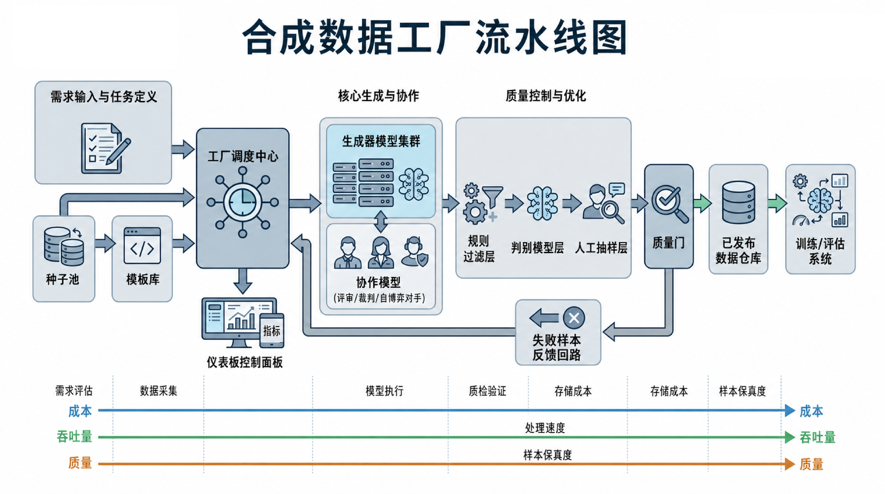

**Part Opening Guide**

As LLM training moves into a stage where fine-grained optimization and scale grow together, the data problem has shifted from "do we have data" to "can we continuously, stably, and cheaply manufacture high-quality training data." Synthetic data has moved from a prompt trick into one of the core capabilities of model iteration. But this path is not automatically safe. Model-generated data can amplify bias, reduce information density, produce samples that look correct but are fragile, and feed a model's own defects back into later training.

The real question is how to turn synthetic-data capability into an industrial system that can be reused, evaluated, and governed. Such a system must cover task design, template orchestration, candidate generation, filtering, difficulty control, deduplication, contamination checks, manual sampling, version tracking, and feedback iteration.

# Chapter 15: Synthetic Data Factory: From Seeds to Validation

After LLM training becomes continuous and operational, the core question is no longer whether a team can call a model to generate some examples. The question is whether the team can produce training-ready data in a stable, low-cost, explainable, and auditable way.

Many teams begin synthetic data with prompt writing. They ask a model to imitate a style, fill a gap, create a dialogue, or expand a class of questions. This works during early validation because it is fast and intuitive. But once synthetic data is used at scale, the team must shift from "generation" to "production." A production system has raw materials, templates, scheduling, multi-model collaboration, quality gates, rework, feedback, versioning, and operating dashboards.

## 15.1 Why Synthetic Data Needs Factory Thinking

### Why Scattered Generation Cannot Create Stable Capacity

Scattered generation is easy to start. One engineer with a good prompt and a strong model can create a batch that looks useful. The problem is that this approach depends heavily on individual skill, has inconsistent inputs, lacks process control, and has weak acceptance criteria.

Different people may write different prompts for the same task, producing incompatible task boundaries, output formats, difficulty levels, and style constraints. The dataset may look large, but it is really a mixture of different production logics.

Scattered generation is also hard to schedule. One day the team generates code explanations, the next day safety refusals, and the next long-context summaries. The process becomes firefighting rather than production. When quality fails, the team cannot tell whether the seed, template, model, filter, or validation standard caused the issue.

### From "Can Generate" to "Can Deliver": The Definition of Capacity Must Change

Many teams measure synthetic-data capacity by raw generation count. A factory should measure effective output: data that passes filtering, validation, and training consumption.

Useful capacity has at least four levels: candidate output, accepted storage volume, training-consumable volume, and actual contribution to model capability. If a system produces 100,000 candidates but only 10,000 pass gates, its production capacity is 10,000, not 100,000.

### Why Standardization Is the Starting Point of Factory Production

Without standardized inputs, templates, validation criteria, and logs, there is no scheduling, traceability, or feedback. A synthetic sample should be treated as a manufactured item with process metadata.

```json
{
  "id": "syn_qa_00010293",
  "meta": {
    "task": "customer_service_qa",
    "template": {"name": "cs_refund_v1", "version": "1.2.0"},
    "seed_id": "seed_cs_0041",
    "producer_model": "model_small_v3",
    "judge_model": "model_large_judge_v2",
    "difficulty": "basic",
    "risk_level": "low",
    "gating": {
      "format_ok": true,
      "policy_ok": true,
      "dup_score": 0.08,
      "judge_score": 4
    }
  },
  "messages": [
    {"role": "user", "content": "Who pays shipping if I return an item?"},
    {"role": "assistant", "content": "It depends on the platform and merchant rules. If the return is due to product quality, the merchant often pays. If it is a no-reason return, the buyer often pays. Please confirm whether it is a quality issue and whether it is within the no-reason return period."}
  ]
}
```

### Differences Between Synthetic Data Engineering and Traditional Data Augmentation

Traditional augmentation transforms existing samples: image flips, text substitutions, perturbations, or recombinations. It usually assumes the core semantics remain unchanged.

Synthetic data engineering creates new supervised signals. It may create new tasks, new scenarios, new constraints, and new trajectories. Therefore its risks include semantic correctness, task consistency, role boundary, factuality, reasoning validity, and distribution control.

### The Essence of Synthetic Data: Automatically Manufacturing Supervision Signals

Synthetic data is not simply generated text. It is a manufactured supervision signal. Its value depends on whether it encodes the behavior the team wants the model to learn.

For tool-use data, the supervision signal is tool choice, parameter filling, result consumption, and recovery. For safety data, it is stable behavior around risk boundaries. The textual surface is only one layer.

### Why Data That "Looks Good" Can Still Be Harmful

LLMs are good at making flawed content sound plausible. A sample may be fluent, polished, and well formatted while still having a false premise, weak reasoning, wrong tool timing, or harmful refusal boundary.

The most dangerous synthetic samples are often not obviously bad. They sit in a gray zone: smooth but shallow, correct-sounding but misaligned, polite but unhelpful. A factory needs gates that detect these subtle failures.

### System Balance Among Cost, Quality, and Throughput

Synthetic factories always balance cost, quality, and throughput. Strong models, long prompts, multi-step judges, and high human sampling raise quality but lower throughput. Cheap models and light filters raise throughput but may lower training value.

The correct configuration depends on task risk and training stage. Cold start should lean toward quality. Scaling should lean toward automation. Pre-release and high-risk data should lean back toward quality.

### Why "Low-Cost Synthesis" Often Becomes More Expensive

Cheap generation is not cheap if it lowers pass rate, increases rework, weakens training gain, or forces extra debugging. The real metric is cost per useful and training-beneficial sample, not cost per call.

A more expensive generator-plus-validator chain may reduce total cost if it produces fewer bad samples and less rework.

### Factory Scheduling: Turning a System From "Can Run" to "Can Produce"

Scheduling is more than queueing calls. It maps upstream demand, model resources, template priorities, budget, quality goals, and feedback into a production plan.

High-difficulty reasoning samples may need small batches, strong models, and strict validation. Industry customer-service data may use templated expansion plus sampling. Tool-failure cases should enter a repair chain from failure log to template revision to targeted regeneration.

### Scheduling Must Coordinate Priority, Resources, and Risk

High-value, high-risk tasks should use high-assurance pipelines even if they cost more. Large but routine tasks should use standardized batch pipelines. Exploratory tasks should run as pilots before scaling.

Without this stratification, every demand looks urgent, every sample looks important, and every model resource becomes overloaded.

### How Scheduling Connects Upstream Demand and Downstream Training

The scheduler should use training feedback. If evaluation shows weak multi-turn clarification, related templates should receive higher priority. If a sample family has not improved model results across versions, its quota should decline.

Scheduling is the hub of the demand-production-training-feedback loop.



*Figure 15-1: Synthetic data factory flow*

### Cost, Capacity, and Quality Balance Table

| Factory strategy | Typical approach | Cost | Capacity | Quality ceiling | Main risk | Best fit |
|---|---|---:|---:|---:|---|---|
| Strong model direct generation | Strong model generates, light filter | High | Medium | High | Expensive and style-narrow | Cold start, gold samples |
| Medium model plus strong judge | Cheap generator, strong judge | Medium | High | Medium-high | Judge instability | Large routine tasks |
| Multi-model collaboration | Producer, critic, judge, rules, sampling | Medium-high | Medium-high | High | Complex orchestration | Complex and important data |
| Rule-led plus model repair | Templates generate, model repairs locally | Low | High | Medium | Over-templating | Stable narrow-domain tasks |
| Self-play plus sampling | Models generate adversarial or dialogue data | Medium | Medium-high | Medium-high | Self-loop bias | Dialogue, safety, tool interaction |
| Heavy human review | Model generates, humans review heavily | Very high | Low | High | Human bottleneck | High-risk or compliance-sensitive data |

*Table 15-1: Cost, capacity, and quality tradeoffs*

## 15.2 Seed Pool and Template Library

### Acquiring, Filtering, and Stratifying High-Quality Seeds

Seeds are the factory's raw materials. A seed is not just an example format. It encodes task boundaries, granularity, reasoning style, style constraints, and error zones.

Seed sources include human gold samples, real online interactions, public datasets, industry documents, and high-quality subsets from prior synthetic outputs. Each source needs filtering, de-identification, and role labeling.

### What Makes a High-Quality Seed "High Quality"

A high-quality seed has a clear objective, stable structure, representativeness, and transferability. It should expose a useful task pattern rather than merely look impressive.

The best seed is often not the most beautiful sample. It is the one that can be decomposed into reusable production rules.

### Seed Acquisition Should Follow Task Hypotheses, Not Merely Collection

Seed collection should start from hypotheses: what capability is missing, what failure mode needs repair, or what long-tail distribution needs coverage. Randomly collecting "good examples" creates a museum, not a production pool.

Each seed should be tied to a task purpose and expected generation role.

### Seed Filtering Is Not Only Removing Bad Samples; It Selects Process Masters

Filtering removes noise, but it also selects master patterns. Some seeds are format anchors. Some are difficulty anchors. Some are boundary cases. Some are negative examples that define what not to produce.

The seed pool should preserve these roles as metadata.

### The Real Role of Seed Stratification Is Making Raw Materials Schedulable

Stratification turns a pile of examples into schedulable materials. Useful dimensions include task type, domain, difficulty, risk level, style, source, and intended factory role.

The scheduler can then request "high-risk refund edge cases" or "medium-difficulty tool-recovery seeds" instead of searching manually.

### Task, Role, Difficulty, and Constraint Templates

Templates are the factory's process design. Task templates define what to generate. Role templates define interaction stance. Difficulty templates define challenge level. Constraint templates define what must not be violated.

A template library is not a prompt folder. It is a versioned production system.

### Why a Template Library Is Not a Prompt Repository

A prompt repository stores strings. A template library stores task purpose, variables, constraints, input contracts, output schemas, expected failure modes, and validation rules.

It should support versioning, A/B comparison, rollback, and performance tracking.

### How Task Templates Define "What to Generate"

Task templates specify the capability target, input situation, output structure, acceptable variation, and success criteria. A vague task template generates vague supervision.

Examples include "multi-turn clarification before refund policy answer" or "SQL tool recovery after missing field."

### How Role Templates Shape Behavior Style Rather Than Surface Tone

Role templates should not merely say "be polite." They should define operational stance: assistant, reviewer, tutor, safety checker, tool executor, customer-service representative, or adversary.

Role affects what information is asked, what actions are allowed, and how uncertainty is expressed.

### How Difficulty Templates Prevent the Sample Library From Staying "Easy but Pretty"

Difficulty templates define where challenge comes from: ambiguity, multi-step reasoning, conflicting evidence, long context, rare category, adversarial wording, or tool failure.

Without difficulty design, the factory tends to overproduce clean, easy, high-pass-rate samples.

### How Constraint Templates Put "Non-Negotiables" Into the Production Line

Constraint templates encode safety, factuality, format, permission, and business boundaries. They ensure that "must not fail" conditions are represented before validation.

For high-risk tasks, constraints should be stricter than the generator prompt and also checked by gates.

### Methods for Expanding From a Small High-Quality Set to a Large Sample Library

Expansion should proceed in stages: seed selection, template extraction, controlled variation, batch generation, deduplication, quality gates, sampling review, and training feedback.

Expansion should not blindly multiply examples. It should preserve the capability represented by the seed while varying context, style, difficulty, and edge conditions.

### The Key to Scale: Expanding the Right Distribution

Scale is useful only when the distribution expands in the right directions. The team should monitor domain coverage, task type, difficulty, style, error modes, and long-tail cases.

If expansion only creates surface paraphrases, volume grows while training value stagnates.

### From Gold Samples to Scale, an Intermediate Layer Is Needed

Between gold seeds and large batches, teams need an intermediate layer: prototype samples. These are generated in small batches and reviewed to test whether templates preserve the intended behavior.

Prototype batches reveal template weaknesses before expensive full production.

### How Seed Pools and Template Libraries Jointly Determine the Data Ceiling

Seeds anchor reality. Templates define how reality is amplified. Poor seeds create unstable anchors. Poor templates distort good seeds.

The ceiling of a synthetic factory is determined by the interaction between seed quality and template discipline.

### Seed Pools Define Real Anchors; Template Libraries Define Amplification Methods

Seeds answer "what real or desired behavior should this data stay close to." Templates answer "how should this behavior be expanded."

Both need versioning and performance tracking. A failed batch should be traceable back to seed version and template version.

### Seed Sources and Applicable Tasks

| Seed source | Strength | Risk | Best task |
|---|---|---|---|
| Human gold samples | High trust and clear standard | Expensive and small | Gold sets, high-risk data |
| Online interactions | Real distribution | Noise and privacy risk | Failure repair, long-tail mining |
| Public datasets | Broad coverage | License and mismatch | Pretraining or general tasks |
| Industry documents | Domain grounding | Hard to convert to supervision | RAG, domain QA |
| Prior synthetic winners | Cheap reusable patterns | Self-loop bias | Template improvement |

*Table 15-2: Seed sources and suitable tasks*

## 15.3 Generation, Filtering, and Validation

### Single-Model Generation, Multi-Model Collaboration, and Self-Play

Generation architectures include single-model generation, multi-model collaboration, and self-play. Single-model generation is simple and good for startup. Multi-model collaboration separates producer, critic, judge, and verifier roles. Self-play creates interactive or adversarial trajectories.

Each architecture has a different risk profile.

### Why Single-Model Generation Is Good for Starting but Not for Long-Term Dominance

A single model is easy to operate, debug, and budget. It is useful for early batches and simple tasks. But it also concentrates style bias, knowledge gaps, and failure modes in one generator.

Long-term factories need external checking or model-role separation.

### Multi-Model Collaboration Means Role Separation, Not Model Stacking

Multi-model collaboration should separate responsibilities. One model may generate, another critique, a stronger model judge, and rules validate structure.

Simply adding more models without role design increases cost without governance.

### Different Task Types Need Different Collaboration Structures

Factual QA needs source grounding and fact checks. Reasoning data needs solution verification. Tool-use data needs executable calls and simulated observations. Safety data needs adversarial probes and policy checks.

Factory design should be task-specific.

### Why Self-Play Is Powerful and Dangerous

Self-play can create multi-turn, adversarial, and recovery trajectories that are hard to write manually. It is useful for dialogue, negotiation, safety, and tool-use stress tests.

Its danger is closed-loop bias. If both sides share model habits, the data may become internally coherent but externally narrow.

### Rule Filters, Discriminator Models, Judge Models, and Manual Sampling

Quality control should combine rule filters, discriminator models, judge models, and human sampling. Each layer has a role.

Rules catch explicit failures. Discriminators triage likely quality. Judges score against rubrics. Humans inspect subtle semantic and business risks.

### Rule Filters Handle Explicit Errors but Are Not Quality Judgment

Rules are good for schema, forbidden tokens, length, duplicates, invalid fields, and simple policy violations. They are bad at determining whether a sample truly teaches the intended behavior.

Rule pass is only the first gate.

### Discriminator Models Are Triage Systems, Not Final Judges

Discriminators sort candidates by likely quality or risk. They are useful for prioritizing human review and strong-judge calls.

They should not become final authority without calibration.

### Judge Models Must Score by Rubric, Not by Feeling

Judge prompts should contain explicit criteria: correctness, completeness, constraint compliance, difficulty, diversity, and risk. "Which is better" judgments are too vague for factory governance.

Judge consistency should be monitored and compared with human audits.

### The Focus of Human Sampling Is Looking at the Right Things

Human review is expensive. It should target high-risk tasks, new templates, low-confidence batches, distribution edges, and disagreement between automated gates.

Sampling should answer process questions, not only individual-sample quality.

### Quality Gates: Stopping Data Before It Enters Training

Quality gates prevent weak data from entering training. Gates should exist before storage, before training inclusion, before release, and after training feedback.

A good gate records not only pass/fail, but why a sample passed or failed.

### Quality Gates Are Not the Same as Quality Scores

A quality score ranks or estimates. A gate decides whether data may enter the next stage. A sample can have a high score but still fail a hard safety or format gate.

Gates need policy, not only model confidence.

### Why Gates Must Be Layered Rather Than One Total Exit

One total gate hides failure reasons. Layered gates reveal where data fails: format, policy, duplicate, factuality, difficulty, diversity, or business fit.

Layered gates make repair possible.

### Moving Gates Upstream Significantly Reduces System Cost

Early gates catch cheap failures before expensive judging, human review, or training. Moving validation upstream reduces wasted tokens, reviewer time, and training cycles.

The factory should catch obvious invalid candidates as close to generation as possible.

### Combined Validation of Correctness, Readability, Diversity, and Difficulty

Synthetic validation should check correctness, readability, diversity, and difficulty together. Optimizing one dimension alone creates distortions.

Correct but unreadable data is hard to train. Diverse but wrong data is harmful. Difficult but unrealistic data wastes capacity.

### Correctness Is the Bottom Line, but Evidence Differs by Task

Correctness evidence differs. Math needs verifiable solution. Code needs execution. Tool-use needs executable call and correct observation. Factual QA needs source grounding. Safety data needs policy alignment.

The validation method should match task semantics.

### Readability Validation Focuses on Training Friendliness, Not Aesthetics

Readability does not mean literary polish. It means the sample is clear enough for training: no confusing role switches, broken formatting, ambiguous labels, or unnecessary noise.

Some natural messiness is useful, but the supervision signal must remain readable.

### Diversity Validation Is About Structural Difference, Not Only Wording Change

Surface paraphrases are not meaningful diversity. Diversity should cover task type, reasoning path, difficulty, domain, error mode, user style, and output structure.

The factory should measure structural similarity, not only lexical similarity.

### Difficulty Validation Prevents the Factory From Staying in Its Comfort Zone

Factories tend to produce easy samples because they pass gates at high rates. Difficulty validation ensures the dataset includes ambiguity, long tail, multi-step reasoning, conflict, and recovery.

Difficulty should be scheduled and monitored, not left to chance.

## 15.4 Feedback, Versions, and Dashboards

### Failed Synthetic Samples Flow Back to Template and Seed Revision

Failed samples are production signals. They show which templates are underspecified, which seeds are misleading, which judge criteria are weak, and which validation gates miss errors.

Failure feedback should update seeds, templates, rules, rubrics, and scheduling priority.

### Linked Management of Data Versions, Experiment Versions, and Model Versions

Every synthetic batch should record seed version, template version, generator model, judge version, gate version, and dataset version. Training experiments should record which synthetic versions were used.

Without linked versions, teams cannot explain whether a model change came from generation logic, filtering, mixture ratio, or training configuration.

### Synthetic Factory Dashboards and Daily Operating Rhythm

A dashboard should show candidate count, pass rate, rejection reasons, cost per accepted sample, judge disagreement, human sampling results, training use, and model effect.

Daily operation should include demand review, production status, failed-batch inspection, and feedback from training.

### From One-Time Project to Continuously Evolving Data Factory

A synthetic data factory is not a one-time script. It is a continuous system that evolves with model weaknesses, product needs, new risks, and training feedback.

The factory becomes valuable when each generation cycle improves the next.

## Chapter Summary

This chapter framed synthetic data as an industrial production system rather than a prompt trick. We explained why scattered generation cannot create stable capacity, why "generated count" is not the same as effective output, and why standardization is the starting point of factory governance.

We then covered seed pools, template libraries, generation architectures, filtering, validation, quality gates, feedback loops, version management, and operating dashboards. The key idea is that synthetic data is manufactured supervision. Its value depends on traceable raw materials, controlled amplification, layered validation, and training feedback.

## References

Alemohammad S, Casco-Rodriguez J, Luzi L, et al. (2024) Self-Consuming Generative Models Go MAD.

Chen L, Li S, Yan J, Wang H, Gunaratna K, Yadav V, Tang Z, Srinivasan V, Zhou T, Huang H (2024) AlpaGasus: Training a Better Alpaca with Fewer Data.

Feng S Y, Gangal V, Wei J, Chandar S, Vosoughi S, Mitamura T, Hovy E (2021) A Survey of Data Augmentation Approaches for NLP.

Gebru T, Morgenstern J, Vecchione B, Vaughan J W, Wallach H, Daume III H, Crawford K (2021) Datasheets for Datasets. Communications of the ACM 64(12):86-92.

Honovich O, Scialom T, Levy O, Schick T (2023) Unnatural Instructions: Tuning Language Models with Almost No Human Labor.

Mukherjee S, Mitra A, Jawahar G, Agarwal S, Palangi H, Awadallah A (2023) Orca: Progressive Learning from Complex Explanation Traces of GPT-4.

Polyzotis N, Roy S, Whang S E, Zinkevich M (2017) Data Management Challenges in Production Machine Learning. In: SIGMOD.

Pushkarna M, Zaldivar A, Kjartansson O (2022) Data Cards: Purposeful and Transparent Dataset Documentation for Responsible AI.

Sculley D, Holt G, Golovin D, et al. (2015) Hidden Technical Debt in Machine Learning Systems. In: NeurIPS.

Shorten C, Khoshgoftaar T M (2019) A Survey on Image Data Augmentation for Deep Learning. Journal of Big Data.

Shumailov I, Shumaylov Z, Zhao Y, Gal Y, Papernot N, Anderson R (2024) AI Models Collapse When Trained on Recursively Generated Data. Nature.

Wang Y, Kordi Y, Mishra S, Liu A, Smith N A, Khashabi D, Hajishirzi H (2023) Self-Instruct: Aligning Language Models with Self-Generated Instructions.

Xu B, Yang X, Lin Z, Wang H, Zhang C, Xu Y, Li C, Zhou J (2024) WizardLM and Evol-Instruct Style Synthetic Data Research.

Zhou C, Liu P, Xu P, et al. (2023) LIMA: Less Is More for Alignment.
