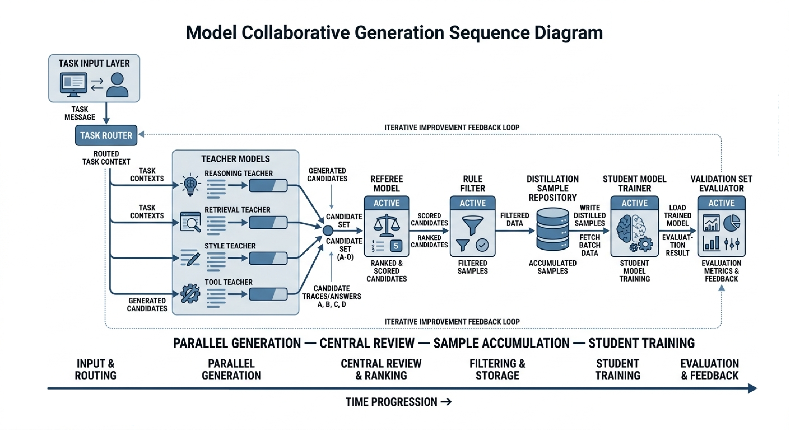

# Chapter 16: Knowledge Distillation and Model Collaboration

As large models gradually move into the engineering deployment phase, teams are increasingly treating "a larger teacher model" as the only answer, and are instead shifting attention to "how to get multiple models to collaboratively generate high-quality samples, and then stably and cheaply transfer these capabilities to a student model." This is precisely the core value of knowledge distillation and model collaboration. For teams responsible for multi-model collaborative generation, distillation, and teacher-student workflows, the real difficulty has never been training a student model once. It is building a reusable, verifiable, and continuously optimizable pipeline for sample production and capability transfer.

The focus of this chapter is not to treat distillation as an isolated training trick, but to put it back into the entire data-and-model collaboration system and re-understand it: how teacher models divide labor, how judge models intervene, how student models receive and absorb capabilities, how synthetic samples are designed, how distillation paths are chosen, how teacher bias is controlled, and how gains should be verified. We particularly emphasize one engineering judgment: distillation is not as simple as "feeding the big model's answers to the small model." It is a structured reproduction process organized around target capabilities. Only when sample structure, role division, verification pipeline, and ROI accounting are all clearly designed can distillation truly become a stable systemic capability.

---

## 16.1 Why the Core of Distillation Lies in Samples, Not Slogans

In many teams, knowledge distillation is often described as "compressing the capability of a large model into a small model." This statement is not wrong, but it is too abstract and can easily obscure the real difficulty of distillation work. Whether distillation succeeds is often not determined by the name of the training framework, nor by whether a more complex loss is introduced, but by whether the samples truly carry the target capability. If the content output by the teacher model does not form a clear mapping to the student's input format, business constraints, and online objectives, then so-called distillation is merely copying surface answers, not transferring usable capability.

From an engineering perspective, distillation is not a one-shot "model compression action," but rather a process of reorganizing knowledge representation around a target task. Although the teacher model has greater parameter capacity, stronger generalization, and richer internal representations, these advantages do not automatically translate into deployable capability in the student model. The real carrier of transfer is not "the teacher model itself," but the samples generated by the teacher model after being shaped by tasks, structured, and filtered. In other words, distillation is not stuffing one model into another. It is slicing out and translating valuable capabilities from one model, and then assembling them into another.

When pushing distillation projects, many teams focus their attention on model size, distillation framework, number of training rounds, and even GPU budget, but ignore a more fundamental question: what exactly should the student learn in the end? Is it to learn to output standard answers more stably, or to make step-by-step judgments in complex scenarios? Is it to mimic the teacher's expressive style, or to learn the teacher's decision logic at key nodes? Is it to execute a fixed process when tools are available, or to make reliable inference in a pure language environment? If these questions are not answered clearly first, subsequent sample production can only be superficially lively, and the student model will find it hard to gain truly transferable benefits.

### Distillation failures are usually sample design failures, not training algorithm failures

When many distillation projects fail, the team's first reaction is to keep tuning learning rate, switching optimizers, lengthening training steps, or trying new distillation losses. However, in real engineering, a more common problem is that the distillation samples themselves have not clearly defined "what we want the student to learn." If the teacher's output is a complete long answer, but after deployment the student only needs to make short-form decisions, then samples that are too long and information-diluted will cause the student to learn redundant expressions rather than decision-making capability. Conversely, if the student must perform complex reasoning, but the distillation samples retain only the final label without intermediate evidence and judgment framework, then the student only learns to imitate results, not decision logic.

Therefore, the first principle of distillation sample design is not "collect more answers," but to first clarify the capability unit. A capability unit may be a classification judgment, a structured extraction, a long-text rewrite, or a tool selection and invocation. Only by first defining the capability unit, then deciding which fields, trajectories, explanations, and constraints to retain in samples, can distillation actually land. Many training runs appear to "converge normally" but perform mediocrely online. Essentially, this is not because the student cannot learn, but because the training set has not expressed what it needs to learn clearly.

More concretely, distillation failures usually come from three categories of sample design errors. The first is supervision target misalignment. The teacher's output looks high quality, but it does not correspond to the task form the student actually needs to perform. For example, the business requires the student to do structured field extraction, but the samples provide long passages of natural language explanation; the business requires the student to make low-latency classification decisions, but the samples contain lengthy arguments. The second is missing sample fields. The team only keeps the simplest "question-answer" pair, but deletes the key evidence, constraints, and failure boundaries the teacher used when making judgments. Students trained this way often know how to answer but not how to evaluate. The third is sample distribution distortion. The data generated by the teacher differs significantly from the real business distribution in tone, length, topic coverage, and difficulty structure, causing the student to perform well on offline sets but struggle with real inputs online.

This is why many distillation projects produce a kind of illusion: the team feels they "have already fed in many high-quality teacher answers," yet there is still no significant gain. The problem is not in the quantity of answers, but in the fact that these answers have not been organized into a form the student can learn from. For distillation teams, samples are not raw material that is "usable as-is." They are intermediate products that need precise processing. A mature distillation system must treat sample design itself as core engineering, not as preparation work before training.

### Capability units come before sample scale

In the early stages of a distillation project, one of the most common mistakes is pursuing scale too early. After seeing the teacher model stably generate results, the team starts mass-producing data, hoping that sample volume can make up for design shortcomings. But distillation is different from traditional pretraining. Distillation samples are not "the more the better." They are "the more correct the better." If the capability unit has not been clearly defined first, the larger the sample scale, the more systematically erroneous supervision will be amplified.

This problem is especially easy to ignore at the start of a project, because "do more first" always sounds reassuring. Once data volume rises, the team feels production is stable, the pipeline is working, and there is something to feed into training. But distillation is not the same thing as general corpus expansion. In pretraining, data volume itself is part of the source of capability; in distillation, data is more about delivering a directional supervision signal. If the direction itself is not defined clearly, then scaling will not produce capability accumulation, but bias replication. Put bluntly, what distillation fears most is not too few samples, but a large batch of samples teaching the student wrong things.

A capability unit refers to a smallest evaluable capability fragment that the student needs to master stably. It can be "judging whether to invoke a tool based on user input," "extracting the liable party from a regulation clause," or "filtering key evidence supporting a conclusion in retrieval results." The purpose of breaking a distillation task into capability units is not just to ease data annotation, but to make teacher output, sample fields, and student objectives form a traceable correspondence. Only when a capability unit is clear can the team know whether to distill answers, processes, styles, or tool trajectories.

This step is important because in distillation projects it is easy to encounter "same surface task, different actual training." For instance, in question answering, some samples actually train fact extraction, some train evidence synthesis, some train boundary expression, and some train tone control. If these are not separated first, all samples will be lumped under "QA capability," and what the student actually learned will be hard for the team itself to articulate. Training loss may decrease, and some local metrics may improve, but once the scenario changes or error attribution is needed, the team will find that the supervision signals are blurred together.

Only after a capability unit is defined does sample design have a boundary. For example, for a "should we invoke an external tool" judgment task, the key in samples is not how much explanation the teacher adds afterward, but whether the input context, trigger condition, invocation decision, and counterexamples are retained. As another example, for "long-text style rewriting," what the student really needs to learn is style constraints, information fidelity, and discourse structure, not the teacher's entire verbose thought process during generation. If a team can first decompose tasks into a number of clearly defined capability units and then design distillation sample structures separately, then whether teachers are swapped, judges upgraded, or students replaced, the whole pipeline remains more controllable.

Furthermore, capability units also determine how evaluation should be done. Without capability units, teams often can only look at a very broad overall metric like "general effectiveness," "overall usability," or "average accuracy." Such metrics are of course useful, but they cannot tell you exactly where the problem lies. If a student keeps choosing the wrong time for tool invocation, and frequently misses key sentences in evidence filtering tasks, the training fixes are completely different. Only when capability units are defined first can evaluation be broken down accordingly, and the team can really answer "what specifically doesn't the student know," "is it unable to do it, or able but unstable," "is the output format wrong, or has the task boundary not been learned."

This is also why mature teams usually do not pursue a "unified large sample pool" from the start. They prefer to first build a small batch of capability-unit data with clear boundaries and single objectives, aligning teacher output mode, sample fields, evaluation methods, and business goals. The data volume at this stage may not be large, but its value is high, because it lays down the supervision direction for later scaling. Only after these capability units have each been validated should one consider how to scale up, how to stitch together, and how to do curriculum-style feeding. The whole distillation process is then less likely to spiral out of control.

From an engineering management perspective, "capability units come before sample scale" is really reminding the team: distillation is not about turning the teacher model's productive capacity into data volume. It is about decomposing the teacher's advantages into discrete capabilities the student can actually learn, evaluate, and deploy. Once this order is reversed, the team easily falls into a state of being seemingly busy but producing fuzzy outputs: more and more data, repeated training, yet the student never forms a few stable, interpretable, reusable capability growth points.

### Not all teacher output deserves to be retained

Teacher model output does not naturally equal high-value samples. Even if the teacher's overall capability far exceeds the student's, it can still produce redundant content, local errors, stylistic imbalance, over-confident boundaries, or even answers that don't comply with business norms. If the team treats teacher output as "automatic ground truth," the distillation process degenerates into an efficient mechanism for replicating errors and noise.

**Code example: Compressing a "long teacher answer" into student-friendly structured supervision**

The following example demonstrates a common "representation mapping" practice: splitting a long teacher answer into three parts—`final / rationale / limits`—which is more conducive to small models learning stable boundaries, and preserving the most critical metadata (teacher source, judge score, whether it enters the main training set).

```python
from dataclasses import dataclass


@dataclass
class DistillSample:
    prompt: str
    final: str
    rationale: str
    limits: str
    meta: dict


def compress_teacher_answer(prompt: str, teacher_text: str, *, teacher_id: str, judge_score: int) -> DistillSample:
    # Pedagogical example: use a simple delimiter to demonstrate "structured trimming"
    # In industrial practice, these fields are usually generated by review tasks / judge models / rule systems
    parts = [p.strip() for p in teacher_text.split("###") if p.strip()]
    final = parts[0] if parts else teacher_text.strip()
    rationale = parts[1] if len(parts) > 1 else ""
    limits = parts[2] if len(parts) > 2 else ""

    return DistillSample(
        prompt=prompt,
        final=final,
        rationale=rationale,
        limits=limits,
        meta={
            "teacher": teacher_id,
            "judge_score": judge_score,
            "use_for_training": judge_score >= 4
        }
    )


if __name__ == "__main__":
    p = "User: How should one answer when information is insufficient?"
    t = "Conclusion: First state the constraints, then propose the minimum necessary clarifying question.###Rationale: Avoid forcing an answer when evidence is insufficient.###Limits: For high-risk scenarios, prioritize safe routing."
    s = compress_teacher_answer(p, t, teacher_id="teacher_v5", judge_score=5)
    print(s)
```

This point is common in real projects. Teams initially tend to place natural trust in strong teachers, thinking that since the teacher's overall performance is far better than the student's, simply keeping its output is more cost-effective than human rewrites bit by bit. This judgment is not entirely wrong, but it misses a critical filtering step: a strong teacher does not mean the teacher is suitable as learning material for the student on every task and every expression form. Teacher models have their own generation habits—sometimes preferring elaboration, sometimes over-explaining, sometimes adding tone and structure that the student shouldn't really learn just to make answers look complete. If all this is retained unfiltered, the student learns not just task capability, but a whole set of expressive burdens that may not suit it.

Therefore, an important but often overlooked judgment in the distillation pipeline is: which parts of the teacher's output deserve to be retained, which should be compressed, which should be deleted, and which should even be rewritten. The teacher's long chain-of-thought explanations may inspire researchers but may not be suitable for the student to absorb; the teacher's complex rhetoric may look sophisticated but may not help a small model form stable behavior; the teacher's confident phrasing on boundary issues may improve readability but may force fixity onto judgments that should not be definitive.

The real difficulty is that "what looks good" in teacher output is not always "what is suitable to learn." For example, a large model in open-ended QA may write a long answer with clear layering and sufficient buildup—humans reading it find it complete. But the deployment scenario of the student model may only need a short, stable reply. As another example, the teacher may use strong tone to enhance persuasiveness even when not fully certain; human reviewers may temporarily find it clear, but if the student learns this tone for real, it may produce boundary problems in high-risk scenarios. What distillation should really ask is never "does this answer look strong" but "which parts of this answer are worth letting the student imitate."

This means distillation is not simple data transport, but an editorial process of knowledge reconstruction. Excellent distillation teams are more like "sample editors" than "sample shippers." They do not seek to retain everything the teacher said, but to pull out, organize, and compress the parts of the teacher that truly help complete the task, and then hand them to the student to learn.

What most tests the team's judgment is usually not finding the teacher's obvious errors, but recognizing content that "looks fine locally but should not be retained overall." For example, certain long explanations from the teacher are not wrong but do not match the student's final deployment goal; certain polite expansions do not violate norms but slow down response cadence; certain high-level summaries are inspiring but too abstract for a small model—worse than explicit, structured intermediate labels. Fundamentally, distillation is not archiving teacher output; it is editing student learning materials.

So in mature distillation pipelines, teacher output is usually followed by several "editing actions." Some tasks suit keeping the conclusion and compressing the explanation; some suit keeping the key intermediate state and removing rhetoric; some suit extracting only tool decisions and result integration, without keeping the teacher's lengthy thinking; some require keeping the teacher's skeleton while rewriting a version more suited to the student's capacity and business requirements. Only after going through this editing layer does teacher output truly start to approach high-value distillation samples.

In this sense, the stronger the teacher, the less the team can afford to be lazy. Because a stronger teacher more easily generates content that "looks very much like a complete answer," the team is more likely to relax their guard and mistakenly believe that batch saving is enough. In reality, the more capable the teacher, the more likely it carries a large amount of high-level expressive habits and implicit reasoning shortcuts. These may be valuable to researchers but not friendly to students. Whether distillation works well often hinges on this step: whether teacher output is treated as raw material to be processed, or as ground truth to be copied verbatim.

### The mapping between teacher output, student input, and business objectives

In distillation engineering, teacher output is never the goal—teacher output is just intermediate material. What truly matters is how this material is reorganized and transformed into input-output pairs suitable for student learning. Teacher models often have longer context, stronger reasoning, and more complex expressive style, but the deployment goals of student models are usually constrained by cost, latency, context length, and inference stability. Therefore, teacher output cannot be transmitted as-is. It must be put through task mapping.

This mapping contains at least three layers. The first is task mapping: whether the teacher's answer corresponds to the task boundary the student will eventually take on. The second is representation mapping: whether the teacher's long chain-of-thought analysis should be compressed into a short explanation, a label, a step outline, or a tool invocation sequence. The third is objective mapping: whether the sample ultimately serves accuracy improvement, style unification, tool success rate improvement, or quality fallback after latency reduction. Only when these three layers are aligned will distillation data avoid the situation of "the teacher is strong, the student is busy, but the results are not better."

Let's start with task mapping. The teacher can usually do much more than what the student needs to do on deployment. The teacher can explain, expand, and add background simultaneously, and even offer several alternative options; but the student may only need to make judgments, extractions, or short answers within a fixed flow. If the task boundary is not aligned first, no matter how good the teacher's output is, it may be teaching the student to do things it doesn't need to do at all. The most common consequence is that the student's answers become longer and fancier without getting closer to the business goal. It looks like capability is improving, but the student is learning in the wrong direction.

Next, representation mapping. The teacher's expressive form may not suit direct absorption by the student. A large model can use long chain-of-thought reasoning to break down complex problems in fine detail, and can naturally weave multiple intermediate judgments into context, but the student model's capacity, context budget, and inference stability may not support the same representation. At that point, the team must judge: should the student see the entire process or just the key steps; should we retain natural language explanations or convert them to structured labels; should we let the student learn lengthy analysis or just the final decision rationale. When representation mapping is poorly done, the student most often ends up "learning a bit of everything but never truly learning anything stably."

The third layer is objective mapping. Distillation is not abstractly "making the student more like the teacher," but answering a very practical question: what does the student rely on to create value after deployment? Is it to approach teacher quality at the same budget, to maintain core task availability at lower latency, or to do quality fallback in tool invocation, format stability, and domain phrasing? Different goals determine what samples should retain, emphasize, and sacrifice. If this layer is unclear, the team will habitually treat "retaining as much teacher information as possible" as the safe option, ultimately giving the student a bunch of high-cost, unstable returns.

From a business perspective, distillation sample design is essentially capability translation: translating implicit capabilities in a high-capacity model into explicit training materials that the student can absorb, generalize, and deploy. The biggest taboo here is treating teacher output as natural truth directly poured into the student, because the teacher's expressive style, verbose habits, and error patterns are not necessarily the optimal strategy for the student's deployment.

This "translation" is hard because it is not as simple as compressing word count. Often, what the team faces is a structural conversion. The teacher may complete judgments through long-text analysis, but the student is better suited to learning a short label plus a brief rationale; the teacher may decide whether to invoke a tool through several rounds of consecutive reasoning, but the student needs explicit trigger conditions and several boundary counterexamples; the teacher may give a stylistically elegant long rewrite, but what the student really needs to learn is discourse order, information fidelity, and tonal constraints. In other words, when mapping is done well, the student receives the "capability skeleton." When done poorly, the student only receives "the surface appearance of how the teacher speaks."

Furthermore, this mapping is rarely accomplished in one pass; it usually requires multiple iterations. Many teams doing distillation for the first time will first retain the teacher's full answer and train out a student that "says a lot but isn't stable enough"; in the second round, they begin to realize the need to compress fields, unify format, and add boundary labels; only in the third round do they gradually form a sample structure truly suited to the student's capacity and business goal. This shows that mapping in distillation is not theoretically derived, but gradually calibrated through business validation. The earlier the principle "teacher output does not equal student input" is established, the lower the cost of subsequent trial and error.

Truly mature teams do not treat this mapping as a temporary processing step but build it into a reusable engineering methodology: which tasks keep conclusions, which keep brief processes, which add counterexamples, which extract only tool trajectories, which must be rewritten into a format the student can stably learn. Once this methodology stabilizes, even when teachers are replaced, students change scale, or business goals shift, the distillation pipeline doesn't have to start from scratch. Ultimately, the core of distillation is not "feeding the stronger model's output to the weaker model," but "translating the stronger model's capabilities into training materials the weaker model can actually use." What is missing in between is precisely this mapping layer.

### Task mapping: First answer "what is the student actually responsible for"

Task mapping is the most fundamental of the three mapping layers. Many distillation problems appear to be data quality issues on the surface, but are actually problems of unclear task boundaries. The teacher model can usually handle a broader task range than the student, so the team easily becomes greedy, trying to cram all the capability the teacher demonstrates in a large task into the student. But the student going into production is usually not meant to replace everything the teacher does; it is meant to take over the high-frequency, standardizable, verifiable portion. If this boundary is not drawn clearly first, even the most beautiful samples will struggle to produce stable returns.

For example, in an enterprise QA system, the teacher may simultaneously possess knowledge QA, style polishing, factual summarization, risk warning, and even multi-turn clarification capabilities, but the student's actual duty may simply be "outputting structured answers when the knowledge base is hit." At that point, if all the teacher's behaviors are placed into distillation samples, the student will instead learn many patterns it doesn't need to take on, becoming both heavy and unstable. The significance of task mapping is to first distinguish "what the student must know," "what the student preferably knows," and "what the student should not be responsible for."

Teams that do distillation well often write a student-responsibilities specification at the very start of the project. This specification is not a technical document but a capability-boundary definition: in which scenarios the student must give a definitive answer, in which scenarios it should refuse or fall back, on which tasks it only needs to output short conclusions, on which tasks it needs to retain explanation fields. With such boundaries, teacher output knows where to converge, and sample design will not become aimless "keep as much as possible."

### Representation mapping: The teacher can say a lot, but the student shouldn't learn all of it

The core question of representation mapping is what form teacher capability is absorbed in by the student. The teacher model may have completed a high-quality reasoning through long-chain analysis, but the student doesn't necessarily need to reproduce this entire chain. For a student model with limited capacity and constrained deployment, the key often isn't replaying every thought of the teacher, but learning the teacher's judgment framework at critical nodes.

This is easily misjudged in distillation. When the team sees the teacher answering long and thoroughly, they instinctively feel that since this content helped the teacher arrive at good results, the student should also learn all this content. But reality is often otherwise. The teacher can carry long analytical chains because it has larger parameter capacity, longer context budget, and more tolerance for redundancy and back-and-forth in intermediate processes. The student model often doesn't have such headroom. It faces tighter latency, shorter context, and less reasoning space at deployment. At that point, feeding the teacher's long passages of analysis to the student as-is often results not in "learning more completely" but in "learning more laboriously and less stably."

The same teacher output can be transcribed into multiple sample representations. It can be kept as a complete answer, or broken into "input - conclusion - key evidence - constraints"; it can be compressed into "problem decomposition - evidence location - final judgment"; it can be rewritten as "when to invoke a tool - what tool to invoke - how to wrap up based on the result." Different representations have huge impact on student learning. Many small models fail to learn not because the task is too hard, but because the sample representation is too close to the teacher's perspective without adapting to the student's capacity and task boundary.

What needs to be grasped here is not how much the teacher said, but at which few places the teacher made the most critical judgments. For instance, a legal QA response: the teacher may write long background, clause explanation, conditional supplements, and analogies, but what the student really needs to learn may just be three things: first locate applicable clauses, then distinguish known facts from unconfirmed facts, and finally preserve the conclusion boundary when information is insufficient. As another example, in a tool invocation task, the teacher might first analyze user intent, then enumerate candidate paths, and finally decide which interface to invoke. But the student model doesn't necessarily need to reproduce this whole natural-language analysis; it needs to learn "what input features trigger tool invocation," "which parameters are required," "how to fall back after a failed invocation."

So representation mapping isn't a simple compression action—it's more like a rewrite. The team isn't done after shortening the teacher's answer a little; they must rejudge: which content is the task skeleton, which is just the teacher expressing sufficiently; which steps are necessary support for the student, which are just the teacher's natural elaboration under large capacity. If this judgment is done well, the student absorbs structure; if not, the student only absorbs surface activity.

In this sense, representation mapping is supervision-signal re-encoding. Teacher output is "raw knowledge expression," while distillation samples are "training-friendly expression." These two layers should not be conflated. For a book aimed at engineering teams, this must be emphasized: distillation is not preserving the teacher's expressive habits; it's extracting the teacher's effective decision structure.

This manifests very differently across tasks. In open-ended QA, the student may be best at learning "brief conclusion + one core piece of evidence + one sentence of constraint"; in structured extraction, the student is better at learning field definitions, extraction boundaries, and missing-value strategies; in multi-hop retrieval, the student doesn't necessarily need the teacher's full natural-language reasoning, but rather "what to find first, what to filter next, how to merge finally"; in style rewriting, the student doesn't need to mimic all the teacher's rhetoric, but to grasp discourse order, tonal constraints, and information fidelity. In other words, representation mapping has no universal answer—it must follow the task's purpose.

The real problem in many distillation projects is not that the teacher isn't strong enough, but that the team is too reluctant to discard things. They always feel that since the teacher computed and wrote it all out, throwing it away feels wasteful. But for the student, the most expensive thing is often not insufficient information, but too much irrelevant information. Once the student is forced to simultaneously learn conclusions, long explanations, rhetorical styles, buildup methods, and the teacher's own thinking habits, it easily ends up "touching a bit of everything but mastering none of it stably." Training looks hardworking, but the actual deployment value is poor.

Therefore, representation mapping ultimately tests not compression technique but task understanding. The team must first know what the student needs to learn before knowing what in teacher output should be kept, cut, rewritten, turned into labels, structured fields, or intermediate states. Only when this step is correct will distillation samples increasingly look like the student's training materials, not archived copies of teacher answers.

### Objective mapping: Distillation is not single-metric optimization

Objective mapping addresses another common misconception: what kind of benefit do distillation samples actually serve? Many teams default to "improving accuracy" as the goal of distillation, but in real projects, distillation often serves multi-objective tasks. It might be to let a small model reduce latency while maintaining basic quality; it might be to make output more stable and consistent; it might be to standardize tool invocation flow and reduce online error rates. Without clarifying this, the team easily gets the wrong orientation in sample design.

"Improving accuracy" is of course a reasonable goal, but it is often only a surface goal, not necessarily what the business cares most about. After many systems go live, the most painful issue is not that the model occasionally answers wrong, but that it answers with varying length, varying boundary tightness, inconsistent tool invocation, and inconsistent phrasing across the same task class. For business stakeholders, these issues don't necessarily show up directly in a simple accuracy number, but they continuously consume user experience, system stability, and the cost of human fallback. If distillation only focuses on accuracy, it easily passes over these issues that really affect deployment quality.

For example, if the distillation goal is low-cost replacement of a large model, then sample design should focus on high-frequency, stable, clearly defined tasks, not obsessing over open-ended long-tail problems. Conversely, if the goal is strengthening vertical-domain quality, samples should retain more domain terminology, boundary definitions, risk warnings, and error counterexamples. Or if the goal is improving tool invocation success rate, the key supervision signal in samples is not the answer itself but invocation timing, parameter construction, error recovery, and post-execution wrap-up.

Behind this is a very practical judgment: where exactly does the student model create value? If it handles high-frequency entry tasks—customer service first-round responses, internal knowledge QA, routine form extraction—then what matters more is not answering the hardest questions perfectly, but doing many common questions stably, quickly, and cheaply. Conversely, if it handles the first-layer quality fallback in vertical high-value scenarios, sample design cannot just pursue throughput and average performance; it must give more weight to boundaries, terminology, domain phrasing, and high-risk counterexamples. Different goals mean samples should not look the same.

Many teams initially doing distillation default to transferring the teacher's advantages on offline benchmarks to the student as much as possible, feeling this is always safe. But in real deployment, they often find that although the student improves on some offline questions, online gains aren't obvious. The reason isn't that distillation didn't work, but that the goal served by the distillation signal isn't fully aligned with what the business wants. For instance, the teacher excels at open-ended explanations, so the team keeps a lot of long-answer samples, and the student learns to "write" better but not to "get things done"; or the team wants the student to be more like the teacher, keeping a lot of buildup and rhetoric, and after deployment the latency hasn't dropped much but the style is heavier, deviating from the original goal of low-cost replacement.

Therefore, objective mapping is essentially answering "whom is distillation for?" Is it for model leaderboards or deployment metrics; is it for offline-set performance or real-flow success rate? If this question isn't clarified, all subsequent sample design may go deeper in the wrong direction.

This step is critical because many trade-offs in distillation cannot be discussed apart from goals. Should we keep the teacher's long explanations? Should we add more counterexamples? Should we sacrifice some open-ended capability for structured stability? Should we prioritize high-frequency tasks over hard long-tail? These aren't abstract "good or bad" decisions but depend on whether they align with the project's most central return direction. Without objective mapping, the team easily falls into a "wanting everything" state: wanting the student to approach the teacher's overall capability, while being faster, more stable, cheaper, and incidentally solving all online problems. In the end, samples become increasingly mixed, training goals increasingly muddled, and no one can say what this batch of data is optimizing.

From an engineering standpoint, objective mapping should be done as early as possible and written specifically enough. For example: "Use a 7B student to replace a 70B teacher to handle 80% of high-frequency QA traffic while compressing average latency to less than one-third of the original"; or "Without significantly increasing inference cost, improve tool invocation success rate and parameter legality"; or "In a vertical legal scenario, prioritize ensuring boundary expression and term consistency, allowing slightly weaker open-ended capability." Only with goals stated to this level of specificity will sample fields, teacher filtering, judge criteria, and student evaluation naturally converge.

Furthermore, objective mapping also determines how the team views "distillation failure." If the goal is low-cost replacement, then the student not learning particularly long, complex open-ended analyses from the teacher isn't necessarily a failure; if the goal is improving tool-chain stability, the student not changing in chitchat capability isn't necessarily important. Conversely, if the team didn't make goals clear at the start, then when seeing the student "missing something," it easily treats all differences as regression and keeps adding things to samples, eventually turning what was a clear distillation task back into a hodgepodge.

So what objective mapping really solves is not finding a pretty slogan for distillation, but setting a clear ROI center for the whole pipeline. Once this center is clear, the team knows which teacher capabilities are worth translating to the student first, which samples to produce more of, which fields must be retained, which expressions can be discarded, which metric increases are truly effective, and which are just superficial activity. Whether distillation is done well, in the end, never comes down to how much the student resembles the teacher, but whether the student completes the work it was meant to take on, at a more appropriate cost and form.

### The boundaries of distillation gains: compression, transfer, and specialization

Distillation is not an infinitely beneficial path. When pushing distillation, the team must clearly know where the gains actually come from. The first type of gain is compression: transferring usable capability from a large model on certain tasks to a smaller, faster, cheaper model, in exchange for inference cost and latency advantages. The second is transfer: using a strong teacher to generate high-quality pseudo-labels for weakly supervised or data-scarce scenarios, enabling the student to quickly acquire a certain capability. The third is specialization: through multiple rounds of distillation and filtering, fixing the knowledge, conventions, and style of a vertical scenario into a lighter, specialized model.

But distillation also has boundaries. For extremely strong open-domain reasoning, long-horizon complex planning, or tasks heavily dependent on the latest external knowledge, distillation can usually only transfer "common patterns," and struggles to fully transfer "real-time capability." When business changes very fast and data distributions drift frequently, distillation gains will also be eroded by maintenance costs. In other words, distillation is suitable for sedimenting capabilities that are relatively stable, frequently occurring, and structurally definable; it is unsuitable for replacing all online intelligence.

Therefore, the right posture for a distillation project is not "the student fully replaces the teacher," but to clarify which tasks the student should take over, and on which boundary scenarios it should continue to fall back to the teacher or retrieval system. The value of distillation often comes from sensible division of labor, not from blindly trying to close the model capability gap.

Going further, although compression, transfer, and specialization are often mentioned together, their engineering logics differ. Compression focuses on cost-performance balance; transfer focuses on introducing capability under data scarcity; specialization focuses on long-term business stability. A project that pursues all three at once must accept trade-offs: emphasizing compression too much may sacrifice long-tail capability; emphasizing transfer too much may introduce teacher bias; emphasizing specialization too much may make the student lose elasticity when distribution changes. The distillation team should not deny these contradictions but write them explicitly into the design.

### When you should not continue distilling

In practice, there is another equally important but often unspoken judgment: some problems aren't suitable for further solution by distillation. For instance, when the student model's main errors are no longer "doesn't know how to answer" but "lacks the latest knowledge," "lacks real environmental state," or "lacks tool return results," continuing to add teacher samples usually brings very limited improvement. What really needs supplementation here is not distillation data, but retrieval pipelines, tool integration, or real interaction data.

As another example, when the teacher itself is unstable on certain tasks, or when teachers have clear disagreements without mature judging and verification mechanisms, blindly distilling will only solidify the instability into the student. Distillation cannot substitute for real verification, nor can it cover up upstream knowledge and process problems. A mature team should recognize the stop signal for distillation: when more samples are produced but online gains approach zero; when the student looks more and more like the teacher but not more like what the business needs; when the cost of maintaining the sample repository starts to exceed the cost of directly invoking the teacher—then it's time to pause expansion and turn to real data, process optimization, or system-role restructuring.

---

## 16.2 Role Division Among Teacher, Judge, and Student

Multi-model collaboration is not simply chaining several models together. It is building a bounded division-of-labor system around sample production, quality control, and capability transfer. Teachers are responsible for generation, judges for constraints, and students for absorption. Only when roles are clear will the collaboration pipeline avoid becoming an inexplicable black-box production line. For distillation systems requiring long-term maintenance, clear model role division is more important than peak one-time performance, because it determines whether tasks can be expanded, models swapped, and problems located later.

From a systems engineering perspective, the essence of role division is splitting the responsibilities originally concentrated in a single large model. In the past, many teams were used to letting one strong model think, answer, and self-verify all at once, as if this gave the shortest chain and simplest implementation. But once tasks start becoming complex, especially involving high-risk domains, multi-tool environments, or diverse output requirements, this "one model does everything" approach quickly exposes problems: errors are hard to attribute, boundaries hard to control, samples hard to filter, and costs hard to optimize. This is where multi-model collaboration shows its value. It isn't about manufacturing complexity but about clarifying responsibilities inside the system so different capabilities can be optimized independently.

In the distillation pipeline, the teacher model, judge model, and student model each take on different responsibilities. The teacher's core task is producing candidate knowledge and behavioral samples; the judge's core task is controlling quality, deciding what to keep, and identifying biases; the student's core task is absorbing the most worth-keeping portion under limited capacity. If these three roles don't have clear boundaries, the team easily blames one stage for problems caused by another. For instance, when teacher output quality fluctuates, mistakenly tuning student training; when judge standards are unstable, falsely concluding the teacher isn't strong enough; when student capacity is insufficient, blindly increasing the number of teachers. Clear role division isn't just for better organizing the system, but for downstream diagnosis and evolution.

### Single-teacher, multi-teacher, and mixture-of-experts strategies

Single-teacher strategies suit scenarios where task definitions are clear, target style is unified, and the teacher's capability is highly consistent with business requirements. For example, a vertical-domain QA system may only need one high-quality general teacher to generate answers, supplemented by rule filtering, to build the first version of a distillation dataset. The advantages of single-teacher are short pipeline, fast implementation, and unified sample style. The disadvantage is that it easily replicates the same bias, the same expressive style, and the same error pattern to the student at scale.

The value of multi-teacher strategies lies in complementarity. Different teachers can each take on roles like reasoning, retrieval summarization, structured extraction, and style rewriting, decomposing a complex task into several verifiable sub-capability modules. For example, in legal or financial scenarios, one teacher can handle regulation location, another clause interpretation, and another answer rewriting and risk warning, with a judge model uniformly checking factual consistency and format compliance. The benefit of this approach is not just higher quality, but more importantly, reducing the risk of a single teacher's bias being inherited holistically.

Going further, the mixture-of-experts strategy emphasizes not "more models, the better" but "models only act where they excel." In this mode, the system first does task identification, then routes to the expert model suited to generate samples. A truly mature multi-model collaboration system cares not about average capability but about task-matching capability. Only when model roles and task boundaries are both clear will multi-teacher collaboration avoid becoming high-cost stacking.

That said, single-teacher, multi-teacher, and mixture-of-experts aren't a simple "pick one of three." In many real projects, they often correspond to different stages. Early on, to quickly validate the distillation loop, teams usually adopt single-teacher direct distillation to get the pipeline running. When single-teacher style is found to be too uniform, boundaries unstable, or coverage insufficient, a second or even third teacher is introduced to form competition. When task types start to clearly diverge and the general teacher can no longer cover all scenarios, the mixture-of-experts strategy truly shows value. In other words, model division isn't designed to the extreme from the start; it gradually refines as task complexity rises.

### Why single-teacher is often a starting point rather than an endpoint

The single-teacher strategy is common not because it's optimal, but because it's easiest to start. As long as the team has one teacher model of high quality, they can quickly start generating samples, training students, and validating initial gains. This is important for project kickoff and pipeline establishment, because in the early days many distillation projects most need not perfect design but proof that "this path can work."

But the biggest structural problem of single-teacher is that it amplifies both the teacher's strengths and weaknesses. If the teacher is especially good at a certain expressive style, the student quickly learns this style; if the teacher has inertia bias on some boundary issues, the student inherits these biases just as quickly. More importantly, single-teacher samples are usually fairly uniform in language distribution, easily producing a student that "performs well in familiar formats but is unstable when there's slight variation." Many distillation projects look successful early but start to fall apart in real environments; essentially the single-teacher sample distribution is too narrow.

Therefore, single-teacher strategy is better understood as a starting solution. It helps teams quickly establish the data production, sample filtering, student training, and initial validation pipeline, but once entering more complex business stages, one must start thinking about how to introduce diversity, control bias, and bring samples closer to real distributions. Otherwise, single-teacher solutions grow larger and the cost of later replacement and correction grows higher.

### Multi-teacher isn't simple stacking; it's responsibility decomposition

The prerequisite for multi-teacher strategy to truly work is not increased teacher count but reasonable responsibility decomposition. If you just have multiple general teachers repeatedly answer the same question and then arbitrarily pick the most pleasing one, multi-teacher brings more cost than gain. Multi-teacher collaboration is valuable because it lets the team decompose a complex task into multiple local tasks, then have different teachers each play to their strengths.

For example, in a distillation system for complex QA, the whole task can be decomposed into four stages: "evidence retrieval - evidence integration - answer generation - style revision." A retrieval-type teacher handles external evidence aggregation; a reasoning-type teacher handles logical integration among evidence; a writing-type teacher converts conclusions into output templates conforming to business norms; and finally a judge uniformly evaluates factual consistency and format completeness. Under such division, multi-teacher isn't doing repetitive work but executing a production chain with clear responsibility boundaries.

This responsibility decomposition has another important benefit: bias becomes easier to locate. If errors appear in the final samples, the team can judge whether the problem lies in evidence retrieval, logical integration, or expression wrap-up, rather than vaguely saying "the model answered wrong." For teams building distillation systems long-term, this locatability is more important than one-time accuracy gains because it determines whether subsequent optimization is structured or relies on repeated experiential trial and error.

### The essence of mixture-of-experts is task routing

For the mixture-of-experts strategy, the core question is not "how many experts to use" but "which task should be routed to whom." Without a clear task identification and routing mechanism, the more expert models there are, the more chaotic the system becomes. Because once a wrong task is sent to a wrong expert, no matter how strong the downstream judge, it can only do after-the-fact patching, not prior prevention.

Mixture-of-experts suits scenarios where task differences are already too large to be uniformly covered by a single general teacher. For example, clause citation in legal tasks, risk attribution in financial tasks, emotional comfort in customer service, parameter construction in tool tasks—these capabilities differ greatly in input form, correctness criteria, and output requirements. Here, rather than continuing to force a general teacher to do everything, it's better to use upstream identification to send the task to a more suitable expert. The samples generated this way are not only higher quality but also naturally more amenable to subsequent domain-specific distillation.

Of course, mixture-of-experts also means rising system complexity. It requires upstream task identification, mid-pipeline sample fusion, and downstream unified quality judgment. If these supporting pieces are insufficient, mixture-of-experts can instead make the pipeline hard to maintain. Therefore, this strategy suits mid-to-late stages where tasks have stabilized in stratification, not as the default opening move for any project.

### The role of the judge model in filtering, scoring, and ranking

In many distillation pipelines, the judge model is often misunderstood as an "after-the-fact acceptance tool." But in reality, the judge model is the quality-control hub of the entire sample production pipeline. The teacher is responsible for generating possible answers; the judge is responsible for deciding which answers deserve to enter the student training set, which can only be retained as failure samples, and which need to be re-generated. Multi-model collaboration without a judge stage easily produces a situation where sample volume rapidly expands but data quality goes out of control.

The judge's role usually manifests in three layers. The first is filtering: identifying samples with obvious errors, non-conforming format, failed tool invocation, factual conflicts, or severe hallucination. The second is scoring: giving fine-grained evaluations along dimensions like correctness, readability, consistency, coverage, and style match. The third is ranking: among multiple candidate results from different teachers, selecting the sample version most suitable for the current student goal. Note especially that the judge isn't seeking the answer that's "most teacher-like," but the answer most suitable for the student to learn.

In engineering practice, the judge model often needs more stability than the teacher. The teacher can explore diverse expressions, but the judge must keep evaluation criteria as consistent as possible; otherwise, the training set will have hidden distributional jitter. The same answer, if given completely different criteria in different batches by the judge, will teach the student chaotic boundaries. Precisely because of this, many teams combine judge strategy with a rule system, using rules to guarantee the baseline and the model to handle complex judgments.

**Code example: A "candidate-judge-store" structure for distillation samples (JSONL)**

This structure can simultaneously serve engineering needs like "multi-teacher competition," "failure sample retention," and "confidence-weighted sampling."

```json
{
  "id": "distill_000781",
  "prompt": "(task input)",
  "candidates": [
    {"teacher": "teacher_A", "text": "(candidate A)"},
    {"teacher": "teacher_B", "text": "(candidate B)"}
  ],
  "judge": {
    "winner_teacher": "teacher_B",
    "scores": {"teacher_A": 3, "teacher_B": 5},
    "reason_tags": ["clearer boundaries", "more executable structure"]
  },
  "store": {
    "train": {"teacher_B": true, "teacher_A": false},
    "failure_pool": {"teacher_A": true}
  },
  "meta": {"task_unit": "boundary_answering", "version": "v0.2.0"}
}
```

Furthermore, in multi-model collaboration, the judge model takes on the role of "system memory." Teachers can change, experts can be swapped, students can iterate, but if the judge criteria remain relatively stable, the entire sample repository won't drift in calibration across cycles. This is especially critical in long-cycle distillation projects. A system without a stable judge easily produces samples emphasizing correctness in phase one, expressiveness in phase two, and length compression in phase three, leaving the student to learn mutually conflicting signals.

### Filtering isn't simply deleting samples; it's defining training boundaries

Many people understand filtering as "removing wrong answers," but in distillation systems, the true role of filtering is defining the student's learning boundary. A sample being filtered out doesn't necessarily mean it has no value; it may mean this sample isn't suitable as positive supervision but could exist as a failure sample, refusal sample, or contrastive sample. If the team treats filtering only as deletion, they lose a great deal of valuable boundary information.

For example, some teacher answers are partially correct factually but are too confidently expressed or omit key constraints. Such samples placed directly into the positive set will mislead the student into bad habits; but if remade into "error case + correction note," they become valuable counterexample supervision. As another example, some tool invocation trajectories ultimately fail but very clearly demonstrate the cause of the error and the recovery path. Such trajectories aren't suitable as successful samples for distillation but are very suitable for training the student to recognize failure conditions.

Therefore, filtering isn't simply dividing samples into "keep" and "discard"; it's about defining training purposes. Which go into the main training set, which into the hard-case set, which into the contrastive set, which into the refusal set, which into the manual review pool—these are all part of the filtering strategy. The value of the judge model isn't just saving the team manual effort, but helping the team form clear awareness of data stratification.

### Scoring and ranking determine what world the student sees

If filtering decides which samples can enter the system, scoring and ranking decide what kind of sample world the student ultimately sees. Because the student model's training budget is always limited, it cannot absorb all candidate data equally. The most critical fact in distillation engineering is: the student is not shaped by "all the data" but by "the selected portion of data."

This means scoring criteria themselves are an implicit teaching syllabus. If the judge prefers fluent but less cautious answers, the student will gradually become more eloquent but not necessarily more reliable; if the judge prefers concise, conservative answers, the student may be stable but lack interpretability in complex scenarios; if the judge particularly emphasizes format compliance, the student becomes more of a norm executor than an open-ended generator. Therefore, the judge model's scoring dimensions must align with student objectives, not remain at abstract "overall higher quality."

The same goes for ranking. In multi-teacher competition scenarios, what ultimately enters the training set isn't all candidates but the top-ranked batch after sorting. This process effectively decides what style, what logic, and what boundary handling the student sees. In other words, ranking isn't a trivial post-processing step but a key control point shaping the student's distribution in the distillation system.

### Student model capability objectives and training recipe design

A student model is not a shrunken teacher model but an independent product unit with explicit capability objectives. The key determining a student's training recipe is not what the teacher used but what the student must ultimately achieve. A student model targeted at customer service quality inspection pursues stability, low latency, and unified format; a student model targeted at domain QA pursues factual consistency and term standardization; a student model targeted at tool invocation pursues parameter accuracy and invocation success rate. Different objectives have different requirements on sample structure, training epochs, negative sample ratio, and hard-case retention strategy.

Therefore, distillation training recipes can't be discussed separately from student capability objectives. If the student's goal is stable short answers, one shouldn't over-rely on long explanation chains; if the goal is complex decision-making, one shouldn't distill only final labels. Going further, the training recipe must also account for the student model's capacity boundary. Small models fear overly complex sample structures, high label noise, and inconsistent style distribution most. In other words, the stronger the teacher, the more someone must be responsible for shaping the output into a form the student can actually learn.

It also needs emphasizing that student model training objectives are often more than one. In real systems, a student must "be capable," "be stable," and "be cheap." This means the training recipe must balance quality, stability, and deployability. Many distillation schemes fail not because the student can't learn, but because training objectives are too idealized—wanting to retain all of the teacher's long-chain capability while maintaining extremely low latency and tiny model size. A mature team won't dodge these constraints but will actively trim training objectives based on student positioning.

### The student isn't a thumbnail of the teacher; it's a business execution body

This is a point worth emphasizing separately in distillation engineering. Student models are often imagined as "smaller teachers," but this view misleads system design. The student doesn't exist to faithfully replicate the teacher; it exists to stably execute tasks within specific business boundaries. As long as the student is reliable enough on key tasks, cheap enough, and fast enough, it has completed its mission.

Precisely because of this, student training shouldn't take "resembling the teacher" as the supreme goal but "completing business duties" as the supreme goal. The teacher can have creativity, openness, and exploration, but the student more needs determinism, verifiability, and behavioral boundaries. If the team always evaluates the student from the teacher's perspective, they'll constantly demand the student learn more, more comprehensively, more complexly, eventually turning a student that should have been light and controllable into a half-finished product that's neither here nor there.

A more reasonable approach is to first define the student as a business execution body, then reverse-engineer what training samples, distillation paths, and judge criteria are needed. This way, the division among teacher, judge, and student naturally becomes clear: the teacher provides high-value capability sources, the judge decides which capabilities deserve to be sedimented, and the student turns these capabilities into stable, deployable behavior.

### Recipe design must respect model capacity boundaries

In many distillation projects, what teams most easily overestimate is the sample complexity the student model can carry. The teacher model can handle long context, complex reasoning, multi-stage tool invocation, and multi-style expression, but the student doesn't necessarily have the same capacity. Without accounting for this, the richer the distillation samples, the harder it is for the student to converge to stable behavior.

The capacity boundary manifests not just in parameter scale but also in task-carrying capacity. A smaller student model may stably complete short-form classification but fail to simultaneously handle long-chain explanation; it may learn standard template answers but fail to stably generalize to open complex dialogue. Therefore, training recipe design must actively subtract: which fields are necessary, which can be auxiliary signals, which should be moved out of the main training set. One key to successful distillation is matching sample complexity with student capacity, not blindly stuffing teacher capability in as-is.

To make the model collaboration approach clearer, the following table shows common collaboration patterns and their suitable tasks.

| Collaboration Mode | Role Configuration | Typical Flow | Suitable Tasks | Strengths | Risk Points |
|---|---|---|---|---|---|
| Single-teacher direct distillation | 1 teacher + 1 student | Teacher generates → Rule filtering → Student trains | Formatted QA, simple classification, template writing | Short pipeline, fast start, unified style | Single bias easily inherited |
| Single teacher + judge | 1 teacher + 1 judge + 1 student | Teacher generates → Judge scores/filters → Student trains | Vertical QA, summarization, extraction needing basic quality control | More stable quality, better controllability | Unstable judge calibration introduces fluctuation |
| Multi-teacher competition | Multiple teachers + 1 judge + 1 student | Multiple teachers generate in parallel → Judge ranks → Student trains | Long-text generation, complex QA, open reasoning | Higher diversity, can complement each other | Increased cost, harder judgment |
| Mixture-of-experts distillation | Router + multiple expert teachers + judge + student | Task identification → Expert generates → Judge aggregates → Student trains | Legal, financial, medical high-constraint scenarios | Clear division, suits complex tasks | Routing errors amplify mismatch |
| Tool-trajectory collaboration | Teacher agent + tool executor + judge + student | Plan → Invoke tool → Verify → Trajectory distillation | Agents, retrieval QA, code assistants | Transfers operational flow capability | High trajectory noise, costly verification |

In the engineering implementation of multi-model collaboration, timing and handoff points are equally important. The following figure shows a timing diagram of model-collaboration generation suitable for inclusion in the book.



*Figure 16-1: Multi-model collaboration generation timing diagram*

---

## 16.3 Structural Design of Distillation Samples

The surface work of distillation is "making a training set," but its core is "defining what form information takes when entering the student model." The same teacher output, if saved as-is, may just be a lengthy answer; only after decomposition, compression, scoring, annotation, and field-based reorganization does it become a truly trainable, high-information-density sample. The significance of distillation sample structural design lies in deciding what the student absorbs, what it ignores, and what behavioral patterns it retains.

For teams responsible for multi-model collaboration and teacher-student workflows, sample structural design is not an auxiliary step before training but the most decisive intermediate layer in the entire distillation system. No matter how strong the teacher model, if the output can't be organized into a sample structure the student can absorb, generalize, and verify, what ultimately gets transmitted to the student is just a lot of "seemingly rich" text, not stable capability. Conversely, even if the teacher isn't the absolute strongest, as long as sample structural design is clear enough, the student can still gain significant returns on the target task. This is why distillation systems often compete not on "whose model is larger" but on "who better organizes supervision signals."

Further, the difficulty of distillation sample structural design isn't in the number of fields but in the logic of information organization. What a sample should contain depends on which capability boundary the team wants the student to learn. If the student's goal is to efficiently complete structured decisions, then the most critical things in samples are trigger conditions, judgment criteria, and output format; if the student's goal is transferring complex reasoning capability, samples need to retain some intermediate analytical structure; if the student will take on tool-type tasks in the future, then invocation trajectories, parameter selection, and execution feedback are more important than natural-language rhetoric. In other words, distillation sample structure is not a universal template but a systematic answer to "how target capability should be encoded."

### Answer distillation, process distillation, style distillation, and tool-trajectory distillation

Answer distillation is the most intuitive form, where the teacher directly generates target answers and the student learns the mapping from input to answer. This approach suits tasks with clear labels, strong outcome orientation, and low requirements on intermediate process, such as text classification, structured extraction, short-answer QA, and standardized writing. Its advantages are simplicity and efficiency, but the disadvantage is also obvious: the student tends to learn only surface output and struggles to remain stable on out-of-distribution samples.

Process distillation tries to transfer the teacher's judgment criteria, reasoning steps, and structured analytical framework to the student as well. It suits tasks that require intermediate logical support, such as multi-step QA, complex discrimination, and review reasoning. The key to process distillation isn't preserving as long an explanation chain as possible but preserving the intermediate structures that truly help the student form decision boundaries. For example, one can retain the skeleton of "problem decomposition - evidence aggregation - conclusion generation" rather than copying all of the teacher's natural-language thinking.

The goal of style distillation isn't to boost knowledge accuracy but to teach the student a certain output style, like lawyer-style phrasing, customer service-style phrasing, audit-style phrasing, or instructional phrasing. It especially suits enterprise scenarios with explicit tone, compliance wording, and brand expression requirements. Tool-trajectory distillation extends further to agent systems, including as part of the sample the teacher's step sequences when invoking retrieval, databases, calculators, code executors, etc. Here the student learns not just "how to answer" but also "when to invoke a tool, with what parameters, and how to continue decision-making based on tool results."

For a mature team, the distillation path is usually not choosing one of four, but combining them based on task objectives: first use answer distillation as the foundation, then add process distillation for key tasks, overlay style distillation for external-facing output tasks, and add tool-trajectory distillation for agent-type tasks. The design of the distillation path is essentially the design of stratified capability transfer.

### Different distillation types correspond to different supervision densities

Although answer distillation, process distillation, style distillation, and tool-trajectory distillation are often discussed in parallel, one key difference among them is supervision density. Answer distillation typically provides relatively sparse supervision signals—the student only knows "what output the input ultimately corresponds to"; process distillation provides medium-to-high density supervision because the student sees not just the final answer but also part of the judgment path; tool-trajectory distillation usually has higher supervision density because it contains not just decision results but also invocation timing, action sequences, execution feedback, and wrap-up.

This looks like a difference in sample format, but it directly affects what the student learns and how stably. Answer distillation is the "lightest" because it almost only tells the student what to say at the end. The benefit of such supervision is simplicity, cleanliness, and low training cost; the student isn't dragged down by too much intermediate information, especially suiting tasks with clear input boundaries and stable result forms, like structured extraction, short-answer classification, and format-norm rewriting. But its weakness is also clear: the student knows what the final form looks like but doesn't necessarily know why to answer this way. Faced with slightly varied inputs or having to judge among similar options, it becomes fragile.

Process distillation goes one step further. It no longer gives just the conclusion but tries to expose the key judgments before the conclusion, letting the student see how the teacher moves from input to output. The value of doing this is that the student doesn't just memorize answers but also learns a "judgment skeleton." For tasks requiring problem decomposition, evidence filtering, and boundary control, this intermediate information is often very helpful. But problems also follow: if the process is written too long, too scattered, or too much like the teacher's personal thinking notes, what the student learns may not be the key judgments but the teacher's expressive habits, buildup methods, and even some intermediate detours that small models don't need to reproduce.

Tool-trajectory distillation usually has higher supervision density because it must tell the student not just the final answer but also when to act, what step to take, and how to continue when execution results return. For agent-type tasks, this information is very important because what truly determines success or failure is often not the final explanation but whether the intermediate decisions and actions were correct. But once supervision becomes this dense, samples quickly grow longer. With tool selection, parameter construction, invocation order, exception handling, and result integration all piled together, the student may not be able to distinguish which step is the main signal and which is just supporting detail.

Higher supervision density doesn't necessarily mean better fit for the student. For small models, overly dense supervision sometimes brings two problems. First, samples grow longer and more complex, diluting effective supervision with redundant information. Second, information at different levels enters training simultaneously, and the student may fail to distinguish "core signal" from "supporting description." Therefore, when designing distillation samples, one shouldn't simply pursue "keep as much as possible" but rather "keep the most useful part." A mature team must learn to control supervision density based on student model capacity, task complexity, and deployment goals, rather than blindly increasing sample complexity.

What's more troublesome is that supervision density isn't a "higher is always better" scale but a choice that must match the task. Some tasks just need sparse supervision. For instance, simple classification, templated replies, or fixed field extraction—forcing in large chunks of process information not only doesn't help the student learn more but actually leads it astray with extra noise. Conversely, some tasks, if given only answers, leave the student perpetually clueless. For tasks like evidence filtering, boundary judgment, and tool triggering, seeing only the final result, the student often doesn't know where to make the key decisions. In other words, supervision density isn't abstractly "the higher the more advanced" but depends on whether the task requires the student to learn "what the result looks like" or "how to pass through key nodes."

Many teams doing distillation for the first time tend to mistake "more information" for "stronger supervision." But for the student, more information isn't the same thing as clearer signal. A sample with many steps, much explanation, and abundant background doesn't mean the student got more effective supervision. On the contrary, the smaller the model's capacity, the more the supervision signal must be made short, hard, and precise. Where answers are due, give answers; where key judgments are due, give key judgments; where trajectories are due, extract the most important steps. Truly experienced teams aren't constantly adding fields—they're constantly deleting things that don't help the student and only scatter attention.

So from an engineering perspective, the choice of distillation type is essentially deciding how to allocate supervision density. Do we let the student first learn the result stably, then add some process? Do we use sparse supervision to first run high-frequency tasks, then densify supervision on harder tasks? For tool invocation tasks, do we keep just the action skeleton or the full trajectory? This looks like a sample-structure question, but it actually determines whether the student forms "result-imitation capability," "key-decision capability," or merely learns the teacher's seemingly rich but unsuitable expressive style.

### Combined distillation paths are closer to real business than single paths

Real business scenarios are almost never purely answer tasks, purely style tasks, or purely tool tasks. More often, a single task simultaneously involves content correctness, expressive standardization, and process compliance. For instance, in legal QA, the student must not only answer the conclusion but also cite evidence and control phrasing risk; in automated customer-service replies, the student must give a handling plan while maintaining brand tone and emotional comforting style; in agent scenarios, the student must not only complete tool invocation but also produce a humanly understandable explanatory summary after invocation. Therefore, if a distillation system over-relies on a single path, it usually ends up learning only part of the task.

The benefits of a single path are of course clear. It's simple, has a short pipeline, and the sample structure is easy to unify. Doing only answer distillation is easiest to scale; doing only style distillation most easily unifies phrasing; doing only tool-trajectory distillation most easily focuses on action success rate. But the problem in real business is that users don't ask questions according to training paradigms. They don't decompose a request into "this is a content question," "this is a style question," "this is a tool question," and hand them separately to the model. In real deployment, an answer often must be correct, stable, and sound like what this system would say. Sometimes it must act first and explain later, or explain limitations first and give next steps later. The task itself is mixed, and if supervision long-term focuses on only one path, what the student learns is naturally just partial capability.

A more reasonable approach is to view different distillation paths as supervision sources at different capability levels. Answer distillation provides the main task objective; process distillation strengthens decision transferability; style distillation unifies output boundary; tool-trajectory distillation supplements action capability. This combined design lets the student learn "the result," "why this result," and "how to express and execute appropriately." In this sense, distillation sample structural design isn't choosing one method but orchestrating a curriculum structure.

What's most critical here isn't mechanically stitching several distillation types together but figuring out what each solves. Answer distillation usually handles "getting the thing right," which is the most foundational layer; process distillation supplements "why it's done this way," helping the student transfer beyond rote memorization to similar tasks; style distillation manages "how to say it so it sounds like the same system," letting the student maintain consistent tone, boundaries, and expressive habits across tasks; tool-trajectory distillation corresponds to "when to act, how to act, how to wrap up." Without this layer, the student often can only explain, not execute. Viewing these layers separately, combined distillation won't become a sample stew.

For example, legal QA is a typical mixed task. With only answer distillation, the student may produce a roughly correct conclusion but may not bring evidence or know to refrain when material is insufficient. With only style distillation, it may learn cautious phrasing but may not really grasp clause correspondences. With only process distillation, it may rehearse some judgment paths, but the final answer may not match industry expression norms. What's closer to business need is usually splitting these layers and combining: first ensuring conclusion correctness, then strengthening evidence extraction and boundary control, finally shaping the tone and structure into what's appropriate for the legal scenario.

Automated customer-service replies are the same. Users don't care which distillation taught the model—they only care whether this reply moves things forward. It must explain the handling plan, maintain brand tone, and show basic comforting when the user is emotional. When dealing with order queries, logistics queries, refund-status queries, it may also involve tool invocation. With only answer distillation, the student easily learns "reply content"; with only style distillation, it may sound more like customer service but the handling flow is unstable; with only tool trajectory, it may mechanically know how to invoke interfaces but not know how to round things off after results return. The value of combined paths is letting the student form a complete set of capabilities closer to real service action, rather than just improving on one layer.

In agent scenarios, this combinatorial relationship is even more apparent. A usable agent doesn't just get the tool working and stop. It must judge whether to invoke a tool, whether to invoke the next step after, how to fall back when results aren't as expected, and finally how to explain the whole process to humans. This includes trajectory issues, decision issues, and expression issues. If distillation focuses only on tool actions, the student may learn to run the process but not how to wrap up under exceptions; if it focuses only on result summaries, it may write a correct answer but not know how to navigate in between. What the business really needs is never just one step being correct in isolation but the whole chain being closeable.

So the focus of combined distillation isn't "doing several types of data to look more comprehensive" but acknowledging that real tasks are inherently stratified. The student first needs to know what the target answer looks like, then gradually learn how key judgments are made, then learn how to express it, and finally learn how to execute when action is required. This order is much like a curriculum: learn basic conclusions, understand judgment frameworks, learn industry discourse and system boundaries, finally hook these into real flows. When the team treats distillation sample structure as curriculum structure, they won't just think about "which method is better" but about "which layer the student lacks now, and which to supplement next round."

This is why mature teams usually aren't fixated on a single distillation paradigm. They care more about how different types of supervision combine to find an appropriate balance among student capacity, business constraints, and deployment goals. Some high-frequency tasks can mainly rely on answer distillation as foundation, plus a little style constraint; some complex judgment tasks need answer and process together; some agent tasks must consider trajectory, result, and wrap-up expression jointly. There's no fixed formula for how paths combine, but walking only one path almost certainly leaves you with only partial capability.

In this sense, distillation sample design isn't answering "which distillation method to choose" but "what kind of student to teach." If the goal is just to make it recapitulate answers, a single path may suffice; but as long as the goal is deployment, integration into flows, replacing some real business capability, distillation rarely completes with one form of supervision. Tasks in the real world are inherently intersecting, and distillation paths shouldn't be thought of too thinly. Truly effective combinations don't just place method names side by side but, under supervision at different levels, let the student grow into a system whose results are right, whose process can hold, whose expressions are usable, and whose actions can land.

### Teacher confidence, explanation chains, and failure-sample retention strategies

The most easily overlooked point about distillation samples is "not all bad samples should be deleted." Traditional thinking views failure samples as noise to be removed as much as possible. But in many tasks, failure samples are precisely the most valuable material for defining boundaries. A teacher's wrong answer on a highly confusing sample, if properly labeled and supplemented with the cause of failure, can become important counterexample evidence for the student to learn discriminative boundaries.

This requires the sample repository to store not just "final answers" but also metadata related to sample credibility. Teacher confidence can be an explicit score or a synthesis of signals from judge scoring, model consistency, tool execution success rate, and external verification pass rate. Explanation chains need to distinguish whether they're exposed to the student, at what granularity, and whether compressed into structured prompts. For example, overly long explanation chains may add noise, but key judgment criteria after summarization may significantly improve student stability.

The key to retaining failure samples isn't "quantity" but "clear annotation." If failure samples are simply mixed into the training set, the student will learn error patterns; but if failure samples are designed as contrastive learning material, refusal samples, boundary warning samples, or correction samples, they become high-value information sources. Therefore, the distillation system must have not just a positive-example repository but also a boundary-sample repository and failure-mode repository. Teacher bias control often starts here: first let the system see failures, then decide which errors to block and which to convert into learning opportunities for the student.

### Teacher confidence isn't a decorative field; it's a sample scheduling signal

When constructing distillation samples, many teams occasionally keep teacher confidence as an extra field but don't really incorporate it into sample scheduling and training decisions. In fact, if reasonably designed, teacher confidence isn't just "reference information" but a very important control signal across the distillation system. High-confidence samples can enter the main training set first to construct stable supervision; medium-confidence but higher-value samples can enter a review pool or hard-case pool; low-confidence but representative samples can be retained as failure samples or contrastive samples.

The value of this approach is that it turns the sample repository from a pile of flat data into a stratified training-resource pool. The student model doesn't face a glob of mixed supervision but encounters samples of different credibility, difficulty, and purpose at different stages. For the distillation team, this stratification not only improves training stability but also aids subsequent attribution analysis. If a certain capability didn't improve, the team can check back whether samples in the corresponding confidence range have problems, rather than vaguely suspecting "the whole distillation scheme is broken."

### The key to explanation-chain retention isn't length but transferability

In large-model distillation, explanation chains have always been an easily mythologized object. Many teams intuitively believe that as long as the teacher's thinking process is fully retained, the student more easily learns reasoning. But reality is far more complex. Whether an explanation chain is valuable depends not on whether it's complete but on whether it forms a transferable judgment structure for the student.

This misunderstanding is common because from a human perspective, a long, complete explanation chain often appears "rich in information." The teacher first analyzes context, then decomposes conditions, weighs possibilities, and finally draws a conclusion. The whole process looks like genuine reasoning trace. But the issue is that the student model isn't reading this process—it's treating it as a training signal. For small models, overly long natural-language explanations don't automatically become clearer reasoning frameworks; they're more likely to become heaps of sentence patterns, buildup, and expressive habits to imitate. What ends up being learned is often "looking analytical" rather than truly being better at judging.

If the explanation chain is just long natural-language passages the teacher produced to arrive at an answer, it may inspire researchers but not necessarily benefit the student. Especially for smaller students facing lengthy, divergent, or stylistically strong explanation chains, what they learn is often the language pattern, not the reasoning logic. Truly valuable explanation chains are usually intermediate information that's been compressed and structured—key evidence, decision-step summaries, the hierarchy of judgment criteria, counterexample boundaries to be wary of. Such explanation chains aren't replicating all of the teacher's thinking but extracting the teacher's transferable judgment framework.

The most critical point here is that "transferability" is much more important than "completeness." Transferability doesn't mean the student memorizes the explanation verbatim, but that when facing similar but not identical inputs, it can still follow a similar judgment skeleton. For example, if a regulation-QA teacher explanation chain just paraphrases clauses in long passages, repeatedly restates the user's question, and adds expert-sounding commentary, then even if the student learns it, it can't necessarily transfer to the next question. But if this explanation chain is compressed into "first judge applicability scope, then verify subject identity, then confirm constraints, stop drawing conclusions if insufficient," it becomes much more like a transferable judgment sequence. When the student faces new questions later, it's more likely to make stable decisions along this sequence.

This is also why in many distillation projects, retaining CoT verbatim isn't as magical as imagined. The team initially feels that since the big model arrived at good answers via these processes, feeding them along to the student can't be wrong. But after several training rounds, the common outcome is: the student's answers grow longer, the tone becomes more teacher-like, it occasionally writes a couple of analytical-looking sentences, but in scenarios with deformed inputs, conflicting conditions, or insufficient evidence, it's still unstable. The problem isn't necessarily that the model is too small; it's that the explanation chain, though long, doesn't explicitly surface the parts most worth transferring.

A truly useful explanation chain usually doesn't keep all intermediate discourse but actively filters. Which evidence is key, which is just background; which steps are mandatory judgment nodes, which are just the teacher's natural elaboration under large capacity; which boundaries should stop you the moment they're crossed, which still allow continued answering. Once these are organized, the explanation chain truly shifts from "what the teacher said" to "what the student should learn." Otherwise, it's just incidental text in teacher output—looking rich but with uncertain training value.

By task type, this difference is even more apparent. In retrieval QA, what the student really needs is perhaps not full reasoning but "which evidence supports the conclusion and which is only related but insufficient"; in tool invocation, the student more needs "what conditions trigger invocation and what conditions should stop invocation" rather than the teacher's long natural-language analyses before and after; in long-text judgment, what the student needs to learn is often "first grasp the conclusion section, then identify constraints, then verify counterexamples," not all of the teacher's elaborated reading trajectory. In other words, the value of an explanation chain isn't in how human-like its thinking process is, but in whether it can hand over the key judgment skeleton of the task to the student.

Therefore, when designing explanation-chain fields, the team can't simply ask "should we keep CoT" but should ask more specifically: which layer of intermediate information does the student need to form stable capability boundaries? Once this question is answered, the explanation chain won't degenerate into decorative text that adds token cost without necessarily improving effects.

Going further, the team must also keep asking: what capability is this explanation chain meant to boost? Is it to make the student better restrain itself when evidence is insufficient, to drift less on multi-step tasks, or to form more stable judgment order on similar tasks? As long as this question isn't clear, the explanation-chain field easily grows longer, eventually becoming a conservative practice of "since the teacher wrote it, keep it for now." But what's truly valuable in distillation is never how much is kept but whether what's kept lands precisely at the few judgment nodes the student most needs.

So when designing explanation chains, what's ultimately tested isn't whether the team has the courage to keep long processes but whether they have the ability to break, filter, and recompose long processes into supervision signals the student can digest, transfer, and reuse on new tasks. For distillation engineering, this step is often more important than "should we use CoT" itself.

### Failure samples aren't only for error fixing; they also define refusal and caution boundaries

In many high-risk tasks, the student model must not only "answer correctly" but also know "when not to confidently answer." This can hardly be learned from positive examples alone, because positive examples only tell the model what to output under certain conditions but cannot adequately tell it under what conditions it should be conservative, refuse, indicate uncertainty, or fall back to the teacher, rule system, or human review. Failure samples take on exactly this role.

When teams first collect failure samples, their purpose is usually direct: find errors, fix errors, push metrics. This approach isn't wrong, but if failure samples are treated only as "bad examples," their value is used narrowly. For high-risk systems, a more important layer of failure samples is telling the student which places aren't simply "be more careful and you'll get it right" but where it should not have answered, not been overconfident, not crossed business boundaries. Such information, if not explicitly taught to the student through samples, can hardly grow on its own.

For example, in high-constraint scenarios like regulation explanation, financial advice, and medical QA, failure samples often contain very important boundary information: which conditions, once missing, should prevent drawing conclusions; which inputs appear similar but actually belong to another task type; which contexts require explicit risk and constraint warnings. If these failure samples are designed as correction supervision, refusal supervision, or boundary-contrast supervision, the student doesn't just learn to "give answers" but also to "control answers." From a business perspective, this capability is often more important than raising accuracy by a few points, because it directly relates to whether the system is reliable, compliant, and capable of long-term deployment.

The real value of failure samples often lies not in telling the student "you answered wrong here last time" but in concretizing "under what circumstances you shouldn't continue answering." For example, in legal scenarios, when the user omits a contract premise, the most dangerous thing for the student isn't extracting a clause incorrectly but still attempting a definitive conclusion under missing conditions; in financial scenarios, when risk-assessment information is incomplete, the most dangerous thing isn't unattractive phrasing but hard-stating what should be a request-for-more-information as advice; in medical scenarios, when symptom descriptions are vague with potential red flags, the most unacceptable isn't "incomplete answer" but glossing over high-risk situations with seemingly calm phrasing. In these scenarios, failure samples are telling the student: the core of the problem isn't completing the answer but learning where to stop.

So failure samples aren't just error cases; they're also a kind of boundary sample. They isolate situations that are "almost across the line," "look answerable but shouldn't be answered," and "look like similar tasks but require completely different handling." Positive examples mostly teach the student which path to follow; failure samples teach the student which paths to avoid and which forks to not stray onto. With both placed into the distillation system, the student learns not just to charge forward but to have a braking system as well.

This is why for high-risk tasks, failure samples shouldn't be made into simple corrective pairs. If samples end up just as "wrong answer → correct answer," the student certainly learns some corrections but may not learn "why we should be conservative here," "why we should refuse here," "why we should fall back to the rule system or human review here." A more useful practice is making failure samples more explicit: which conditions are missing, which judgment node fails, how to express uncertainty, whether to ask for more information, whether to stop automatic answering. The student then learns not just to fix answers but to control output intensity and boundaries.

Furthermore, failure samples defining refusal and caution boundaries also have a very practical effect: helping the team really write "what the business worries about" into the training set. After many high-constraint systems go live, the business's biggest fear is often not that the model occasionally fails to answer but that it speaks as if knowing when it doesn't. But if this concern remains only in meeting notes, specification documents, or verbal reminders, it rarely becomes stable model behavior. Only when these high-risk failure scenarios are systematically organized into samples does the student encounter these boundaries during training and gradually form more stable default responses.

Such samples also help distinguish two completely different improvement directions. Some failures mean the student really can't do it and needs capability supplementation; some failures mean the student already has partial capability but is too confident when it shouldn't be and doesn't stop when it should. The former needs supplementing knowledge, judgment frameworks, task samples; the latter needs supplementing boundary samples, refusal supervision, cautious-expression templates. Without failure samples to help the team distinguish these two types, subsequent fixes easily get mixed up, eventually either making the system heavier and heavier or continuing to loosen what should have been firm boundaries.

From a business perspective, this capability is often more important than simply raising accuracy by a few points because it directly relates to whether the system is reliable, compliant, and capable of long-term deployment. A system that occasionally answers wrong but knows to stop in high-risk scenarios is often more trustworthy than one with higher average scores but inconsistent boundaries. What users and business stakeholders truly rely on isn't the model being always right but its showing sufficiently stable restraint under uncertainty.

So the value of failure samples can't stop at error fixing. Their deeper role is turning the system's caution boundary into training signal, teaching the student "when to step back." Only this way does the student learn not just how to produce answers but how to control answers, when to pause answers, and under what circumstances to hand judgment back to a more reliable mechanism. For many systems truly going live, this step is often not an add-on but part of core capability.

### Sample compression and high-information-density design

High-quality distillation data doesn't mean longer and more detailed. For the student model, the most valuable samples are often those that retain the most key information under the least redundancy. So-called high-information-density design means keeping the fields that truly determine task success while compressing parts that merely reflect the teacher's expressive habits. Especially in small-model training, redundant text significantly dilutes supervision signals, causing the student to waste a lot of capacity on style imitation and local wording.

Sample compression usually happens at three levels. The first is content compression: compressing long answers into structured fields like conclusion, evidence, constraints, output format. The second is process compression: compressing lengthy reasoning chains into key-step skeletons. The third is distribution compression: clustering and de-duplicating highly similar, low-gain samples to leave the precious training budget for representative, boundary-clear, broadly covering samples. Many teams pursue "scale" in distillation, but the truly effective strategy is often "high density + high coverage," not mere quantity stacking.

In this sense, sample compression isn't weakening teacher capability but helping the student focus. A mature distillation team should manage samples like doing data editing: deleting redundancy, retaining differences, strengthening boundaries, highlighting key fields. This is also why excellent distillation projects often look more like "sample engineering" than just "model training."

### Information density determines the student's effective learning speed

Sample compression matters not just for saving tokens or reducing training-data volume; more importantly, it directly affects the student model's effective learning speed. Every sample the student sees consumes finite parameter capacity to absorb supervision signals. If most of a sample is just the teacher's language habits, repetitive expression, or low-value buildup, this content will compete with the truly important supervision signals for attention.

This is why two datasets of similar size can produce hugely different training outcomes. One looks rich but is full of redundancy and homogeneous samples; another, though smaller, has highly concentrated key task information in each sample. The latter is often more effective at letting the student form stable capability because it reduces ineffective noise in learning. For distillation teams, information density isn't an aesthetic issue but a training-efficiency issue.

### Sample compression isn't blindly shortening; it's structured trimming

A warning: sample compression doesn't equal blindly shortening text. After realizing the redundancy issue, many teams go to the other extreme: over-trimming teacher output until only a very short answer or label remains. This indeed shrinks sample length but may delete valuable judgment criteria, causing the student to learn only surface results while losing the intermediate structure needed for generalization.

Truly effective compression is closer to structured trimming. What it keeps is what the task actually needs; what it deletes is what doesn't help the student learn. For structured-decision tasks, keeping "conclusion + key evidence + constraints" is usually more effective than keeping long explanations; for tool-type tasks, keeping "trigger condition + invocation parameters + tool feedback + final wrap-up" matters more than keeping natural-language reasoning. In other words, compression isn't fighting length; it's fighting ineffective information.

### De-duplication, clustering, and representative sampling determine sample distribution quality

Once distillation samples start being generated at scale, a problem quickly emerges: many samples differ on the surface but are highly similar in capability terms. Without de-duplication and clustering, the student model repeatedly trains on the same patterns while having insufficient exposure to truly scarce boundary samples, long-tail samples, and highly confusing samples. Models trained this way often perform well on regular inputs but become fragile when encountering slightly varied real scenarios.

Therefore, sample compression also has a distributional meaning: covering the richest possible capability space within a limited budget. Clustering helps the team identify which samples differ only in wording while being essentially the same; representative sampling helps balance across difficulties, task types, and error modes; hard-case promotion strategies ensure the student isn't "comfortably fed" with mostly easy samples while never learning the genuinely hard judgments. A mature distillation system ultimately seeks not maximum sample count but the most reasonable sample distribution.

### Sample structure ultimately determines what kind of teacher the student inherits

From a higher level, distillation sample structural design effectively decides "which version of the teacher" the student inherits. The teacher model itself is a complex whole, with high-level capability as well as expressive habits, local biases, verbosity tendencies, and error boundaries. The student doesn't automatically inherit all of the teacher, only the part of the teacher retained in the samples. Therefore, sample structural design is essentially a "teacher slicing" process: the team is deciding which knowledge, styles, and behavioral patterns of the teacher the student inherits, and which redundancies and biases are cut off.

This shows that sample structure is never a neutral technical detail but a core governance mechanism in the distillation system. Who defines fields, who decides how much of the explanation chain to retain, who specifies how failure samples are annotated, who trims redundancy—they're deciding what kind of model the student ultimately becomes. In this sense, the distillation team isn't just doing data engineering; they're doing capability governance.

### The sample repository should be an evolvable structure, not a one-time product

Finally, it must be emphasized that distillation sample structure shouldn't be viewed as a static template fixed for the long term. As business goals change, teacher models upgrade, judge criteria evolve, and student capacity adjusts, the sample structure itself must evolve. A system initially focused on answer distillation may later add key-evidence fields; a system initially not retaining failure samples may build a boundary-sample pool after accumulating online cases; a system mainly handling pure text tasks may add trajectory fields and execution-feedback fields after introducing tools.

Therefore, sample repository construction should have "evolvability" awareness from the start. Field design must be extensible, sample purposes must be stratifiable, metadata must be backfillable, and verification results must feed back into restructuring. Only this way will distillation sample structural design not become a one-shot project but a central asset supporting continuous iteration of multi-model collaboration. For teams truly doing teacher-student workflows long-term, this is even more important than one-time training results because it determines whether the system can continuously absorb new capabilities, correct old biases, and remain effective under new business constraints.

---

## 16.4 Verification Pipeline and ROI Estimation

The most error-prone stage in distillation isn't before training begins but after it ends. Many teams only look at whether the student model gains a bit on a validation set, without building a complete attribution chain, so it's hard to determine whether the gains come from sample quality, training strategy, model division, or coincidental data-distribution match. Distillation without a verification pipeline can at best be called an experiment; only with causal tracking from sample to training to online performance does distillation truly enter the engineering stage.

### Comparing pre- and post-distillation effects and attribution methods

Pre- and post-distillation comparison shouldn't only look at one overall score but should be broken down across at least task dimension, sample-difficulty dimension, scenario dimension, and cost dimension. Because the student model may improve significantly on regular samples but regress on long-tail samples; it may progress on summarization tasks but decline on tool invocation or format-constraint tasks. Only by decomposing metrics can the team know what the distillation samples are actually supplementing and whether they truly match the stated objectives.

Further, attribution analysis should return to the distillation pipeline itself. A common method is bucketed experiments: separately comparing student capability changes when using only single-teacher samples, multi-teacher samples, judge-filtered samples, and samples with failure cases added. This identifies the real source of gains. Another method is field-level ablation: removing the explanation chain, the tool trajectory, or the confidence field and observing on which tasks the model degrades, thereby judging which fields deserve long-term retention.

The essence of attribution work is moving distillation beyond "the results got better" to answer "why they got better." Only this way will the team not fall back into blind trial-and-error during subsequent model swaps, teacher upgrades, and task expansions.

### Comprehensive ROI calculation of model cost, latency, and inference quality

Distillation is a systemic investment, and gains must be calculated alongside costs. Looking only at quality improvement easily leads to the optimistic conclusion "worth distilling"; but if teacher generation cost is very high, judge cost is very high, and sample maintenance cost persists long-term, while the student's online cost savings are limited, the project's true ROI may not be ideal. Conversely, some distillation projects, even with only modest quality gains, have strong engineering value if they significantly reduce latency and per-request cost.

Therefore, ROI calculation should cover at least three dimensions. The first is quality gain: accuracy, factual consistency, tool success rate, format compliance, user satisfaction, etc. The second is system gain: average latency, peak throughput, resource consumption, deployment complexity. The third is operational gain: whether manual-review volume decreases, whether reliance on online invocation of the teacher model decreases, whether delivery cycles shorten. Only by pulling out all three categories of gains together can the team judge whether distillation is creating value or producing an expensive intermediate layer.

**Code example: A minimal ROI estimator (placing "online cost saved" and "distillation investment" on the same ledger)**

```python
def distill_roi(
    *,
    qps: float,
    teacher_cost_per_1k: float,
    student_cost_per_1k: float,
    avg_tokens: int,
    days: int,
    offline_total_cost: float
) -> float:
    """
    Returns ROI = (saved online inference cost - offline investment) / offline investment
    For engineering estimation only: in reality, one should also factor in
    the change in human fallback cost due to quality differences.
    """
    requests = qps * 86400 * days
    cost_teacher = requests * (avg_tokens / 1000) * teacher_cost_per_1k
    cost_student = requests * (avg_tokens / 1000) * student_cost_per_1k
    saved = cost_teacher - cost_student
    return (saved - offline_total_cost) / max(offline_total_cost, 1e-9)


if __name__ == "__main__":
    roi = distill_roi(
        qps=20,
        teacher_cost_per_1k=0.06,
        student_cost_per_1k=0.01,
        avg_tokens=800,
        days=30,
        offline_total_cost=2000
    )
    print("ROI =", round(roi, 3))
```

The following table compares distillation gains and costs, helping the team make more systematic decisions.

| Evaluation Dimension | Typical Gain | Typical Cost | Common Hidden Risks | Suitability Judgment |
|---|---|---|---|---|
| Inference quality | Improved accuracy, consistency, style stability | Teacher generation cost, judge evaluation cost | High scores may come from data leakage or homogeneous validation sets | Suits tasks with clear objectives and evaluation criteria |
| Latency performance | Small model replaces large model with faster response | Long initial distillation and iteration cycles | Latency improves but long-tail errors increase | Suits high-concurrency online scenarios |
| Cost control | Lower per-call cost, GPU savings | Investment needed for sample repository and verification system | When teacher remains in the loop long-term, total cost may not drop | Suits stable high-frequency tasks |
| Domain specialization | Strengthens vertical terminology, format, process norms | Continuous maintenance of domain and boundary samples | Samples become outdated when domain changes rapidly | Suits legal, financial, customer-service highly normative scenarios |
| Tool capability transfer | Higher invocation success rate and process stability | High trajectory labeling, execution verification, and replay costs | Tool version updates invalidate samples | Suits agent and process-automation tasks |
| Organizational coordination | Forms reusable teacher-judge-student pipeline | Increased process complexity, more collaborative roles | Unclear responsibility boundaries slow optimization | Suits mid-to-large teams building long-term |

To make the verification pipeline more intuitive, the following figure shows a distillation sample verification flow.


*Figure 16-2: Distillation sample verification flow*


### When to stop distillation and turn to real-data supplementation

Distillation is not always worth doubling down on. A clear signal is when adding more distillation samples can no longer significantly improve key metrics, while error patterns start increasingly coming from real user distribution, real context deficits, and real tool-environment changes. This indicates that distillation's marginal returns are declining. Continuing to scale synthetic samples and teacher generation at this point usually only makes the training set "more teacher-like" rather than "more user-like."

Another stop signal comes from bias accumulation. When the team finds the student model increasingly good at replicating teacher style but producing homogeneous errors in real scenarios, or persistently maintaining wrong confidence on certain boundary issues, this should raise alarm that teacher bias is being stably internalized. At this point, the most effective approach is usually not to continue distilling but to introduce real interaction data, human-correction data, online failure cases, and business-feedback data to recalibrate the sample distribution.

Therefore, a mature distillation system must include "exit conditions." Distillation is not the goal; stable improvement of business capability is the goal. When synthetic samples can no longer represent real-world complexity, the team should decisively turn to real-data supplementation, letting the student re-align with real tasks rather than continuing to circulate optimization within the teacher's world.

---

## 16.5 Engineering Cases and Pattern Summary

The real value of knowledge distillation isn't in a pretty comparison in the lab but in whether it can support a long-term, scalable, low-cost model-collaboration production system. The significance of engineering cases is helping teams understand under what conditions different patterns work, where failures typically occur, and how teacher bias is discovered and corrected in organizational processes. Below, we summarize with two typical scenarios.

### Case: Distilling a general model into a vertical small model

In many enterprise scenarios, teams initially invoke general large models directly for tasks like customer service QA, contract summarization, ticket classification, public-opinion attribution, and knowledge QA. This approach starts fast but has high cost, large latency, and inconsistent style. So teams often choose a standard distillation path: first have a strong teacher generate answers and explanations in batches on domain tasks, then have judge models and rule systems filter high-quality samples, and finally use these samples to train a smaller vertical student model.

The key to success for such projects isn't how strong the teacher is, but whether task boundaries are clear enough. For example, if the student only needs to output standardized conclusions and fixed fields, the sample structure should center around "input - key evidence - standard output," not retain too much open-ended long text. The reason many vertical small models perform stably isn't that they learned all the general knowledge, but that they only learned the portion the business really needs.

Such cases also best demonstrate "specialization gains." A distilled vertical small model may be far weaker than the teacher in open-domain capability but is faster, more stable, cheaper, and more compliance-friendly on specific business tasks. Therefore, the goal of distillation isn't manufacturing a shrunken general model but manufacturing a business execution body strong and stable enough on key tasks.

### Case: Multi-teacher collaboration improves quality in legal/financial scenarios

Legal and financial scenarios typically have high risk, high standardization, and high explanation requirements simultaneously, making single-teacher distillation often insufficiently robust. A more common practice is multi-teacher collaboration: one teacher handles retrieval or clause location, one handles reasoning and explanation, one handles answer rewriting and style control, with a judge model comprehensively evaluating factual consistency, completeness of risk warnings, and output format. Only through this division can the system separately govern "finding evidence," "explaining evidence," and "standardized expression."

In these scenarios, teacher bias control is especially important. Because even strong teachers, despite overall strong capability, may have systematic biases like lagging on regulatory updates, terminology ambiguity, insufficient risk warnings, and overly confident conclusions. Distilling directly would let the student stably inherit these biases. Solutions usually include: letting multiple teachers compete and cross-verify; introducing rules and external knowledge bases as factual baselines; retaining failure samples for contrastive training; separately evaluating the judge model to ensure stable scoring calibration.

Such cases show that multi-teacher collaboration isn't pursuing complexity but controlling risk. The more highly constrained the scenario, the more different models need to take on different responsibilities, avoiding piling all judgment onto a single teacher. For teams responsible for model coordination and distillation, the real value behind this pattern isn't more models but clearer responsibility boundaries, more visible biases, and more measurable gains.

---

## Chapter Summary

Knowledge distillation isn't just a slogan of "let small models learn from big models." It's a systems engineering effort built around sample production, capability transfer, and ROI verification. Whether distillation succeeds depends first on whether the samples truly express the target capability, not on whether the training framework is complex. The clearer the role division among teacher, judge, and student, and the more sample structure aligns with business goals, the more stable the distillation pipeline and the easier subsequent iteration.

From an engineering perspective, multi-model collaboration and synthetic foundations are prerequisites for distillation to hold. Only by first building high-quality candidate samples through reasonable model division, then verifying samples clearly via judges, rules, tool execution, and manual spot checks, does student model training have a solid foundation. Meanwhile, the distillation path isn't a fixed template but should combine answer distillation, process distillation, style distillation, and tool-trajectory distillation according to task type. Teacher bias control also cannot remain verbal reminders but must be implemented through multi-teacher complementarity, judge cross-checking, failure-sample retention, and real-data inflow.

Ultimately, a mature distillation system doesn't pursue the student fully replicating the teacher, but lets the student stably take over high-frequency, structurable, verifiable tasks within explicit boundaries. When distillation gains start declining or teacher bias starts accumulating, the team should promptly stop over-distillation and turn to real-data supplementation and distribution re-calibration. Only this way does knowledge distillation become not a one-time training trick but a long-term reusable model-collaboration capability for the organization.

## References

<!-- To be added: papers, blogs, tools, and official documentation cited in this chapter. See publishing/citations_progress.md for the completion strategy. -->
