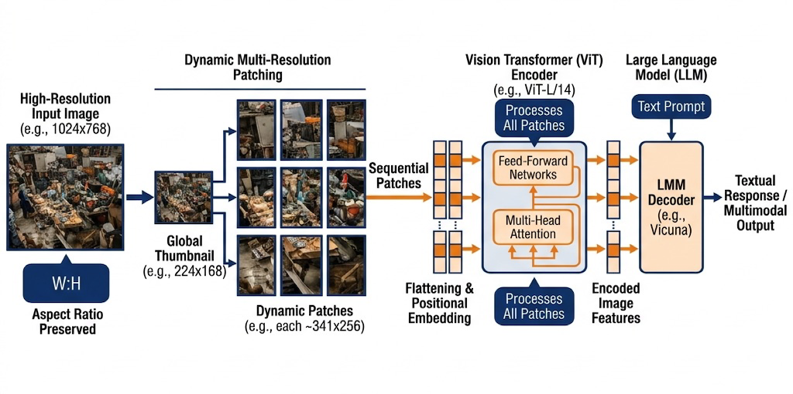

**第三篇 图文多模态数据工程**

**篇前导读**

如果说纯文本大模型是在学习人类沉淀下来的抽象符号系统，那么多模态大模型（MLLM）则是在处理物理世界的镜像。从纯文本拓展到图文对、网页交错排版，乃至视频和音频流，这不仅是给基础大模型增加预训练编码器。跨模态数据在底层工程上面临着四重维度的挑战：
1. **对齐（Alignment）**：文字和图像在数字世界的构成法则是割裂的，如何向模型证明“Apple”序列与一张由红色像素构成的实体图像精确对应？
2. **表示（Representation）**：纯文本先天拥有确定的 1D 序列边界，而视觉信号是连续且高维的。如何将高分辨率的网页截图无损打包进变长 Token 序列？
3. **评价（Evaluation）**：文字可以通过 PPL 或 TTR 指标进行低成本质量测量，而判断图像质量（如美学评分、水印检测）的计算代价通常要调动千万级别参数的深度模型去进行特征扫描。
4. **算力成本（Cost）**：图像的磁盘存储、分布式集群的 I/O 解码带宽与内存张量传输成本，通常远高于纯文本。

本篇（第8至第11章）将系统性探讨多模态大模型的训练基础底座与算力调度体系。我们将以业界经典的图文对数据工程为起点（第8章），随后深入探讨重标注与真实文档 OCR 理解（第9章），进阶到处理时序相关的视频与高并发数字音频流（第10章），并最终探讨跨模态对齐技术（第11章）。

---

# 第8章 图文对数据工程

## 摘要
本章系统性地探讨了图文多模态大模型（VLM）的数据工程挑战与实践。相较于纯文本，多模态数据在对齐、表示、评价和算力成本上面临多维度的工程难题。章节首先分析了视觉噪声的隐蔽性与跨模态语义错位现象，随后归纳了图文样本的三大核心范式：纯图文对、交错图文与长文档截屏。针对工程实现，本章详细讲解了从基于 DALI 的硬件加速解码、宽高比控制到 NSFW 与水印过滤的基础清洗管线；并深入探讨了基于 CLIP/SigLIP 的深度语义过滤，以及利用大型 VLM 进行多粒度重标注（Re-captioning）的策略。最后，通过 AnyRes 动态切分技术与数据配比调优，阐述了将高维图像融入模型训练的适配方案。

**关键词**：多模态数据工程；交错图文；DALI 硬件解码；CLIP 语义对齐；重标注 (Re-captioning)；AnyRes 动态切分

**学习目标**
- 理解多模态数据在对齐、表示、评价与成本方面的四大核心挑战。
- 掌握图文样本的三种主要范式及其在预训练与微调阶段的应用场景。
- 熟悉基于 DALI 的硬件解码与图像基础清洗管线的构建方法。
- 掌握基于 CLIP/SigLIP 的语义过滤技术及 VLM 重标注策略的工程价值。
- 理解 AnyRes 动态多分辨率切割算法的原理与实现。

## 8.1 多模态数据为何难于文本

相较于 NLP 数据工程，视觉语言模型（Vision-Language Model, VLM）的数据清洗在规则制定上更具挑战性。

### 8.1.1 视觉噪声的隐蔽性与“薛定谔的坏图”

在纯文本的数据工厂中，所谓的“脏数据”或“乱码”往往是可以被低成本检测的。但在图像的世界里，噪声常常呈现出复杂状态：
- **概念隔离噪声**：一张高清的风景照，角落带有小尺寸色情水印（NSFW），这种图对多模态合规性是致命的。
- **空间失真噪声**：一张背景凌乱的抓拍，描述语是“摊位上的一把梳子”，但这把梳子在全图占比极小，经过卷积下采样后可能完全丢失。
- **频域压缩噪声**：经过多次 JPEG 压缩的文档图像，产生严重的“振铃伪影（Ringing Artifacts）”，这对依赖边缘特征的深度识别网络（OCR）造成障碍。

这些“视觉隐蔽噪声”无法通过哈希指纹或文件 MD5 排除。在数据流中，通常需部署轻量级视觉判别引擎（如水印检测器、美学评估器）来进行稠密推理过滤。这意味着前置的数据清洗工作也会增加可观的计算开销。

### 8.1.2 语义缺失与跨模态“多义错位”（WebTox）

多模态的对齐学习，建立在一个天真的假设之上：我们抓取到的（Image, Text）对，它们彼此在描述同一个事物。然而，互联网上海量的“图片与替代文本（Alt-text）”天然是高度撕裂且毫不对应的。

由于十余年来网页爬虫与 SEO（搜索引擎优化）被恶劣滥用，爬虫工程师每天都会抓取到几百亿个长成这样的恶性图文对：
- **肉眼看到的图片内容**：一只正在草地上开心奔跑的金毛犬。
- **HTML 里提取到的 Alt-text**：“2023包邮正品优质特价全场满减买一送一宠物用品”。

如果将此类诱导数据直接输入模型，模型在反向传播中可能被迫学习到错误的图文关联（如“金毛犬等于包邮促销”等语义错位）。
这一现象在工程实践中被称为 **WebTox（网络语义毒数据）**。实验表明，该类噪声的混入可能使模型在视觉问答基准上的表现劣化。为了系统性缓解此问题，业界发展出了以 CLIP Score 为核心的跨模态语义过滤技术。

### 8.1.3 画像分辨率与 GPU 显存的四次方博弈

在纯语言建模时代，送入语言模型的代价随 Token 长度呈线性增长。但在多模态领域，**图像分辨率对于计算开销的影响呈二次方攀升**。

以基于 ViT 的视觉编码器为例。假设切割模块（Patch Size）尺寸恒定为 $14 \times 14$ 像素：
- 当向网络输入 $224 \times 224$ 分辨率图片时，它会被切成 $(224/14) \times (224/14) = 256$ 个 Patch Token。此时，自注意力的计算复杂度大约是 $256^2 = 65,536$ 级运算量。
- 如果将输入分辨率拔高至 $1008 \times 1008$，Token 序列长度剧增至 $(1008/14) \times (1008/14) = 5184$ 个。
- 由于标准 Transformer 的 Attention 计算开销是与其产生的 Token 序列长度呈“二次方”复杂度的，此时单层注意力的计算量飙升到了 $5184^2 \approx 26,873,856$ 级运算量。

仅仅将图像边长拉大 4.5 倍，Attention 层的计算量就膨胀了近 410 倍。这使得高分辨率图像处理对硬件资源提出了极高的要求。因此，图文数据工程核心之一就是探索**“动态裁切降维与多尺度 Patching 策略”**。


*图8-1：多模态图文数据工程全景图 —— 从最左侧的 DOM 树抓取与 PDF 解析起始，依次穿透格式解析、水印底线过滤、CLIP 语义对齐、直至最右侧的交错序列拼装与 Token 化表示。分布式计算与 Metadata 是横跨底层的核心支撑。（来源：本书自绘）*

---

## 8.2 图文样本的范式：从配对到交错

大模型不同阶段的训练目标，决定了我们需要喂入极其不同格式的数据。根据近年来的前沿结构（如 Flamingo (Alayrac et al. 2022), LLaVA (Liu et al. 2023), GPT-4V），典型的多模态文本主要被塑造成三种范式：

### 8.2.1 图文对 (Image-Caption Pairs)
这是最古典、最“堆量”的范式。
- **形式**：严格的一张图对应一段独立的强描绘文字 `{ "image": "dog.jpg", "text": "A golden retriever playing fetch in the park." }`。
- **代表开源集**：LAION-5B (Schuhmann et al. 2022), COYO-700M。
- **适用场景**：主要用于冷启动阶段的**多模态对比学习（Contrastive Pre-training）**，比如训练 CLIP 的前置模型，或者给新接入的 Vision Encoder 建立基础的视觉感知基线。
- **致命弱点**：无法教会模型推理，只能使其学会认物。

### 8.2.2 交错图文 (Interleaved Image-Text)
为了赋予模型在复杂上下文中的“多图关联推理”能力，数据引擎必须从网页端提取还原“原生交错版面”。
- **形式**：类似于我们在维基百科或微信公众号中看到的结构：一段起因 + `<img_1>` + 发展过程 + `<img_2>` + 结局总结。图像 Token 被视为一种特殊的词汇，散落在长文本序列之间。
- **代表开源集**：OBELICS (Laurençon et al. 2023), MMC4 (Zhu et al. 2023)。
- **适用场景**：这是当今**生成式 VLM 预训练**的最核心弹药。它教会模型如何根据“前文”和“图片 1”，去推断“后文”或“图片 2”应该是什么。
- **采集挑战与 DOM 解析工程**：交错图文的工程难度庞大。传统的文本爬虫遇到 `` 标签直接跳过，而为了组装交错格式，爬虫必须解析极为庞杂的 HTML DOM 树，并进行**“基于渲染坐标的相对距离计算”**。
  因为在很多现代网页的复杂级联样式（CSS）中，代码文档树的顺序往往并不是用户眼里的视觉排版顺序。如果仅按照 HTML 标签顺序提取，很可能把页面底部的免责声明强行与顶部的配图绑定。
  
  为此，顶尖团队通常会使用带渲染引擎的无头浏览器（Headless Browser，如 Playwright）运行 JavaScript 生成页面快照，利用类似于下面的规则提取元素：
  **代码清单 8-1：交错图文节点提取逻辑**
```python
  # 简化的 DOM 交错节点提取伪代码
  text_nodes, img_nodes = get_rendered_nodes(page)
  interleaved_sequence = []
  
  for node in all_nodes_sorted_by_y_axis():
      if node.type == 'TEXT':
          if len(node.content.split()) > 5: # 抛弃过短文本，如导航栏
              interleaved_sequence.append(node.content)
      elif node.type == 'IMAGE':
          if node.width > 200 and node.height > 200:
              # 将合法图片转化为一个占位符 Token，并将 url 存入侧边通道
              interleaved_sequence.append(f"<img_{node.id}>")
              save_to_image_db(node.url, node.id)
  ```
  一旦 DOM 结构提取错位，模型就会读出张冠李戴的荒谬逻辑。

### 8.2.3 长文档理解与截图 Grounding (Document Grounded)
面对 B 端商业落地的真实需求（看财报、读发票），传统的自然图像训练完全失效，必须引入高分辨率文档数据。
- **形式**：输入的是渲染后的高频高清晰度截屏文档图（如 ArXiv 论文或密集型的 Excel 截图），对应输出结构化的 JSON 取值序列或者边界框（Bounding Box）坐标 `<box>`。
- **适用场景**：极其依赖极高分辨率的分块（Patching）和 OCR 的辅助。主要用于 SFT（监督微调阶段）教会模型实施精密的值提取与逻辑结构理解（如公式与图表的指代排版）。
- **坐标归一化工程**：在 Grounding 任务中，模型需要输出物体的具体像素坐标。然而，训练图片的分辨率千差万别，为了让语言引擎能“读懂”坐标，通常需要将原始的绝对像素坐标 `(X, Y)` 映射到位 `[0, 1000]` 的离散 Token 桶中（即 `[<loc_255>, <loc_899>]`）。这种离散化强行将连续空间的坐标变为了大语言模型熟悉的“词汇表”。

**表8-1：图文样本类型、特征与适用任务表**

| 样本类型 | 数据特征 | 核心获取手段 | 最高适用阶段 | 带来的关键能力 |
| :--- | :--- | :--- | :--- | :--- |
| **纯图文对 (Image-Caption)** | T/I 一对一，高噪声 | 网页 ``，公有云 OSS 爬取 | 对齐预训练 (Alignment) | 基础特征感知、跨模态检索检索 |
| **交错图文 (Interleaved)** | T/I 多对多，长序列 | DOM 树渲染解析、PDF 线性化剥离 | 主力生成式预训练 | 多轮逻辑推理、Few-shot 上下文感知 |
| **长文档截图 (Doc/OCR)** | 超高分辨率，文本密集 | PDF 渲染、无头浏览器自动化截图 | 深度 SFT / 强化学习 | 排版理解、表单/论文/发票抽取分析 |
| **高精描绘 (Grounded Caption)** | 含边界框 `<box>` 的长文 | 标注员框选，或闭源千亿模型重写 | 高阶 SFT / RAG 对齐 | 图像细粒度空间感知与抗幻觉能力 |

---

## 8.3 清洗、过滤与语义对齐技术 (上篇：基础清洗)

从全网抓取来的 Raw Data 泥沙俱下，必须经历至少三轮不同级别的漏斗挤压。我们将这一阶段称为前置清洗期（涉及极多的纯工程 I/O 操作及硬件加速的分类器运用）。

### 8.3.1 格式硬解法则与 GPU 的“像素抢夺战”
文本清洗时，`JSON.loads` 或 `open()` 几乎是零开销的操作；但面对数十 TB 甚至 PB 级的图像压缩包，**解码（Decoding）**本身就会演化为整个训练集群最大的吞吐瓶颈（Bottleneck）。
在互联网上，图片可能是古老的 JPEG、体积庞大的 PNG，甚至带有破损文件头或嵌入 ICC 颜色配置错误的网络恶搞变种（WebP）。

如果使用标准 Python 生态下的 CPU `Pillow` 或 `OpenCV-Python` 库来执行 Resize 和 Normalize：
- 在 8 卡 A100 的节点上，哪怕给 PyTorch DataLoader 开满 `num_workers=64`。
- 密集的 CPU 图片缩放运算会占满物理核心。
- 将非压缩 RGB 张量搬运到 GPU 显存中，PCIe 带宽可能成为瓶颈，导致 GPU 处于等待数据的状态，降低整体吞吐。

**工程解法：基于 NVIDIA DALI 的端到端流水线**
在大型企业的图文处理阵列中，通常会强制切入基于 **NVIDIA DALI（Data Loading Library）** (NVIDIA 2023) 的显存级加速流水线。
其核心思想是**“尽早将比特推入 GPU，并在显存内解压缩”**：
1. **CPU 仅搬运二进制**：CPU 读取未经解码的 JPEG 字节流（Byte Stream），并不执行解码。
2. **NVJPEG 硬件解码**：字节流通过 PCIe 极宽的车道送入 GPU 后，调用 GPU 集成的专属 JPEG 硬件解码器（NVJPEG）在显存内部瞬间完成解压。
3. **融合算子变换**：随后的裁剪（Crop）、调整尺寸（Resize）与方差均值归一化（Normalize）等操作全部被编译为一个 CUDA Graph，直接在张量上执行。

通过这种“硬件接管一切”的手段，使得处理单张 512x512 图像的时间延迟能够从 CPU 端的 8ms 锐减至 0.4ms 以下。这是支撑万亿参数多模态模型能活下来的生命线（*详见附录与遗留参考图 `图6_2_使用DALI与不使用DALI的区别`*）。

### 8.3.2 分辨率与宽高比控制（Aspect Ratio Filtering）
在原始清洗期，最直接的提效手段是制定尺寸抛弃规则：
- **拒绝小图**：短边低于 `224px` 或体积低于 `20KB` 的图片直接抛弃。
- **过滤极端宽高比图像**：对于宽高比极端畸形的图（如长宽比超过 1:18 的长图），强制 Resize 成正方形会丢失特征。因此，通常要求**宽高比强制限制在 $[0.33, 3.0]$ 的区间内**，任何落出此区间的会被标记并进入针对性的“动态切片”旁路（详见 8.4 节）。

### 8.3.3 NSFW、面部隐私与水印靶向拦截
图文工程相比纯文本工程受到极高伦理合规关注：你决不能让你的多模态模型一开口或者一描述就生成人名隐私或版权宣发图。
在这一阶段的流水线通常串联部署了三至四个小型的纯视觉或分类网络：
1. **NSFW 分类器**：对任何概率打分超过阈值（如0.4）的高挑感图像直接软删除。
2. **水印鉴别器 (Watermark Detector)**：由于大量网络图片来自图库（Getty Images、Shutterstock），一旦模型吸收了这些图，模型不仅会频繁在生成回答中“幻想”出那些水印字样，还会不可避免地遭到商用风险反噬。我们必须过滤掉所有带密集斜纹或高光中心水印的样本。
3. **模糊度判定阈值 (Blur/Aesthetic Score)**：利用类似 LAION 团队训练的 AES（Aesthetic Predictor）美学评分模型，抛弃那些重度失焦、光照极度昏暗或充斥单纯彩色噪点的垃圾片源。

**多模态敏感数据过滤 Checklist（工业界标准）：**
- [ ] 是否在文本侧集成了禁止词库（Blocklist），对 `<alt>` 标签中的暴恐、色情文字进行了强硬剔除？
- [ ] 视觉 NSFW 分类器是否针对二次元/插画模型（Anime NSFW）进行了补充训练以防漏网之鱼？
- [ ] 肖像权隐私：是否调用了人脸模糊（Face Blurring）算法将高清晰度的素人人脸（非公众人物）打码？
- [ ] 商业水印拦截库是否处于周度更新（Weekly Update）状态，防止新涌现图床的污染？

完成了这三大基础清洗关卡，初始库规模可能已大幅锐减。这些幸存的图像内容基本干净，但在接下来的下篇，我们将引入 CLIP Score 进行语义过滤。

---

## 8.4 清洗、过滤与语义对齐技术 (下篇：深度语义过滤)

脱离了视觉层面的低级错误后，多模态数据工程迎来了最具挑战性的阶段：定量测量一张图和一句话之间的“匹配度”。

### 8.4.1 CLIP Score 及其进阶者 SigLIP 的量化哲学

在 OpenAI 放出 CLIP（Contrastive Language-Image Pre-training）(Radford et al. 2021) 模型之前，判断图文匹配几乎是一门玄学。CLIP 通过大规模对比学习，巧妙地将图像片段（Image Embedding）和文本片段（Text Embedding）拉入到了同一个高维特征向量空间。

**1. 基础过滤动作与 InfoNCE Loss 的遗产**：
我们通常使用预训练的稳定版 CLIP（例如开源版的 `OpenCLIP ViT-L/14`）分别对图和对应的 Caption 进行向量化前向推理，并计算两个向量的**余弦相似度（Cosine Similarity，即 CLIP Score）**。
- **高匹配（Score > 0.30）**：图文高度吻合，比如图片是一只猫，文字写的是"一只橘猫在晒太阳"。这类数据将被无条件列入 Golden 数据集。
- **低匹配（Score < 0.22）**：严重不匹配，例如图片是猫，文字是"欢迎关注我的公众号"。这类数据通常直接丢弃（Discarded），因为它们给模型提供的全部是反向的梯度噪声。
- **中等匹配（0.22 < Score < 0.30）**：处于灰色地带。此时我们不会轻易抛弃高昂搜集来的资源，而是触发下一节提到的重标注流程（Re-captioning）。

> **[注意]**：以上阈值（0.22 / 0.30）基于 `OpenCLIP ViT-L/14` 模型；若改用 `ViT-B/32` 或 `SigLIP`，同一批数据的得分分布会有显著差异，阈值需在目标数据上重新校准，切勿直接复用。

**2. 从 CLIP 到 SigLIP：摒弃全局 Softmax 的新方向**
在大型企业数据管线中，传统的 CLIP 模型正逐渐被一种名叫 **SigLIP（Sigmoid Loss for Language Image Pre-Training）** (Zhai et al. 2023) 的新架构所取代。
在传统 CLIP 训练时，模型计算的是整个 Batch 内图像和文本的全局 Softmax 概率。这就带来一个致命工程问题：如果你的分布式 Batch Size 巨大（例如 $32768$），那么强迫模型区分如此多对（Pair）的微小差异，会导致模型对某些“难负样本（Hard Negatives）”过于敏感，进而在推理 CLIP Score 时产生震荡。
SigLIP 则将这个全局多分类问题，优雅地转化为了**逐对（Pairwise）的二分类 Sigmoid 预测问题**。这使得 SigLIP 对“部分匹配”或“复杂背景图文”拥有更高的宽容度和稳定的 Score 打分。工程团队可以设定更加精准一致的截断阈值，而不用担心因为领域漂移导致阈值突然失效。

**代码清单 8-2：基于 SigLIP 的图文对齐度过滤**
```python
# 基于 SigLIP/CLIP 的图文对齐度过滤伪代码（可扩展为工业级流处理）
import torch
from transformers import AutoProcessor, AutoModel

device = "cuda" if torch.cuda.is_available() else "cpu"
# 使用更稳定、无需巨型 Batch Size 的 SigLIP 权重
processor = AutoProcessor.from_pretrained("google/siglip-base-patch16-224")
model = AutoModel.from_pretrained("google/siglip-base-patch16-224").to(device)

def filter_by_semantic_score(image, text_caption, threshold=0.25):
    inputs = processor(text=[text_caption], images=image, padding="max_length", return_tensors="pt").to(device)
    with torch.no_grad():
        outputs = model(**inputs)
        # 提取融合后的特征并计算点积相似度
        image_embeds = outputs.image_embeds / outputs.image_embeds.norm(p=2, dim=-1, keepdim=True)
        text_embeds = outputs.text_embeds / outputs.text_embeds.norm(p=2, dim=-1, keepdim=True)
        
        # 获取受模型温度系数缩放的 Logit，转化为客观置信度
        logits_per_image = image_embeds @ text_embeds.T * model.logit_scale.exp()
        similarity = logits_per_image.item()
        
    return similarity >= threshold, similarity
```

### 8.4.2 挽救优质图像：多粒度合成重标注 (Synthetic Re-captioning)

当一张图像拥有极高的分辨率、绝佳的构图和罕见的实体，但其附带的原始网页文本质量极差时，直接抛弃它将是对数据资产的浪费。使用视觉大模型（如 LLaVA-1.5、Qwen-VL-Max 等）来重新生成描述，是构建高质量多模态数据集的关键策略。

在最新的大模型工程实践中，为了兼顾“冷启动对齐”与“后期长文本生成”的双重要求，数据团队会对这批图像实施流水线维度的“**多粒度（Multi-granularity）重标注阵列**”：

1. **短描述（Short/Brief Caption）提取**：
   - **指令（Prompt）设为**：“仅用一句话，指出画面正中央最主要的主体及其核心动作。不超过 15 个字。”
   - **产出结果**：“一名拉小提琴的亚裔女性。”
   - **工程价值**：极其纯净、没有修饰词的短句，非常适合在预训练最早期的第 1 个 Epoch 中，用于迅速拉平视觉 Encoder 和文本 LLM 之间极其基础的注意力绑定。如果一开始就喂入长篇大论，模型往往会因对齐焦点涣散而出现“幻视”。

2. **长描述（Detailed/Dense Caption）渲染**：
   - **指令（Prompt）设为**：“作为一名盲人视听解说员，请巨细靡遗地描写图片中的构图、光影、人物特征、服饰颜色、背景元素以及潜在的情绪氛围。长度在 150 字左右。”
   - **产出结果**：“在纽约时代广场的黄昏下，天空呈现出深邃的紫橘色晚霞。画面正中央，一名穿着破洞做旧牛仔裤和白色毛衣的亚裔女性正闭着眼拉奏一把红棕色的木质小提琴。画面的景深（Bokeh）较浅，她的背后是模糊的黄色出租车和闪烁的霓虹灯牌，整体氛围显得忧郁而专注。”
   - **工程价值**：这种高密度信息是训练模型获得极强逻辑感、细节抵抗力和防止“一问三不知”幻觉的核心燃料。只有使用这种数据进行 SFT，模型才会被赋予出色的“图片观察描述力”。

3. **结构化边界框与 OCR 注入 (Grounded Injection)**：
   - **并行流合并**：仅仅用大模型去“看”还不够准确，尤其是画面里出现密集数字时。重标注引擎的旁路（Side-car Workflow）会同步唤醒 PaddleOCR。如果在长描述发现画面背景恰好有一块广告牌，合并脚本会将其坐标转化为特殊的 Token 拼接入文本：`...背景是一块写着 "<box_45_120_350_200> Broadway 5th Ave. </box>" 的广告牌。` 这真正实现了将纯视觉符号在底层转化为确切的字符串引擎。


*图8-2：图像语义对齐与过滤流程图 —— 展示了量化决策树：基于 CLIP 与启发式规则将劣质匹配筛出并送往大模型 Re-captioning 流水线，最后将图片动态切分后存入训练池。（来源：本书自绘）*

---

## 8.5 采样配比、表示和训练适配策略

完成多模态数据的前置清洗后，下一个关键步骤是将其高效送入 GPU 进行训练。在数据输入阶段，数据打包（Packing）与比例混合（Data Mixing）对系统架构的设计具有较高要求。

### 8.5.1 图像在序列中的“霸权”与 AnyRes 动态切分

在常见的纯文本打包中，1000 个文字可能只需要 300 个 Token。但对于多模态，图像是一个占据长序列的关键因素。以一张常规切分的 $336 \times 336$ 图片经过 ViT-L/14 处理为例，它将挤占 576 个 Token 的槽位。

早期 VLM 通常对输入图像采取固定尺寸缩放（Resize）：无论是横版风景图还是纵向长文档，强制压缩至 $224 \times 224$ 的正方形，导致内容比例失真。为解决这一问题，现代预处理普遍引入了 **AnyRes（动态高分辨率保持）** 策略：



*图8-3：AnyRes 动态多分辨率切割算法原理图 —— 左侧超长全景图被自适应网格划分为 $1 \times 3$ 个原生分辨率的局部图像块，同时结合右上方全局缩略图一同送入 Vision Encoder。这保留了高频局部特征与宏观语义。（来源：本书自绘）*

**AnyRes 原理与核心策略详解：**
1. **基础补零（Zero-padding / Letterboxing）策略**：对于不想失去原始横纵比，且分辨率未溢出的图，在周围补全黑色或均值边框凑成正方块，使得模型能学到相对的无失真几何形状。
2. **多重补丁切割（Multi-Patch Splitting / Grid Cropping）**：将一张 $336 \times 1008$ 的超清竖版图片，动态匹配到 $1 \times 3$ 的切割网格（Grid），切割成 3 张 $336 \times 336$ 的正方形子图（Local Sub-patches）。同时，为了不失去全图视野，还会外加一张经过大幅下采样（Down-sampled）的**全局缩略图（Global Context Patch）**。这意味着这 1 张原图将被输入为 4 份 576 Token 的巨大矩阵块（合计消耗 2304 个 Token）。
3. **坐标编码注入（Positional Embedding Injection）**：被切开的子图不能随便丢进模型。在 DataLoader 组装阶段，必须为每个子图块打上类似 `[<row_1>, <col_1>]` 的二维相对位置编码，让模型知道哪块图在左、哪块在右。

若不对这种交错图文做严格拼接控制，GPU 显存中将被庞大的无声像素挤满，文本逻辑学得极其缓慢。为此我们需要使用**基于长宽比分组（Aspect-Ratio Grouping）的 Sequence Packing** 技术：像贪吃蛇一样，把多长条同类的图文对塞入同一个 4096 的 Sequence 窗口，并在图像和图像块之间插入特殊的界限标识符 `<image>` 与 `</image>`，利用 Attention Mask 阻断跨文档的计算污染，从而节约显存边界带来的极大浪费。

### 8.5.2 三足鼎立的配比调参 (Data Mixing)

为了使多模态大语言模型（MLLM）具备均衡的认知能力，预训练阶段的数据配比（Data Mix）需要精确规划不同数据源的权重：
1. **通用自然图像（Web Images）占比约 50-60%**：提供基础的世界物体常识（猫狗、汽车、风景色准、人物神态）。这部分通常由极其严酷 CLIP Score 筛选后的开源数据集（如 DataComp-1B (Gadre et al. 2023) 的核心过滤提纯集）承担。
2. **图表与代码图纸（Charts/Plots/Math）占比约 15-20%**：提供顶尖的抽象数理推理能力。如果缺失此部分，大模型看折线图、股票 K 线图或是复杂的思维导图时，将会完全胡编乱造。
3. **高密度 OCR 文档截图（Documents）占比约 20-30%**：大量的扫描版白皮书、PDF 单页、收据发票影印件。这对于未来模型去充当“合同审查专员”或者“财务发票小助手”至关重要，它训练了模型克服自然图像中极少出现的“超高细粒度文本焦点”（Fine-Grained Text Focus）能力。

**表8-2：图像清洗策略与代价对照表**

| 清洗阶段策略 | 算力代价 | 核心作用与收益 | 残留风险与副作用 |
| :--- | :--- | :--- | :--- |
| **基础分辨率切除** | 极低（I/O密集） | 剔除无意义色块，节省 30% 储存开支 | 误伤具备极高历史意义但只留下低像素版本的（如旧新闻片）纪实图 |
| **DALI 硬件提速解码** | 中低（GPU密集） | 打破 DataLoader 瓶颈，解码提速百倍 | 业务侵入性高，遇到奇异损坏 JPEG 格式易引发底层库异常 |
| **NSFW / 水印检测** | 中等（CNN前向） | 符合商业落地合规要求，防范内容安全风险 | 对抗性微小水印检测率仍需提高，依赖检测分类器的持续优化 |
| **SigLIP/CLIP 对齐** | 高（双塔特征） | 直接消除图文语义错乱，是认知质量根基 | 高分段可能有“语义白开水化”，扼杀带有深刻隐喻、讽刺意味的独特配图 |
| **VLM 重标注合成** | 极高（LLM生成） | 颠覆烂数据基盘的终极手法，带来源头细节 | 资金燃烧速度极快，且易混入前序旧模型的幻觉或重复的机械句式结构 |

---

## 8.6 真实踩坑案例与商业落地长效指南

在真实商业项目（例如集团 P03 多模态底座大模型研发）中，很多错误并不是算法推导出来的，而是在损失几千张 A100 的日租费后，用血泪总结出的真理。

### 8.6.1 被大图库“绑架”的反向学习

在研发早期阶段，某部门直接下载清洗版的开源数据集 LAION-5B 某子集进行对齐训练。在盲审中发现：无论给模型看什么纯风景照片，模型大都会在结尾高频生成类似“请到某图库下载高清免水印图片”的冗余文本。

**教训复盘与拔除**：这被称为“图库污染现象（Stock Photo Contamination）”。即使是经过 CLIP Score 卡了极高阈值的“优质集”，只要它在收罗初期没有使用强力的 OCR 或特征分类下狠手切除带防盗水印的高分商业图，大型图床就会用其浩如烟海的垃圾推销模板文本，缓慢渗透并侵蚀模型最终学到的词汇条件概率分布。这是绝不能偷懒省钱的学费，对于严肃的商业级大模型，**必须针对特定的商业图床建立专门的负面哈希清单，对外部数据执行严密的“二次清洗净化池”**。

### 8.6.2 为项目 P03 构建的多模态数据壁垒

回顾整个图像文本数据工程的战略框架，图文大模型研发的核心门槛不仅仅在于“使用怎样的 Vision Encoder”，更在于模型接收多模态数据前的数据预处理。

从海量互联网中提取的 DOM 树残片；经过高速硬件解码、严格的宽高比裁剪、安全风控扫描；再到 SigLIP 量化评测与高分辨率图像重写（Re-captioning）之后——这些图片才被提炼成拥有丰富文本配对的多模态数据集。

这些数据流与上游处理能力，正是构建大规模多模态模型的重要基础。

## 本章小结

本章作为拥抱多模态领域的揭幕战，我们详细铺陈了多模态数据区别于纯文本的“四重地狱挑战”，并逐级点出了图文工程的三大结构范式。为了平息图片压缩包对流水线的吞噬，我们探索了依靠底座硬件优化的 DALI 极速解码模式。

针对多模态语义对齐的挑战，本章分析了通过“CLIP Score 语义过滤”结合“视觉大模型重标注（Re-captioning）”提升低信噪比数据质量的工程实践。最后，本章通过数据配比优化与典型案例复盘，为企业级多模态模型的语料质量治理提供了工程指导。

虽然图文交织数据是当前多模态预训练的主流，但在复杂的行业应用场景（如财报分析、票据识别与医疗文档解析）中，通用自然图像数据无法有效解决高密度字符与排版表征的问题。下一章将探讨“第9章：重标注与文档理解（OCR）”，深入分析大模型如何通过特化文本提取与结构解构引擎，实现高精度的文档语义理解。

## 参考文献

Alayrac J B, Donahue J, Luc P, Miech A, Barr I, Hasson Y, Lenc K, Mensch A, Millican K, Reynolds M, others (2022) Flamingo: A Visual Language Model for Few-Shot Learning. Advances in Neural Information Processing Systems 35:23716-23736.

Bai J, Bai S, Yang S, Wang S, Tan S, Wang P, Lin J, Zhou C, Zhou J (2023) Qwen-VL: A Versatile Vision-Language Model's Understanding, Localization, Text Reading, and Beyond. arXiv preprint arXiv:2308.12966.

Dosovitskiy A, Beyer L, Kolesnikov A, Weissenborn D, Zhai X, Unterthiner T, Dehghani M, Minderer M, Heigold G, Gelly S, Uszkoreit J, Houlsby N (2020) An Image is Worth 16x16 Words: Transformers for Image Recognition at Scale (ViT). In: International Conference on Learning Representations 2021.

Gadre S Y, Ilharco G, Fang A, Hayase J, Smyrnis G, Nguyen T, Marten R, Wortsman M, Ghosh S, Zhang G, others (2023) DataComp: In Search of the Next Generation of Multimodal Datasets. Advances in Neural Information Processing Systems 36.

Laurençon H, Saulnier L, Tronchon L, Bekman S, Singh A, Lozhkov A, Wang T, Karamcheti S, Rush A M, Kiela D, Cord M, Wolf T (2023) OBELICS: An Open Web-Scale Filtered Dataset of Interleaved Image-Text Documents. Advances in Neural Information Processing Systems 36.

Liu H, Li C, Wu Q, Lee Y J (2023) Visual Instruction Tuning (LLaVA). Advances in Neural Information Processing Systems 36:34892-34916.

Liu H, Li C, Li Y, Lee Y J (2024) Improved Baselines with Visual Instruction Tuning (LLaVA-1.5). In: Proceedings of the IEEE/CVF Conference on Computer Vision and Pattern Recognition, pp 26296-26306.

NVIDIA (2023) NVIDIA Data Loading Library (DALI). https://github.com/NVIDIA/DALI.

Radford A, Kim J W, Hallacy C, Ramesh A, Goh G, Agarwal S, Sastry G, Askell A, Mishkin P, Clark J, others (2021) Learning Transferable Visual Models From Natural Language Supervision (CLIP). In: Proceedings of the 38th International Conference on Machine Learning, pp 8748-8763.

Schuhmann C, Beaumont R, Vencu R, Gordon C, Wightman R, Cherti M, Coombes T, Katta A, Mullis C, Wortsman M, others (2022) LAION-5B: An Open Large-Scale Dataset for Training Next Generation Image-Text Models. Advances in Neural Information Processing Systems 35:25278-25294.

Zhai X, Mustafa B, Kolesnikov A, Beyer L (2023) Sigmoid Loss for Language Image Pre-Training (SigLIP). In: Proceedings of the IEEE/CVF International Conference on Computer Vision, pp 11975-11986.

Zhu D, Chen J, Shen X, Li X, Elhoseiny M (2023) MiniGPT-4: Enhancing Vision-Language Understanding with Advanced Large Language Models. arXiv preprint arXiv:2304.10592.

