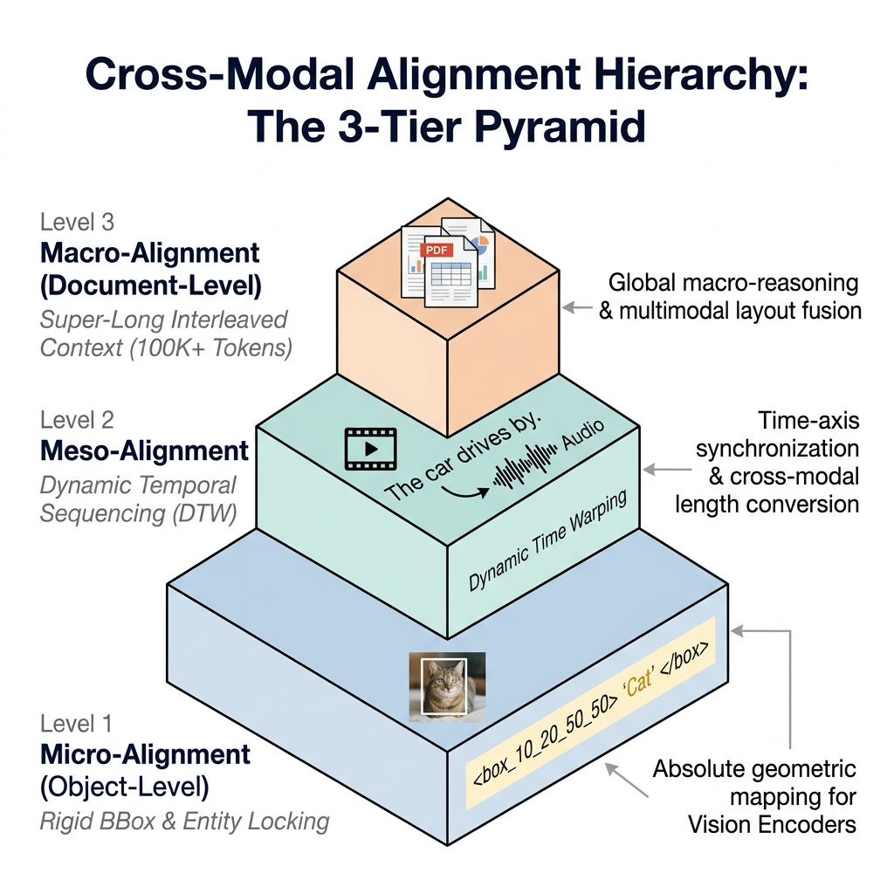

# 第11章 跨模态对齐与融合

## 摘要
本章作为多模态数据工程的收官部分，深入探讨跨模态对齐与融合的核心技术。通过剖析不同模态间的异构空间问题，指出单纯的单模态清洗无法建立跨模态语义映射。本章介绍了跨模态对齐的三级金字塔架构：对象级（框与词的细粒度锚固）、片段级（连续时间序列映射）及文档级（多图文长上下文交错融合）。在此基础上，详细探讨了多模态样本表示、数据配比（Data Mixing）原则以及难负样本（Hard Negatives）的挖掘方法。最后，本章构建了跨模态评测的质量评估体系，并通过工业级案例分析常见对齐失败原因及修复策略。

**关键词**：跨模态对齐；异构空间；多模态融合；数据配比；难负样本挖掘

**学习目标**
- 理解多模态异构空间对齐挑战。
- 掌握跨模态对齐的三层金字塔模型（对象级、片段级、文档级）。
- 了解统一张量表示与数据混合配比机制。
- 熟悉难负样本挖掘策略在对比学习中的作用。
- 掌握跨模态数据质量评估与幻觉检测方法。

---

经过对单模态数据的清洗与重构，我们已经获得了高质量的图像、文本与视频片段数据。

然而，将各自清洗完毕的图片流、声音波形和文本直接输入模型，模型并不能自然习得“跨模态推理（Cross-modal Reasoning）”。各模态信号间对应关系的缺失，会导致训练信号的混乱并引发多模态幻觉（Hallucination）。

本章作为**《第三篇：多模态高质量数据工程》**的收官章节，聚焦于多模态数据工程的核心难题——如何制作**跨模态融合的训练监督样本（Cross-modal Fusion & Alignment Samples）**，让不同模态的编码向量在同一语义空间中实现有效对齐。

---

## 11.1 问题场景：多模态对齐失效现象与物理意义

### 11.1.1 跨模态对齐失效现象

在大规模多模态模型预训练中，如果底层数据管道在拼装“视频+文本+音频”时仅做时间轴的粗略对齐，未进行语义特征的精确绑定，容易出现模态间的错误耦合（例如将视觉上的“厨房”与音频库中的无关噪音结合），严重影响模型的跨模态认知与预测准确率。

### 11.1.2 模态鸿沟与异构空间挑战

“对齐（Alignment）”这个词在 AI 领域有着宽泛的涵义。在下一卷（第四篇）中，它将代表人类核心价值观的 RLHF 对齐；但在本章的底层数据准备中，这里的“对齐”特指解决跨模态表示中的**异构空间模态鸿沟（Heterogeneity Gap）**。

文本在 Embedding 空间里是一条高度抽象的高维向量，它代表“语义（Semantics）”；而一张图片的像素矩阵如果被 Vision Encoder 编码出来，它代表的往往是“边缘、颜色、纹理集合（Patch Features）”；一段波形文件则映射着高频低频的振幅空间。

这三类向量不仅维度与数值尺度存在差异，不同模态向量映射的数学流形（Manifold）在原始状态下也是不相关的。所谓“跨模态对齐工程”，即构建高质量的数据集，引导不同的模态编码器在面对同一个物理实体时，输出在共享空间中距离相近的表征向量。

### 11.1.3 独立清洗与对应关系构建的差异

独立清洗能够提高单模态数据质量，但无法自动建立跨模态的关联。如果不将具体的图片与相关的文字进行**精确关联（Hard Link）**，模型就难以建立文本与视觉特征的准确映射。

多模态端到端融合模型的收敛问题，常常由于对齐样本的弱相关或错配导致。系统在进行对比损失（Contrastive Loss）优化时，弱相关甚至相悖的图文配对会干扰模型对常识的正常学习。

---

## 11.2 方法框架：对齐对象的边界与三级金字塔

为了实现有效的对齐，必须先理清需要对齐的对象，并建立严密的层级结构设计。

### 11.2.1 对齐对象分类

在多模态大模型的训练中，跨模态对齐不仅限于“图文对”，而是涵盖了各种模态之间的排列组合。我们需要为不同的对齐对象设计对应的处理流程：

1. **图-文对齐（Image-Text Alignment）**：最基础的对齐。要求视觉特征能够精细映射到名词实体、颜色、空间关系和动作等文本语义。
2. **音-文对齐（Audio-Text Alignment）**：通过 ASR（语音识别）和 Captioning，将声纹特征与文字对应。不仅包含“文字内容”，还包括“说话人身份（Speaker）”与“情绪特征”。
3. **视-音对齐（Video-Audio Alignment）**：画面动作与环境声的同步匹配，例如“敲击动作的瞬间”与“碰撞声”的对齐，这是消除幻听的关键。
4. **视-音-文三模态对齐（Video-Audio-Text Tri-modal Alignment）**：高阶的多模态对齐，不仅需要音画同步，还需要文本精准描述该时间窗口内发生的所有物理事件。

### 11.2.2 三级金字塔架构：对象级、片段级与文档级

在实际工程中，跨模态对齐根据颗粒度（Granularity）被分为三个阶层，构筑出跨模态对齐的三级金字塔。



*图11-1：跨模态对齐的三级金字塔架构 —— 展现了从微观到宏观的三级对齐体系：底层为基于 BBox 的对象级对齐（Object-Level），中层为基于 DTW 时序同步的片段级对齐（Segment-Level），顶层为跨模态长上下文交错的文档级对齐（Document-Level）。（来源：本书自绘）*

#### 1. 对象级（Object-level / Micro-alignment）：框与词的细粒度锚固

这是多模态对齐的基础步骤。该层级强调精确的几何坐标映射关联，例如，将图片中特定目标通过 Bounding Box（边界框）标注，并与文本关联。这有助于在早期的投射层（Projection Layer）训练中建立基础的视觉-语言关联，该层的对齐质量直接影响 Vision Encoder 的局部特征提取能力。

#### 2. 片段级（Segment-level / Meso-alignment）：连续时间序列映射

该级别处理时间序列映射。例如一段 3.5 秒的视频对应丰富的帧序列与音频，但可能仅对应一句简短的文本。对齐过程常使用 DTW (Dynamic Time Warping) 或基于注意力机制的关联系统，并需严格控制因果时序。

#### 3. 文档级（Document-level / Macro-alignment）：超长交错的多模态融合

在掌握短序列对齐后，模型需处理更为复杂的长文档和跨模态推理任务。这里的对象不再是离散的片段，而是包含数十至数百页带图表的说明书、学术论文或长视频序列（例如由多页 PDF 渲染生成的连续图像序列）。此阶段的重点在于超长上下文中的模态错落排布（Interleaved Ordering），使模型具备跨文档内容推理能力。

**表11-1：三层异构对齐策略与代表性任务应用一览表**

| 对齐层级 | 对齐手段与特征表达 | 数据构建成本 | 核心适用任务 |
| :--- | :--- | :--- | :--- |
| **对象级 (Object-level)** | BBox 标注；通过大模型生成精细抠图与坐标点。 | 依赖人工或大模型推理，成本较高 | Region Grounding（区域级还原）、病理图像诊断。 |
| **片段级 (Segment-level)** | 时间轴对齐；双塔打分（如 CLIP Score）过滤。 | 消耗计算与显存资源 | Action Recognition（动作识别）、Video Captioning（视频描述）。 |
| **文档级 (Document-level)** | 高级排版提取引擎；长序列交错排序。 | 对上下文窗口挑战大 | Multi-modal QA、长时事件因果推理。 |

---

## 11.3 跨模态融合工程流水线：表示、配比与难负样本

完成对齐层次的设计后，需要通过统一表示、数据配比与负样本挖掘，将对齐后的多模态样本打包送入模型训练流。

### 11.3.1 统一超维张量表示与占位符工程

语言模型需将图片和声音处理为离散 Token，这依赖于占位符工程（Placeholder Engineering）与量化（Quantization）。例如通过 VQ-VAE (van den Oord et al. 2017) 将张量映射为离散编号。

在组装训练数据时，样本数据流通过占位符表示多模态特征：
**代码清单 11-1：多模态占位符 JSONL 格式示例**
```json
{
  "id": "mm_00483921",
  "modalities": ["image", "text"],
  "content": "<|image_start|> <IMG_TK_451> <IMG_TK_882> <|image_end|> 这是一只可爱的猫。",
  "visual_features_path": "s3://multimodal-bucket/features/cat_001.pt"
}
```
这种设计是融合训练数据设计的基石。它使得文本管道和视觉管道能够解耦开发：数据工程师在 JSON 结构中维护元数据和占位符逻辑，而深度学习框架中的 DataLoader 在训练时根据 `visual_features_path` 将对应的特征张量读取并注入计算图。


*图11-2：多模态融合样本设计图 —— 左侧展示了独立的图片/音频/文本池，中端展示了数据拼装 JSONL 结构，右侧通过占位符技术映射为离散 Token，最终打包成统一维度的融合张量块。（来源：本书自绘）*

### 11.3.2 多模态样本配比（Data Mixing）的优化策略

多模态样本配比失衡可能导致模型丢失部分能力（如丧失纯文本逻辑推理能力），引发跨模态遗忘（Cross-modal Catastrophic Forgetting）。因此，合理的数据配比（Data Mixing）至关重要。

在工业界，多模态样本的配比通常需要通过消融实验（Ablation Study）确定。典型的融合配比策略如下：
- **纯文本保留池（20%~30%）**：混入高质量的数学、代码和逻辑推理纯文本（如第一篇提到的精选文本语料），以维持语言模型的基础逻辑推理与泛化能力。
- **粗粒度图文对齐（40%~50%）**：广域图文样本（如高质量图文对数据集），用于构建基础的物体语义关联。
- **细粒度与交错数据（10%~20%）**：包含 BBox 标注图、多图交错长文档、OCR 结构数据。这类数据对于提升模型复杂推理能力至关重要。
- **合成微调对话（10%）**：高质量的多轮多模态对话，用于将基础对齐能力转化为对话格式。

### 11.3.3 “难负样本（Hard Negatives）”挖掘与生成策略

在对比学习对齐中，为了提高模型对细粒度语义的感知能力，通常需要挖掘和引入难负样本（Hard Negatives）。

**难负样本的五大挖掘手段：**

1. **微差文本替换（Subtle Text Replacement）**：将正样本图片“一只蓝色的杯子放在木桌上”原样保留，在文本侧使用仅替换了关键修饰词的负样本——“一只**黑色**的杯子放在木桌上”，以引导视觉编码器关注局部的颜色细节。
2. **跨模态属性错位（Cross-modal Attribute Swap）**：在图像侧进行局部语义篡改。例如通过图像编辑模型将图像中的“红苹果”替换为“绿苹果”，同时保留原始正向文本，以促进模型精确感知视觉区域与文字描述的绑定关系。
3. **批内在线最难负样本挖掘（In-Batch Online Hard Negative Mining, OHNM）** (Chen et al. 2020)：在每个训练批次内部动态计算所有样本两两之间的相似度，挑选出相似度最高但语义不匹配的样本对，让模型在训练过程中自适应选择高价值的困难样本。
4. **时序扰动法（Temporal Perturbation，适用于视频-文本）**：将视频字幕与不匹配的时间窗口画面进行配对。例如正样本为「`<00:03-00:06>` 运动员起跑」，负样本则是将文本错配到「`<00:10-00:13>` 运动员冲线」，这有利于训练模型建立严格的时间因果关联。
5. **大模型辅助生成（LLM-Generated Synthetic Hard Negatives）**：利用大语言模型根据正向描述自动生成“语义极相近但含关键事实错误”的对抗文本，这种方法具备较高的多样性，便于规模化生产。

**表11-2：五种难负样本挖掘策略对比**

| 挖掘策略 | 生成方式 | 适用粒度 | 主要优势 | 主要风险 |
| :--- | :--- | :--- | :--- | :--- |
| **微差文本替换** | 词典/属性词库替换 | 属性级 | 精准控制替换位置 | 需维护细粒度词典 |
| **跨模态属性错位** | 图像编辑 / 文本改写 | 区域/关系级 | 图文双向制造困难 | 图像编辑质量不稳定 |
| **批内在线挖掘** | 动态相似度矩阵 | 样本对级 | 自适应难度，无需预构建 | 批内假负例风险较高 |
| **时序扰动** | 时间轴错位配对 | 片段级（视频） | 强化时序因果学习 | 需精确的时间戳标注 |
| **LLM 辅助生成** | 大模型指令生成 | 多粒度 | 规模大、多样性高 | 存在假负例，需过滤筛选 |

---

## 11.4 质量评估体系：跨模态评测与质量过滤

跨模态数据的质量评估需要从多维度进行指标核验，特别需重点关注对跨模态幻觉（Hallucination）的检测。

### 11.4.1 跨模态评测指标映射

跨模态评测不仅要看单一模态的质量，更要看模态之间的映射关系是否正确。以下是工业界常用的评估指标：

**表11-3：跨模态评估指标与常见误差类型映射表**

| 评估指标（Metric） | 业务含义 | 常见误差来源 | 处置建议 |
| :--- | :--- | :--- | :--- |
| **跨模态召回率（R@1 / R@5）** | 评估文本搜索图/视频的精准度（Recall at 1 / Recall at 5）。 | 坐标点或映射逻辑错误。 | 重新校验 BBox 及映射关系数据。 |
| **时序连续性分数（Temporal Continuity）** | 音画序列在时序上的一致性。 | 抽帧或视频预处理时序逻辑错误。 | 引入绝对时间戳进行约束校验。 |
| **多模态幻觉率（CHAIR）** | 评估生成不存在的物体或动作的概率。 | 训练数据中存在弱相关图文配对。 | 提高过滤阈值，或使用过滤模型进行纠偏。 |
| **文本蕴含度冲突指数** | 同一张图像的多句描述间是否存在逻辑冲突。 | 标注文本逻辑错误。 | 加强人工审核抽检（Human-in-the-Loop）。 |

### 11.4.2 成本约束与对齐预算治理

跨模态对齐计算成本较高。数据工程师需建立合理的成本核算模型：优先使用高效的规则过滤，在核心数据上再使用高成本的对齐计算。

---

## 11.5 跨模态对齐失败案例与工程建议

作为本篇的收尾，以下三个真实失败案例揭示了跨模态对齐工程中最典型的错误模式，对数据工程师具有重要的参考意义。

### 11.5.1 案例一：医疗多模态问答中的空间位置错位（对象错位）

在某健康 AI 项目的胸透 X 光片与医嘱文本对齐训练中，基准评测表现优异。然而在实际测试中发现，模型对部分正常阴影区域进行了误诊，产生了严重的安全隐患。
**根因与复盘**：在数据增强过程中错误地使用了图像镜像反转，导致物理空间信息与文本描述发生方向性错位，造成了错误的对齐。

### 11.5.2 案例二：安防长篇视频检索中的“时空错配”（片段错位）

在某安防视频检索模型的训练中，出现了音画时序错位现象。例如，当监控画面显示翻墙动作时，音频轨道却播放了数小时后的争吵声。
**根因与复盘**：片段级对齐的数据库读写延迟导致指针偏移（Offset By One Bug），音视频时序完全错位。

### 11.5.3 案例三：自动驾驶多模态大模型的语义捷径（语义错配）

某自动驾驶实验室训练出的视觉语言模型，在看路况视频时，只要画面中出现红绿灯，无论红绿，模型输出的决策文本一律是“绿灯，加速通过”。
**根因与复盘**：训练数据中存在高度同质化的模板标注，导致模型学习到了非因果关系的语义捷径（Shortcut Learning）。修复方案是生成相关难负样本以消除捷径学习。

### 11.5.4 跨模态融合与对齐工程 Checklist

在将你的多模态数据集推送给训练集群前，请务必核对：
- [ ] **对齐防泄漏**：是否确保数据增强（如翻转、裁剪）时，对应的文本描述（如左右关系）和 BBox 坐标同步更新了？
- [ ] **时序锚点核验**：音视频片段切分后，是否抽检过绝对时间戳（Global Timestamps）没有发生偏移倒挂？
- [ ] **负样本难度分布**：是否检查了 In-batch 负样本的相似度分布？阈值是否过高导致了真阳性被误杀（False Negatives）？
- [ ] **格式哨兵完整性**：JSONL 里的占位符 `<IMG_TK>` 是否被错误地 HTML 转义了？是否每一段都带有 `<\|image_start\|>`？
- [ ] **数据配比安全网**：训练包里是否保留了至少 20% 的纯文本高质语料以防止跨模态遗忘？

### 11.5.5 总结与前瞻

至此，我们完成了多模态数据工程的核心探讨，从单模态的数据清洗到跨模态的结构化对齐。这些高质量数据将成为模型预训练的基石。

然而，预训练模型仍需要明确的指令引导和价值观对齐，才能更好地理解与服从人类指令。这正是下一篇将重点探讨的内容——**《第四篇：指令微调与偏好数据》**，它将系统介绍 SFT 数据设计、RLAIF、PPO 以及人类反馈系统的全链路工程实践。

---

## 11.6 附录：跨模态对齐分布式训练故障排除手册

> 以下精选 5 类在万卡跨模态对齐预训练中真实发生的代表性崩溃场景，覆盖对齐 Loss 发散、BBox 坐标错位、负样本污染、DTW 内存溢出和多模 Token 混合格式错误五大核心链路。

---

### 11.6.1 Contrastive Loss 发散至 NaN [ERR_CROSS_MDL_FUSION_7X001]

**[故障现象]**：在 42 个 Epoch 稳定训练后，导入最后一批含大量低质量视频语料的融合批次时，Contrastive Loss 在数秒内陡增，整个训练节点以 NaN 宕机。

**代码清单 11-2：Contrastive Loss异常发散日志**
```bash
[WARNING] node-001.storage-backend.local:
Infinity detected in temporal grounding cross-attention matrix!
Attention weights collapsing due to zero-division in normalization.
Traceback Exception raised in /transformers_mod/alignment/fusion_encoder.py line 2001.
Loss scaled to NaN. Global step 14510 aborted.
Cross-Modal Feature Match Score dropped from 0.89 to 0.00000000003.
```

**[根因与修复]**：
- **根因**：极少量含啸叫噪声或纯黑屏的异常样本进入批次，触发交叉注意力层权重的零除法极化；伪负样本（Noisy Negatives）同时干扰对比损失。
- **修复**：①在融合节点前加高通余弦裁切滤波器，强制对特征向量做 Norm Clipping（L2 norm 上限为 10）；②从难负样本池中撤出所有损坏样本（CLIP-Score < 0.1 或音频 SNR < 5dB）；③启用梯度裁剪 `max_norm=1.0` 防止极端梯度传播。

---

### 11.6.2 BBox 坐标系翻转导致对象级对齐失效 [ERR_CROSS_MDL_OBJ_FLIP_002]

**[故障现象]**：对象级（Object-level）对齐准确率指标 R@1 在某一数据批次导入后从 0.82 骤降至 0.31，推理时出现大规模左右空间方向错误。

**代码清单 11-3：对象级对齐边界框错位日志**
```bash
[ERROR] grounding_eval_worker_05:
Region match failure: predicted bbox [x1:680, y1:200, x2:920, y2:450],
ground truth bbox [x1:80, y1:200, x2:320, y2:450].
IoU score: 0.00. Entire partition eval batch rejected.
Suspected data augmentation mirror flip applied AFTER bbox annotation.
```

**[根因与修复]**：
- **根因**：数据增强管线中随机水平翻转（HorizontalFlip）在图像翻转后未同步更新 BBox 的 x 坐标（应将 `x1` 替换为 `W - x2`，`x2` 替换为 `W - x1`）；医疗影像 X 光胶片还额外存在物理扫描仪镜像输出问题。
- **修复**：①所有涉及几何变换的数据增强操作强制绑定 BBox 同步变换（使用 Albumentations 框架的 `BboxParams`）；②对医疗影像增加物理方向元数据字段校验（`metadata.orientation`）；③在流入训练前加 BBox-Text 一致性检测（检查 BBox 内区域的 CLIP 向量与标注文本余弦距离）。

---

### 11.6.3 难负样本挖掘假负例导致对比损失异常 [ERR_CROSS_MDL_HARD_NEG_003]

**[故障现象]**：在引入 Hard Negative Mining 后，Recall@5 不升反降，训练损失的方差异常增大，模型对近义词和语义相近句子的区分能力明显下降。

**代码清单 11-4：负样本挖掘误杀正样本日志**
```bash
[WARN] hard_negative_miner_worker_2:
False negative rate in batch 3421: 38.7% (threshold: < 5%).
Positive pairs incorrectly tagged as hard negatives: 8,240 / 21,300.
CLIP cross-modal similarity threshold set too aggressively: 0.92 → too many true positives excluded.
Contrastive loss variance: 4.82 (expected < 0.8). Training instability detected.
```

**[根因与修复]**：
- **根因**：Hard Negative 挖掘的相似度阈值（0.92）过高，大量真正的正样本对被错误分类为难负样本，产生了假负例污染（False Negative Contamination）。
- **修复**：①将阈值从 0.92 降至 0.75，并引入两阶段判断：先用 CLIP 做粗过滤，再用人式规则做精筛；②限制每批次 Hard Negative 占比不超过正样本数的 2 倍；③部署独立的 False Negative 检测器，定期抽样人工审核。

---

### 11.6.3 DTW 时间规整内存溢出导致对齐管线阻塞 [ERR_CROSS_MDL_DTW_OOM_004]

**[故障现象]**：处理长视频片段时，DTW 对齐计算进程因内存耗尽被系统异常终止，导致任务积压。

**代码清单 11-5：DTW时间规整内存溢出日志**
```bash
[FATAL] dtw_alignment_worker_08: Killed (signal 9).
DTW matrix allocation failed: requested 94.3 GB for sequence lengths (4500, 6200).
MemoryError: Cannot allocate ndarray of shape (4500, 6200) dtype float32.
Queue depth at crash: 14,382 pending segments. Estimated loss: 890h of aligned audio-visual data.
```

**[根因与修复]**：
- **根因**：标准 DTW 的时间和空间复杂度均为 O(N×M)，长片段的计算分配矩阵过大，且未对输入序列长度做限制。
- **修复**：①强制将超过 60 秒的片段切割为 30 秒子段后再做 DTW；②使用 FastDTW（线性复杂度近似算法）替代标准 DTW；③为每个 DTW worker 设置内存配额，超限后触发降采样以防 OOM。

---

### 11.6.5 多模 Token 格式错误导致占位符解析失败 [ERR_CROSS_MDL_TOKEN_FMT_005]

**[故障现象]**：训练进入多模 Token 混合批次后，模型 Embedding 层抛出索引越界，部分样本的图像占位符被误解析为文本 Token，导致 batch 级训练中断。

**代码清单 11-6：多模Token占位符解析失败日志**
```bash
[ERROR] multimodal_dataloader_worker_3:
Token index 152104 out of vocabulary range (vocab_size=128256).
<IMG_TK_451> placeholder decoded as raw text token, bypassing vision encoder.
JSONL sample malformed: missing <|image_start|> sentinel in sample_id: mm_00483921.
Affected batch: 256 samples. Training step 28,441 aborted.
```

**[根因与修复]**：
- **根因**：JSONL 打包脚本在写入多模样本时，对包含特殊字符（`<`、`>`、`|`）的 Placeholder 进行了 HTML 转义，导致 Tokenizer 无法识别哨兵 Token；部分样本还遗漏了 `<|image_start|>` 前缀。
- **修复**：①在 JSONL 序列化时对 Placeholder 字段使用 `ensure_ascii=False` 且跳过 HTML 转义；②在 DataLoader 的 `__getitem__` 中加断言，确保每条多模样本包含成对的 `<|image_start|>...<|image_end|>` 哨兵；③建立格式校验器（Linter），在入库前 100% 扫描所有 JSONL 文件的 Placeholder 完整性。

---

## 11.6.6 高频错误速查表

| 错误代号 | 错误类型 | 核心触发条件 | 修复策略 |
| :--- | :--- | :--- | :--- |
| ERR_CROSS_MDL_FUSION_7XXXX | Contrastive Loss → NaN | 噪声样本触发注意力零除法 | Feature Norm Clipping + 梯度裁剪 |
| ERR_CROSS_MDL_OBJ_FLIP | BBox 坐标翻转 | 几何增强后未同步更新 BBox | Albumentations BboxParams 绑定变换 |
| ERR_CROSS_MDL_HARD_NEG | 假负例污染 | Hard Negative 阈值过激 | 双阶段筛选 + 占比上限控制 |
| ERR_CROSS_MDL_DTW_OOM | DTW OOM 崩溃 | 长片段 O(N×M) 矩阵爆内存 | 切片 + FastDTW 近似算法 |
| ERR_CROSS_MDL_TOKEN_FMT | Placeholder 解析失败 | Placeholder 被 HTML 转义 | ensure_ascii=False + 入库 Linter |
| ERR_CROSS_MDL_TEMPORAL | 时序因果倒置 | 数据库最终一致性写入偏移 | 强一致性存储 + 全局时间戳约束 |
| ERR_CROSS_MDL_MIRROR | 医疗影像镜像污染 | 扫描仪物理输出镜像未校正 | orientation 元数据方向校验 |

## 参考文献

Chen T, Kornblith S, Norouzi M, Hinton G (2020) A Simple Framework for Contrastive Learning of Visual Representations (SimCLR). In: Proceedings of the 37th International Conference on Machine Learning, pp 1597-1607.

Radford A, Kim J W, Hallacy C, Ramesh A, Goh G, Agarwal S, Sastry G, Askell A, Mishkin P, Clark J, others (2021) Learning Transferable Visual Models From Natural Language Supervision (CLIP). In: ICML 2021, pp 8748-8763.

Rombach R, Blattmann A, Lorenz D, Esser P, Ommer B (2022) High-Resolution Image Synthesis with Latent Diffusion Models (Stable Diffusion). In: Proceedings of the IEEE/CVF Conference on Computer Vision and Pattern Recognition, pp 10684-10695.

Sakoe H, Chiba S (1978) Dynamic Programming Algorithm Optimization for Spoken Word Recognition (DTW). IEEE Transactions on Acoustics, Speech, and Signal Processing 26(1):43-49.

Salvador S, Chan P (2007) Toward Accurate Dynamic Time Warping in Linear Time and Space (FastDTW). Intelligent Data Analysis 11(5):561-580.

van den Oord A, Vinyals O, Kavukcuoglu K (2017) Neural Discrete Representation Learning (VQ-VAE). Advances in Neural Information Processing Systems 30.

Wu Y, Chen K, Zhang T, Hui Y, Berg-Kirkpatrick T, Dubnov S (2023) Large-Scale Contrastive Language-Audio Pretraining with Feature Fusion and Keyword-to-Caption Augmentation (CLAP). In: IEEE International Conference on Acoustics, Speech and Signal Processing, pp 1-5.
